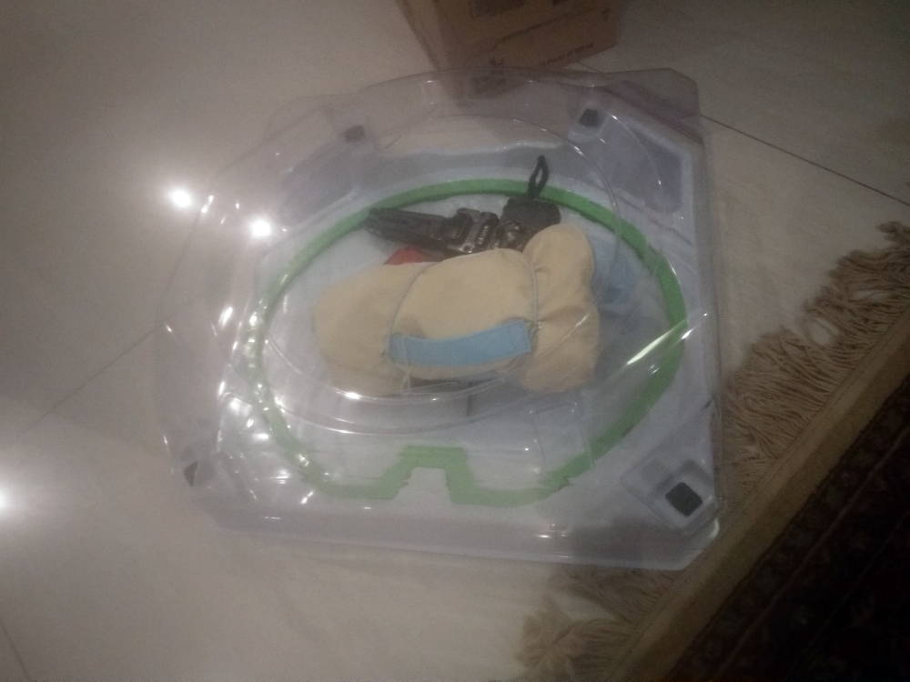
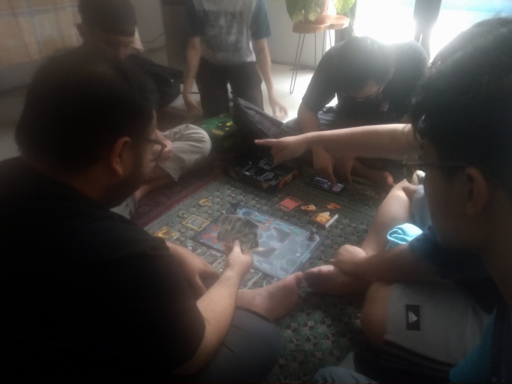
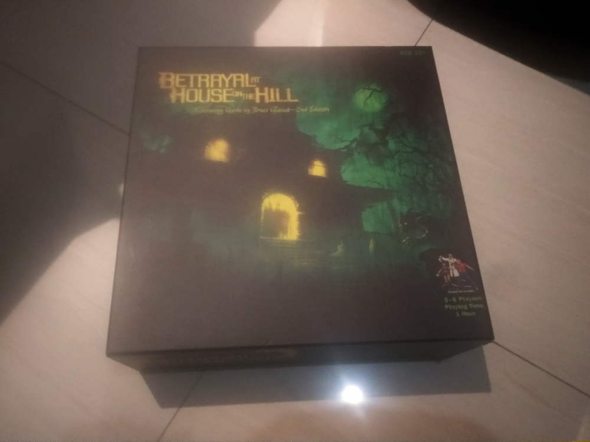
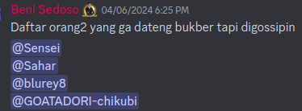
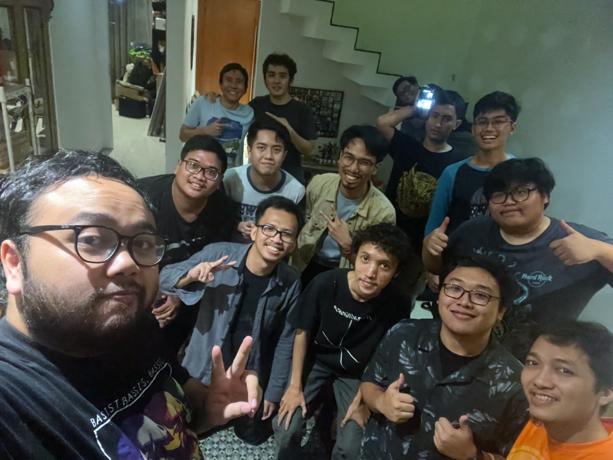
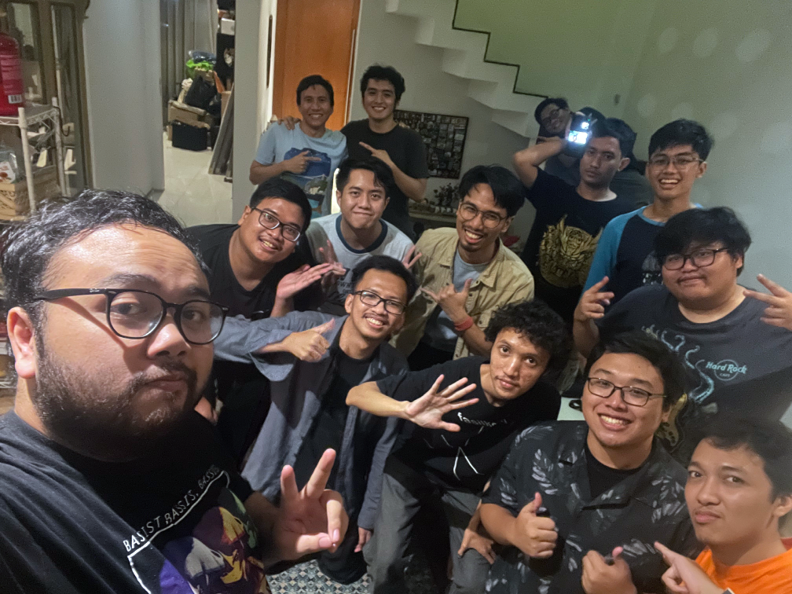
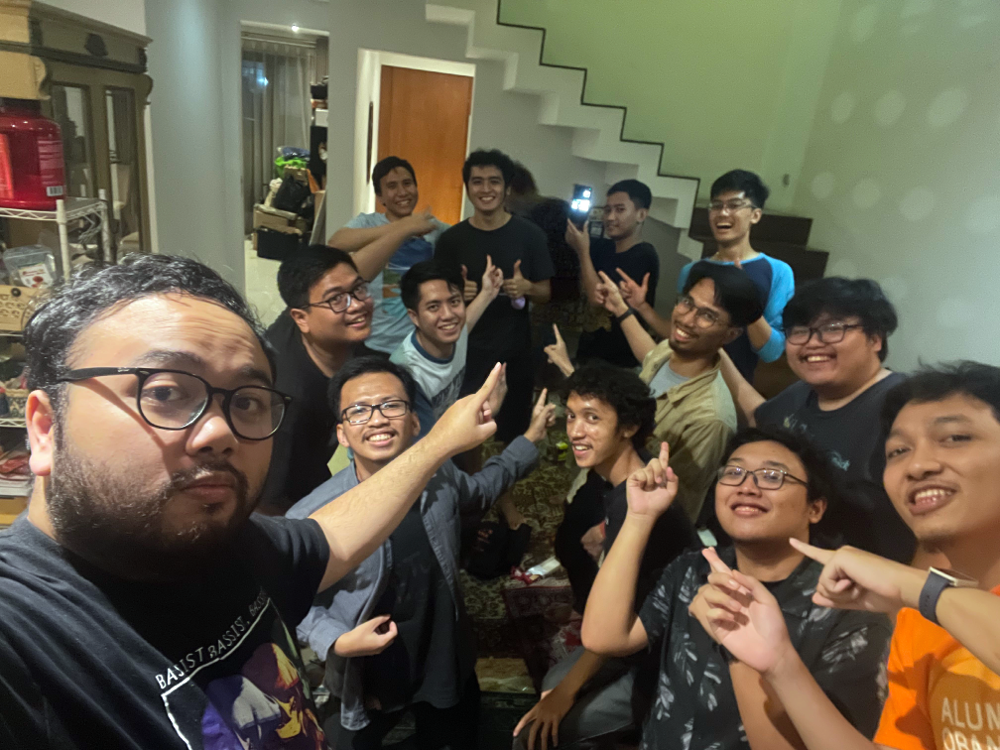

---
# Copyright (c) Gagah Pangeran Rosfatiputra (GPR) <gpr@gagahpangeran.com>.
# Licensed under CC-BY-NC 4.0.
# Read the LICENSE file inside the 'content' directory for full license text.

title: "Bukber 2024"
date: "2024-04-06T12:00:00+07:00"
featuredImage: "./img/bukber1.png"
tags: ["Story"]
lang: "id"
---

Ramadhan tiba, Ramadhan tiba, Ramadhan tiba, tiba-tiba Ramadhan. Pas Ramadhan
tentunya ada satu acara yang gak boleh dilewatin, yaitu buka puasa bersama atau
bukber. Bukber selain isinya buat makan doang tentunya sekalian kumpul sama
teman-teman yang udah susah ketemu.

<!-- excerpt -->

Sabtu kemarin gue ikut bukber bareng teman-teman kuliah dulu. Kita bukber di
rumahnya Dean sama kayak tahun lalu. Alasannya adalah karena tempatnya gampang
dan gak perlu _booking_ restoran lagi, dan tentunya kita bisa berisik dengan
bebas.

Tahun ini bukbernya lebih mancanegara karena beberapa teman yang kerjanya di
luar negeri bisa datang. Ada Abed dari Jepang sama Sage dari Inggris. Bahkan
Sage sampe bawa biskuit asli dari negeri almarhum Ratu Inggris tersebut.
Sayangnya kurang tehnya aja, tapi akhirnya kita beli teh kotak biar tetap ada
rasa teh-tehnya gitu.

Gue berangkat bareng Bimo sama Dafa naik mobilnya Bimo. Pas kita nyampe, udah
ada Kani, Sage, Abed, Gio, Douglas, sama Ariq.

Pas ngabuburit kita main _board game_ punyanya Dean. Bimo, Kani, sama Dafa main
_game_ yang namanya _**Unmatched**_. Sisanya main _game_ yang namanya _Betrayal
at House on the Hill_.

Pas lagi seru-serunya main, tiba-tiba bapaknya Dean pulang. Trus kita dipanggil
satu-satu kayak lagi absen kuliah.

Gak lama kemudian orang tuanya Dean pergi lagi. Ternyata mereka buka puasa di
luar karena kita bukber di sini. Rasanya udah kayak ngusir tuan rumah sendiri.

_Game_-nya selesai pas banget ketika adzan maghrib. Langsung lah kita buka
puasa.

Sambil makan kita ngomongin orang-orang yang enggak datang. Tapi daripada kita
ngomongin di belakang, akhirnya kita kasih tau mereka di Discord.

Makanan utama yang kita pesan sama kayak tahun lalu, nasi kebuli dari Emados.

Nah, pas sambil makan ini kita dengerin cerita Nafis tentang perjalanan dia main
mobil RC. Dari mulai main sendiri di lapangan, trus main di _track_ balap,
_upgrade_ mobil dari yang murah sampe yang mahal, sampe akhirnya dia dapet
podium di balapan pertamanya. Rasanya udah kayak protagonis anime banget
ceritanya.

Sebelum pulang, karenya makanannya masih banyak, kita ngambilin makanannya buat
dibawa pulang. Tahun lalu gue berhasil ngambil donat J.Co sekotak penuh. Tahun
ini gue bawa punya sekolak JPops sama biskuit dari Inggris. Trus Dean juga
bagi-bagi Indomie _cup_ sekardus.

Berikut foto-foto sebelum pada pulang.

Udah kayaknya itu aja cerita buat bukber tahun ini. Semoga tahun depan bisa
kumpul bareng dan bukber lagi.
