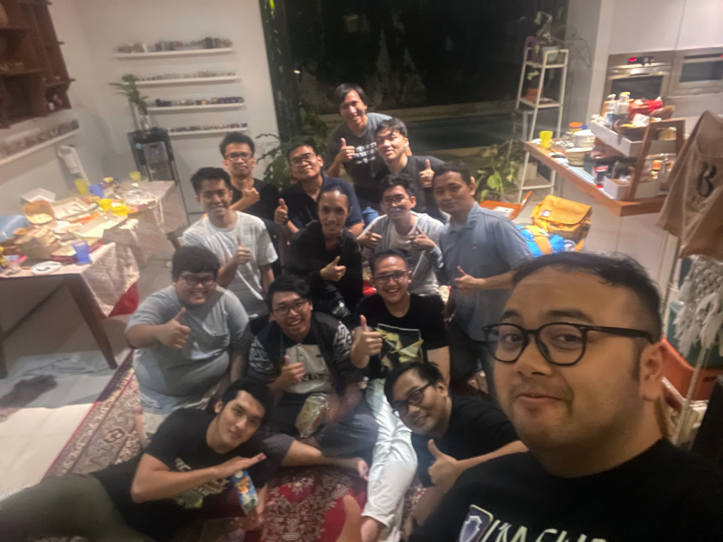

---
# Copyright (c) Gagah Pangeran Rosfatiputra (GPR) <gpr@gagahpangeran.com>.
# Licensed under CC-BY-NC 4.0.
# Read the LICENSE file inside the 'content' directory for full license text.

title: "bukber 2025"
date: "2025-03-18T15:07:19.030Z"
featuredImage: "./img/bukber1.jpg"
tags: ["Story", "Bukber", "Ramadhan", "Puasa"]
lang: "id"
---

Sabtu kemarin, gue kembali ikut bukber dengan teman-teman kuliah dulu. Sama
seperti [tahun sebelumnya][bukber2024] dan juga dua tahun sebelumnya lagi, kami
bukber di rumahnya Dean.

<!-- excerpt -->

Kemungkinan besar tahun ini adalah tahun terakhir kami bukber di rumahnya Dean
karena tahun depan Dean bakal kuliah di Amerika. Opsi lainnya adalah bisa aja
kami bukber di rumahnya Dean tanpa Dean. Tapi Dean udah nolak duluan usulan
tersebut.

Biasanya di tahun-tahun sebelumnya, gue selalu berangkat bukber numpang mobilnya
Bimo. Tapi tahun ini Bimo gak ikut karena harus nemenin istrinya di Singapura.
Akhirnya gue memutuskan untuk berangkat sendiri naik motor.

Gue berangkat dari rumah sekitar jam tiga sore. Pas mau berangkat, gue lupa gak
pake helm, untungnya gue ingat pas baru keluar rumah.

Di jalan juga kena macet, tapi untungnya masih bisa jalan. Beruntungnya lagi pas
gue pergi juga gak hujan, padahal hari-hari kemaren sore-sore biasanya malah
hujan.

Gue sampe dengan selamat sampe rumah Dean sekitar jam setengah lima sore. Jadi
durasi perjalanan sekitar satu setengah jam. Pas banget orang tuanya Dean
berangkat keluar ketika gue sampe. Mereka pergi karena kami pake rumahnya buat
bukber.

Gua masuk udah ada Kani, Ariq, Gio, sama Sage. Gak lama kemudian, Reyhan sama
Dafa nyampe. Abis itu Ervan nyampe, satu-satunya teman non-muslim kami yang ikut
bukber tahun ini.

Sambil nunggu buka puasa, kami main board game yang namanya _**Citadel**_.
Objektif dari game-nya yang gue tangkap adalah bangun tower sebanyak-banyaknya
pake duit dari bank atau ngambil dari orang lain. Tiap _turn_ ada _role_ dan
segala macamnya. Gue gak begitu ngerti, tapi ikut main aja.

Selama kami main, satu persatu orang-orang yang ikut bukber datang. Sisanya ada
Tan, Nafis, Satrio, Dipsi, dan Aziz.

Nafis sempat keluar beli minum ke Alfamart, tapi dia kayaknya dia nyasar dan gak
balik-balik. Padahal Alfamart-nya tinggal keluar gang terus belok doang.

Adzan Maghrib pun tiba dan kami semua makan bareng. Tahun ini gak ada "makanan
utama", karena tiap orang bawa makanan masing-masing buat dibagi-bagi.

Abis makan dan sholat, kami semua ngobrol bareng. Mulai dari masalah negara yang
terjadi saat ini, sampe kami semua dengerin Ervan cerita soal agama Katolik.

Topik lain yang dibahas adalah menanyakan _progress_ dari Nafis, melanjutkan
obrolan tahun kemarin tentang dia ikutan balapan mobil RC. Katanya dia masuk top
10 di kejuaraan _season_ kemarin.

Kami semua pulang ketika hujan yang turun akhirnya reda. Gak lupa pula sebelum
pulang kami semua foto bareng dulu.

Udah itu aja cerita buat bukber tahun ini. Semoga tahun depan bisa kumpul bareng
dan bukber lagi meskipun belum tahu tempatnya bakal di mana.

[bukber2024]: /blog/bukber-2024/
