---
# Copyright (c) Gagah Pangeran Rosfatiputra (GPR) <gpr@gagahpangeran.com>.
# Licensed under CC-BY-NC 4.0.
# Read the LICENSE file inside the 'content' directory for full license text.

title: "Comifuro XX: Shortest Path Edition"
date: "2025-05-25T13:45:57.574Z"
featuredImage: "./img/comifuro-xx.jpg"
tags: ["Story", "Comifuro", "Event"]
lang: "id"
---

Sabtu kemarin gue ke [Comifuro XX][cf]. Sama seperti CF sebelumnya, tujuan utama
gue adalah ketemuan sama teman-teman lama. Tapi tidak seperti CF sebelumnya,
kali ini gue ada niat dan rencana untuk membeli sesuatu. Barang-barang apa saja
yang gue beli di CF kali ini?

<!-- excerpt -->

Biasanya gue beli sesuatu di CF itu cuma kalo pas lewat dan ada barang yang
menarik trus gue beli. Tapi kali ini gue bikin rencana dan nyari _booth-booth_
yang pengen gue beli. Gue sampe nge-_print_ peta CF trus nandain posisi _booth_
yang akan gue datangi.

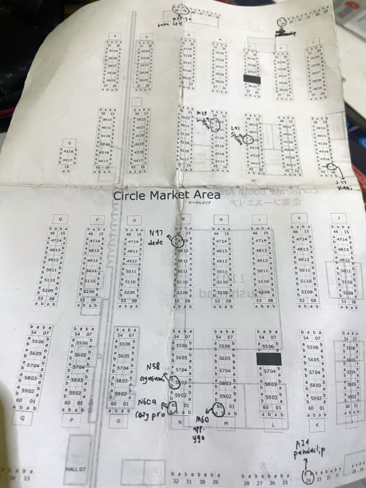

Gue jadi ingat salah satu _scene_ di [Lucky Star][luckystar] pas Konata jelasin
rute buat belanja di Comiket ke teman-temannya. Kalian bisa lihat [adegannya
kayak gini][konatacomiket].

Mungkin harusnya gue juga bikin rute _shortest path_ buat ngunjungin semua
_booth_ yang gue tandain. Mungkin ini mirip _[Travelling Salesman
Problem][tsp]_, tapi kayaknya terlalu _overkill_ kalo buat nyari _shortest path_
buat rute di CF.

Gue nyampe di ICE BSD sekitar jam setengah 10 dengan waktu perjalanan dari rumah
sekitar 45 menit. Kayak CF sebelumnya, antrian buat tukar tiket udah panjang
banget dan pagi itu cuaca lumayan panas.

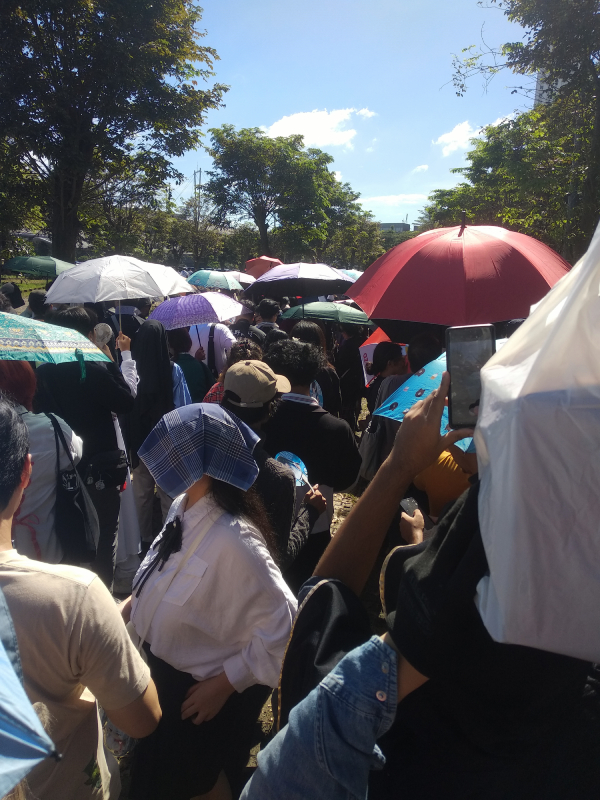

Hal yang gue ingat pas di antrian tukar tiket adalah di sebelah gue kayaknya ada
remaja perempuan datang sama bapaknya. Trus bapaknya yang juga ikut antre lagi
kepanasan sampe jongkok gitu. Wah hebat juga bapak ini datang nemenin anaknya ke
CF. Gue aja gak kepikiran buat datang acara kayak gini lagi kalo gue udah tua
nanti.

Setelah sekitar 30 menit, gue udah dapat tiket dan masuk ke dalam _hall
event_-nya. Oke gue mulai perjuangan gue untuk mengunjungi semua _booth_ yang
udah gue tandain di peta.

Pertama gue ke _booth_ Ragasukma yang letaknya paling dekat pintu masuk. Gue
ketemu sama mas [Sweta Kartika][swetakartika] dan beli beberapa komik bikinan
dia.

Gue pertama kali tau mas Sweta ini sekitar tahun 2014 pas dia gambar komik
[Nusantaranger][nusantaranger]. Trus waktu itu juga gue sering ke _event_ dan
ketemu mas Sweta pas lagi jualan _merch_ Nusantaranger.

Awalnya dia gak nyadar atau gak ingat kalo tentang gue. Pas dia lihat gantungan
kunci Nusa Five dan nanya nama gue siapa. Trus abis itu dia inget nama gue dan
kami ngobrol karena udah lama gak ketemu. Terakhir gue minta foto bareng sama
mas Sweta.

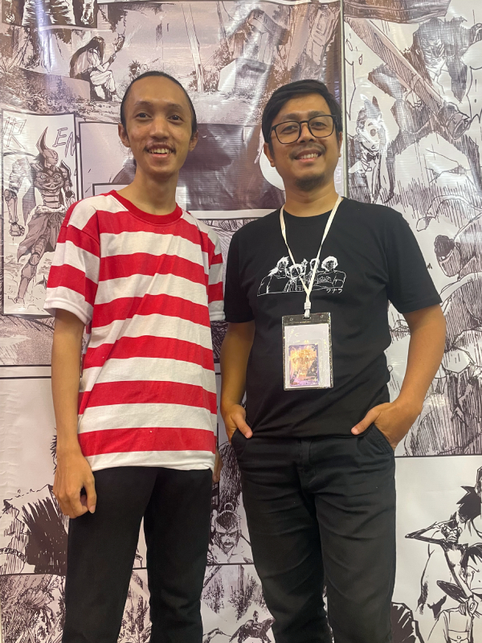

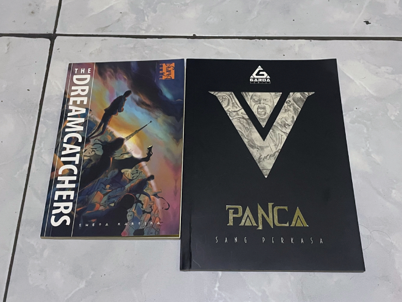

Setelah itu gue ke _booth_ Jagad Raya yang letaknya gak terlalu jauh. Gue ketemu
mas [Shani Budi][shanibudi] dan beli dua volume komik Jagad Raya yang dijual.

Sama kayak mas Sweta, mas Shani ini dulunya juga yang bikin komik Nusantaranger
sebagai _original creator_. Gue juga dulu ketemu mas Shani di _event_ yang ada
Nusantaranger _booth_-nya.

Sama kayak mas Sweta, awalnya dia juga gak nyadar atau gak ingat tentang gue.
Trus dia nanya nama gue dan akhirnya dia ingat tentang gue. Trus kami ngobrol
dan gue tanya-tanya dikit tentang komik Jagad Raya ini. Terakhir gue juga minta
foto bareng sama mas Shani.

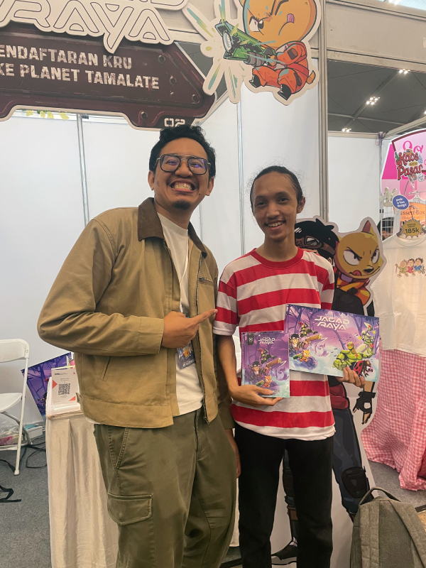

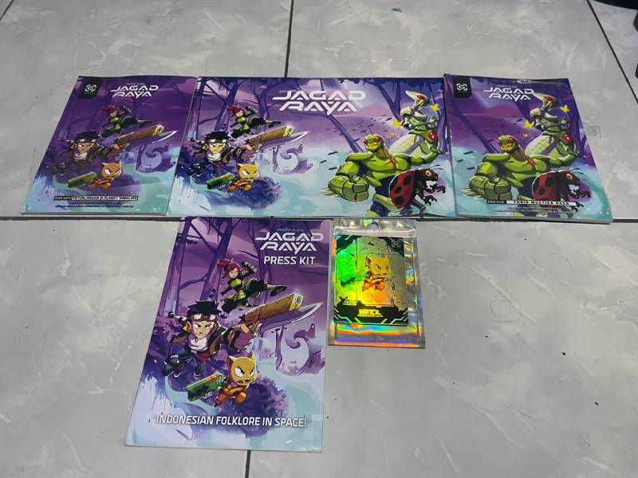

Abis itu gue ke _booth_ Surya Aboogie. Gue nandain _booth_ ini karena Kani,
temen kuliah gue dulu, yang buka _booth_ ini. Jadi sebenarnya niatan gue cuma
buat ketemu Kani doang.

Gue ngobrol bentar dan dia ngomentarin kaos Madura yang gue pake. Gue dan Kani
sama teman-teman kuliah yang lain pernah ke Madura buat nikahan teman kami Jack
trus sempat beli kaos Madura.

Gue minta rekomendasi barang buat dibeli dari _booth_ dia. Trus akhirnya gue
cuma beli stiker doang. Abis itu gue langsung pergi dan lupa buat foto bareng.
Tapi kemudian gue balik lagi dan akhirnya foto bareng.

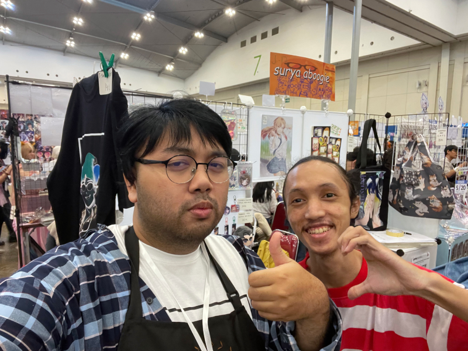

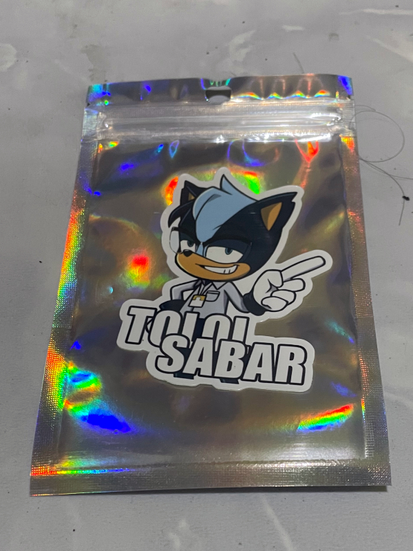

Abis itu gue _speedrun_ ke _booth_ lain karena gue cuma pengen beli _merch_-nya
dan gak kenal sama yang jual.

Di _booth_ Orkestra Lingkar Magis buat beli buku-buku ini yang terlihat seperti
buku tentang pendidikan.

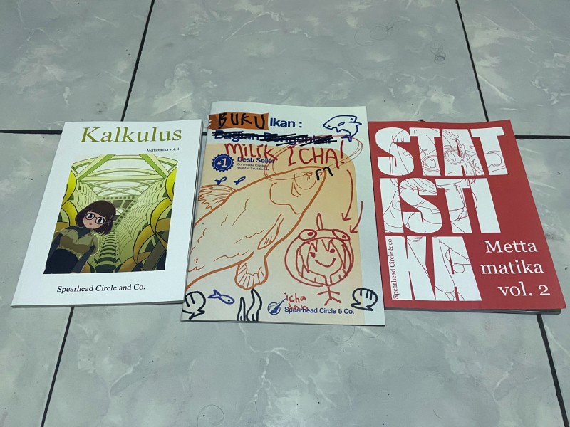

Di _booth_ Kincrot Corp gue beli _merch_ yugioh bikinan [smiling
spectra][spectra].

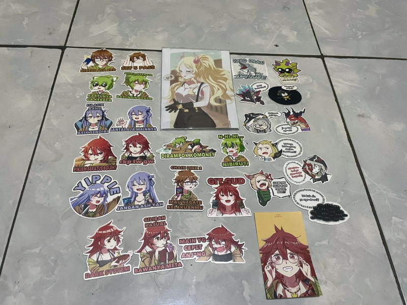

Tahun kemarin gue juga sempat beli _merch_ yugioh di _booth_ yang sama. Jadi
_merch_ yang baru ini buat nambahin aja.

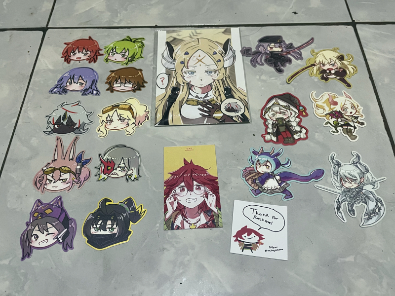

Di _booth_ Bandung Duelist gue beli _merch_ yugioh lagi. Awalnya gue pengen beli
_art_ Lovely Labrynth yang NSFW di _booth_ ini. Tapi gak jadi karena gak tahu
mau simpan di mana.

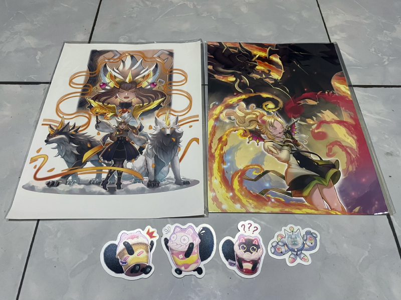

Gue juga ke _booth_ adik gue, namanya Dukun Jompo. Tapi pas gue ke sana, kok
orangnya gak ada, yang jaga cuma satu orang.

Ada juga beberapa _booth_ yang gue tandain tapi cuma lihat doang gak beli
apa-apa. Jadinya cuma lewat doang.

Setelah mengunjungi semua _booth_ yang udah gue tandain, gue ke depan _exit
hall_ 10 buat dapet sinyal internet. Teman-teman gue yang lain udah pada
ketemuan di depan _exit hall_ 8.

Gue ke sana dan pas jalan mendengar orang teriak dengan keras.

"MADURA!!!"

Gue lihat ada Satrio teriak karena gue pake kaos Madura. Selain itu udah ada
Dafa sama Gio udah pada ngumpul.

Abis duduk ngumpul, trus kami keliling buat beli _merch_ yang mau dibeli. Satrio
sama Gio ada beberapa _pre-order_ yang mau diambil. Satrio juga ngambil barang
_pre-order_ yang Hilmy titip karena dia gak datang. Gue juga nunjukin Dafa ke
_booth_ yang ada _merch_ yugioh yang pengen dia beli.

Kami juga mampir ke _booth_-nya Kani tapi dia udah gak ada. Pas lagi keliling,
kami juga ketemu anak Fasilkom 2016, ada Danin, Aulia, sama Adrian. Danin ngasih
gacha berupa kartu pokemon ke kami semua. Gue dapatnya kartu Umbreon.

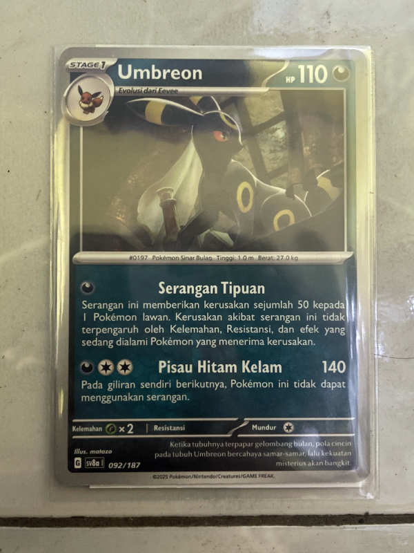

Satrio ternyata ada _pre-order_ takoyaki di salah satu _booth_. Setelah semuanya
udah selesai belanja, kami keluar _hall_ buat makan siang.

Pas lagi keluar buat nyari tempat duduk buat makan, kami ketemu Kenia, salah
satu teman kuliah juga. Dia bareng temannya juga lagi keluar mau makan siang.

Oh ya, semua teman-teman yang gue kenal yang ketemu di CF gue kasih stiker ini.

Gak ngerti kan maksudnya apa?

Sama gue juga.

Abis makan siang, kami berempat foto bareng.

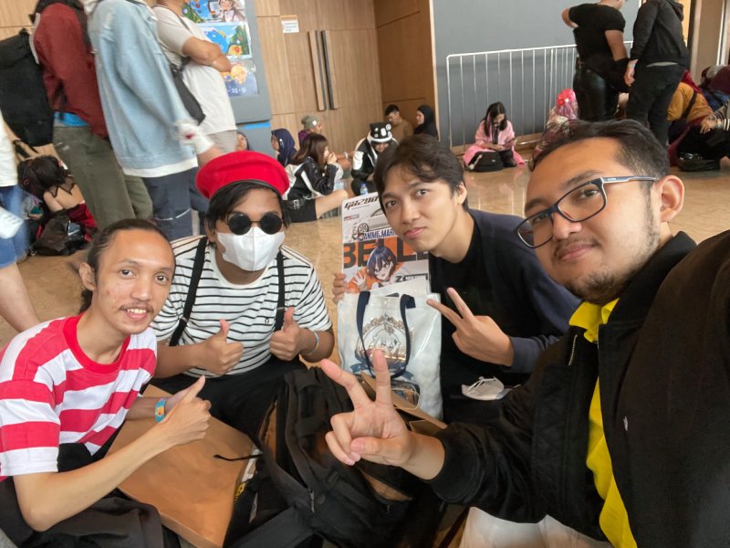

Kemudian kami masuk lagi buat ketemu Kani, tapi ternyata dia udah pergi karena
ada acara _workshop_. Trus kami bubar buat urusan masing-masing.

Gue masih sama Dafa kemudian duduk di dekat pintu keluar. Beberapa saat
kemudian, temannya Dafa datang dan mereka pulang bareng.

Sebelum gue pulang, gue ke _booth_ adik gue dulu. Akhirnya dia ada di sana dan
gue foto bareng sama dia yang lagi _cosplay_.

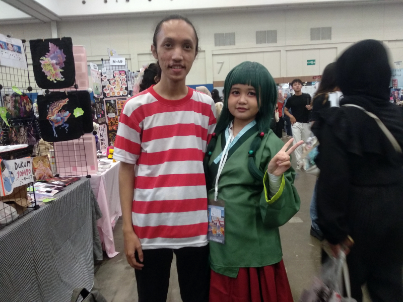

Udah abis itu gue pulang dan sampe rumah langsung tidur.

Semoga CF berikutnya gue bisa datang dan ketemu teman-teman lagi.

[cf]: https://comifuro.net/
[luckystar]: https://en.wikipedia.org/wiki/Lucky_Star_(manga)
[konatacomiket]: https://youtu.be/dNdQMoRxfeg?t=18
[tsp]: https://en.wikipedia.org/wiki/Travelling_salesman_problem
[swetakartika]: https://x.com/SwetaKartika
[nusantaranger]: https://indonesia-fan-toku.fandom.com/id/wiki/Nusantaranger
[shanibudi]: https://x.com/ShaniBudi
[spectra]: https://x.com/smilingspectra
