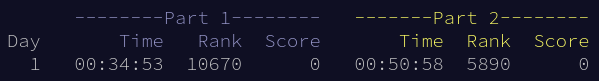

---
# Copyright (c) Gagah Pangeran Rosfatiputra (GPR) <gpr@gagahpangeran.com>.
# Licensed under CC-BY-NC 4.0.
# Read the LICENSE file inside the 'content' directory for full license text.

title: "Count The Digit (AoC 2023 Day 1)"
date: "2023-12-01T23:30:00+07:00"
featuredImage: "./img/digits.png"
tags: ["Advent of Code", "Tech"]
lang: "en"
---

After almost a year, here is the new post of [Advent of Code][aoc].

<!-- excerpt -->

For those who don't know what is Advent of Code, you can read about it from my
[last year post][lastyear].

I failed to write the posts for all problem from last year. The biggest reason
is because I'm too lazy to write it, hehe. So for this year I will try different
approach by posting everyday after I successfully on that day.

The good news is I successfully solved 24 of 25 problems from last year. There
is only one problem that I can't solve. By the time the year has change to 2023,
I'm already too lazy to try to solve it again.

Hopefully this year I can solve all of the problem and write post about all of
them.

## Day 1: Trebuchet?!

> [Full problem statement][problem]

The first problem of the year should be an easy one.

For each line of a string, find the first and last _digit_ in that string, then
combine them to form a single _two-digit_ number. What is the sum of all those
numbers?

For part one, the _digit_ is just a character in the string that is a number
between 0-9.

I only need to check each character in the string is a number or not to get the
_digit_.

Part two is the tricky one, the _digit_ can also be spelled with letters. So the
words `one`, `two`, `three`, `four`, `five`, `six`, `seven`, `eight`, and `nine`
are also a _digit_.

I just create a map of those words into its number. Then I check the substring
that start from each position of character of the string is one of those words
or not. If it is, then use the map to get the _digit_ from that word.

> [Solution Code][solution]

## Closing

That's it for day one.

The problem is quite easy but the implementation is a bit tricky. I spend most
of the time thinking how to implement the second part. I also try to remember
how to code in C++ because it's been so long that I code with it.

I started late in about 30 minutes after the puzzle is unlocked. But the result
it's not too bad.

Let's see if next problem is tricky to implement or not.

[aoc]: https://adventofcode.com
[lastyear]: /blog/parsing-input-is-hard-aoc-2022-day-1-5/
[problem]: https://adventofcode.com/2023/day/1
[solution]:
  https://github.com/gagahpangeran/advent-of-code/blob/master/2023/01/sol.cpp
