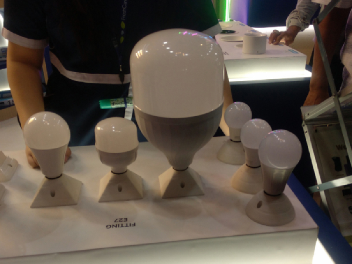
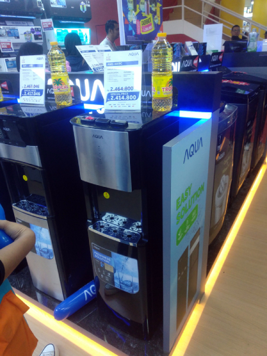
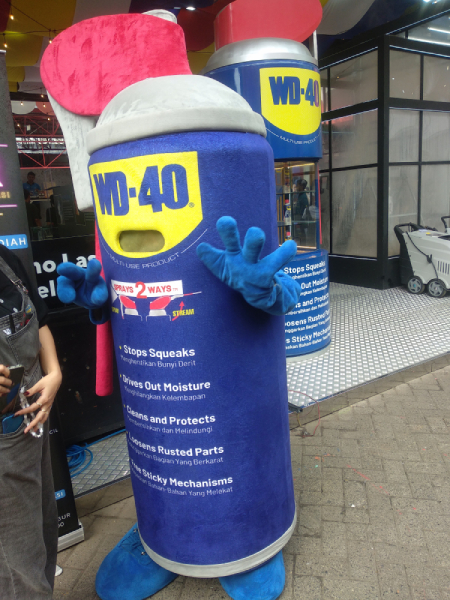

---
# Copyright (c) Gagah Pangeran Rosfatiputra (GPR) <gpr@gagahpangeran.com>.
# Licensed under CC-BY-NC 4.0.
# Read the LICENSE file inside the 'content' directory for full license text.

title: "Jakarta Fair 2025"
date: "2025-07-17T17:30:00+07:00"
featuredImage: "./img/jakarta-fair.jpg"
tags: ["Story", "Jakarta Fair"]
lang: "id"
---

_Kemayoran~_

<!-- excerpt -->

Hari minggu kemarin, gue sekeluarga pergi ke Pekan Raya Jakarta (PRJ), atau
sekarang disebut sebagai Jakarta Fair. Emak gue ngajakin ke sana karena hari itu
adalah hari terakhir.

Gue, emak gue, dan adek gue berangkat dari pagi naik Transjakarta, sementara
kakak gue nyusul karena hari itu dia ada kerjaan. Kami nyampe sekitar jam 11 dan
kondisi masih belum terlalu rame. Gue kira karena ini hari terakhir bakalan rame
dari pagi.

Sebenarnya gue gak mau beli apa-apa di sana. Tapi emak gue maksa gue buat beli
kemeja baru karena baju yang gue pake itu-itu aja. Akhirnya gue beli kemeja yang
lagi promo 150 ribu dapat tiga.

Selain itu kami juga keliling ke dalam sebuah _hall_ yang isinya kebanyakan
jualan elektronik. Ada satu tempat yang jualan lampu yang ukurannya gede banget
dan energinya 60 watt.

Lampu sebesar dan seterang ini bisa menyinari masa depan gue yang gelap.

Di tempat itu juga ada mas-mas _sales_ yang bawa-bawa lampu kayak pedagang
asongan. Terus ada ibu-ibu datang nyamperin mas-masnya.

"Mas mau beli akua."

"Saya jualan lampu bu."

Sungguh _random_ kelakuan orang-orang di tempat ramai seperti ini.

Kemudian kami ngelewatin tempat jualan TV. Gue dengar _sales_-nya teriak ada
banyak promo.

"Beli TV gratis kulkas.'

"Beli TV gratis iphone."

"Beli TV gratis TV.:

Gue penasaran kan, gue lihat TV-nya gede banget. Ada mungkin lebarnya 3 meter.
Ini TV bisa jadi tembok kamar gue karena lebarnya sama kayak kamar gue. Pantas
aja beli TV kayak gini dapat bonus TV lagi.

Terus kami ngelewatin tempat jualan dispenser. Kali ini promonya beli dispenser
gratis minyak goreng.

Ini maksudnya kita disuruh minum minyak goreng apa gimana.

Gue iseng nanya ke mbak-mbak _sales_-nya.

"Mbak, ini kalo gak dicolok, airnya bisa naik gak?"

Trus mbak-mbak bingung, nanya ke mas-mas disebelahnya.

"Mas, ini kalo gak dicolok, airnya bisa naik gak?"

Mas-mas yang ditanya juga kelihatan bingung, kemudian nanya ke mas-mas lain yang
ada di seberang kami.

"Ini kalo gak dicolok, airnya bisa naik gak?"

Akhirnya mas-mas yang ini bisa jawab.

"Gak bisa, kan ini sistemnya kayak pompa harus ada yang nyedot ke atas."

"Oh, gitu makasih ya mas."

Gue jawab gitu aja karena gak mau pertanyaan iseng gue ini malah jadi pesan
berantai panjang.

Abis itu kami ke tempat kursi pijit. Emak gue disuruh nyobain kursinya, gue juga
disuruh duduk di kursi yang lain.

Sambil dipijit, Emak gue sekalian ngobrol sama mas-mas _sales_-nya. Gue juga
ditawarin buat nyobain juga. Awalnya gue cuma mau duduk doang, tapi lumayan lah
10 menit pijat gratis.

Mas-masnya kemudian nyalain kursi pijatnya. Seketika bagian kaki dari kursinya
naik, dan bagian punggungnya mundur ke belakang. Sekarang posisi gue kayak
tiduran gitu dan muka gue menghadap ke atas. Berasa kayak naik suatu wahana di
Dufan gitu, udah kayak mau meluncur naik roket.

Terus tiba-tiba kaki sama tangan gue dicengkram sama kursinya. Bagian bawah kaki
gue berasa kayak ada yang nusuk-nusuk gitu. Tangan gue berasa kayak
dicemek-cemek. Kemudian punggung gue berasa kayak ada benda tumpul yang
nusuk-nusuk gitu.

Ini mungkin karena gue jarang dipijat atau gimana ya, rasanya kayak agak sakit
gitu. Sambil menahan sakit, gue pun coba mencari pertolongan. Gue nengok ke
mas-mas _sales_-nya, terus dia ngelihat gue.

"Enak mas?"

Gue dengan masih menahan sakit tapi gak mau mengecewakan mas-masnya kemudian
membalas, "iya enak mas".

Terus dia lanjut ngobrol sama emak gue.

Kemudian tiba-tiba leher gue berasa kayak dijepit gitu sama dua benda tumpul.
Abis itu jepitannya turun ke bawah menelurusi punggung gue. Terus turun ke
pinggang sampe akhirnya berhenti di pantat. Ini pas jepitannya turun gitu,
rasanya kayak nyawa gue lagi diperas dari leher sampe akhirnya keluar di pantat.

Gak berhenti sampe situ, pas lagi di pantat tiba-tiba itu alatnya bergetar di
bagian pantat gue. Loh, loh, loh, kok tiba-tiba jadi kayak alat masturbasi gini.
Getarannya kemudian naik dari pantat, kemudian ke pinggang, punggung, sampe
akhirnya ke leher.

Hal itu terjadi sekitar 4 kali selama gue pake kursi pijatnya. Pijat yang
durasinya 10 menit berasa kayak siksaan selama 10 jam. Mungkin awalnya kursi
pijat ini emang hasil modifikasi dari alat penyiksaan buat interogasi kriminal
kayaknya.

Selesai dipijat, badan gue rasanya sakit dan capek. Nafas gue terengah-engah
berasa abis lari maraton. Energi gue habis setelah pantat gue digetarkan
berkali-kali.

Selepas dari kursi penyiksaan tersebut, kami lanjut keliling lagi. Pas lagi
keliling, gue bertemu dengan idola para bapak-bapak. Dia sangat terpercaya
ketika dibutuhkan untuk melumasi sesuatu.

Ya benar, gue bertemu dengan WD-40.

Gue pengen minta dia untuk melumasi punggung gue setelah sakit dipijat, tapi gue
malu. Jadinya dia gue foto aja.

Mulai agak sore, kakak gue akhirnya datang dan kami makan siang. Abis itu kami
keliling lagi buat beli hal lain.

Malamnya, kami masuk _hall_ yang isinya jualan kosmetik. Gue dan emak gue
memutuskan untuk duduk sementara adek dan kakak gue keliling buat belanja
kosmetik.

Sekitar jam 9 malam, kami pulang naik Transjakarta lagi. Sampe rumah sekitar jam
11 malam. Abis itu gue langsung tidur karena badan gue capek dan masih sakit
abis dipijat.
