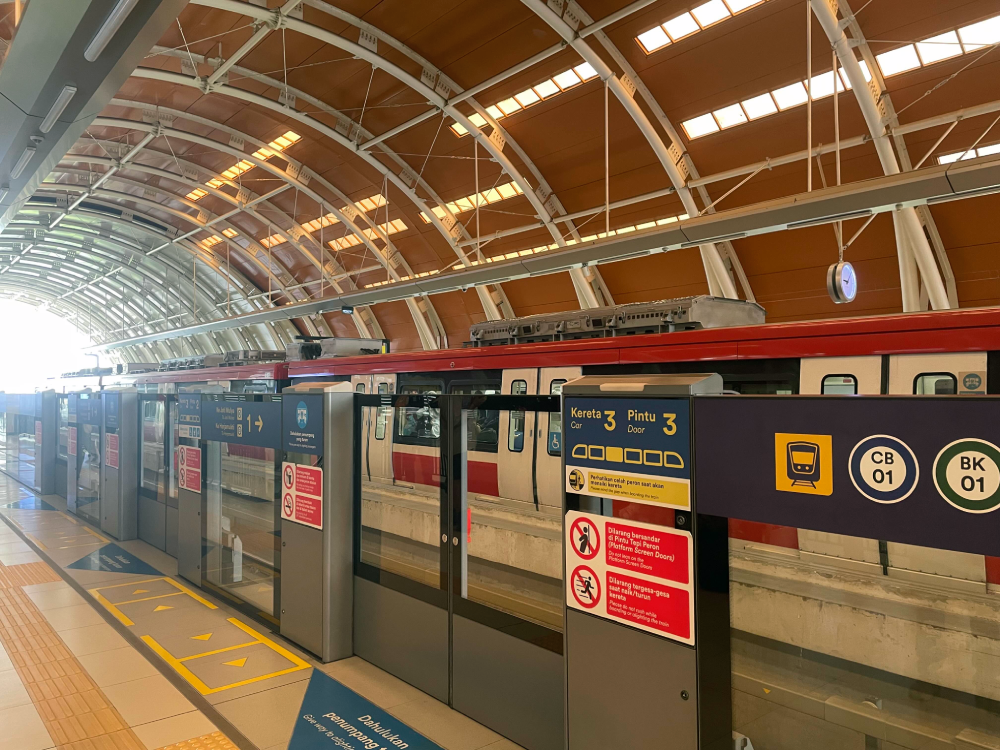
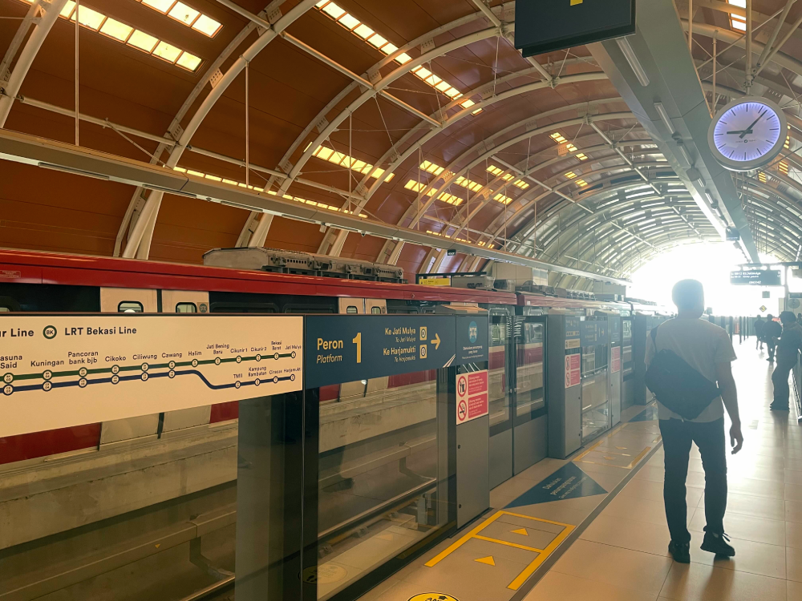
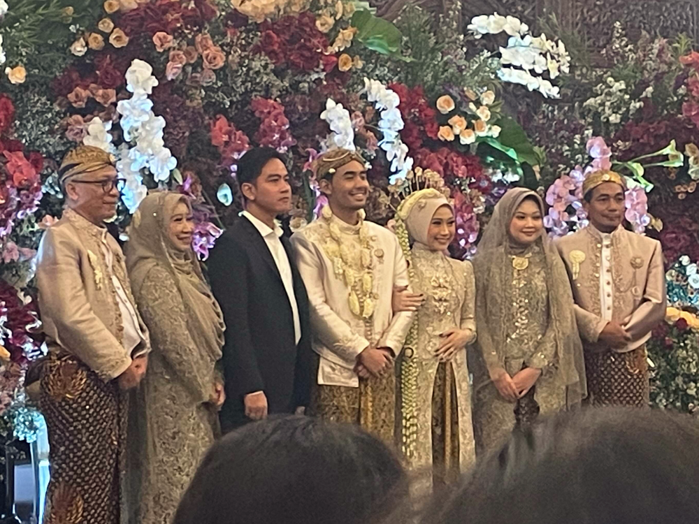
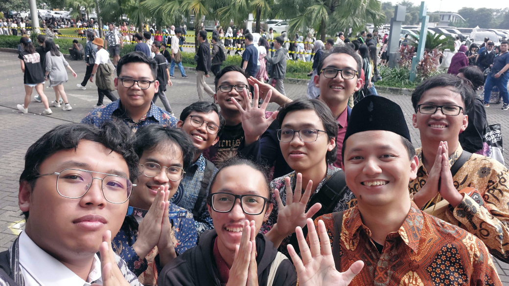
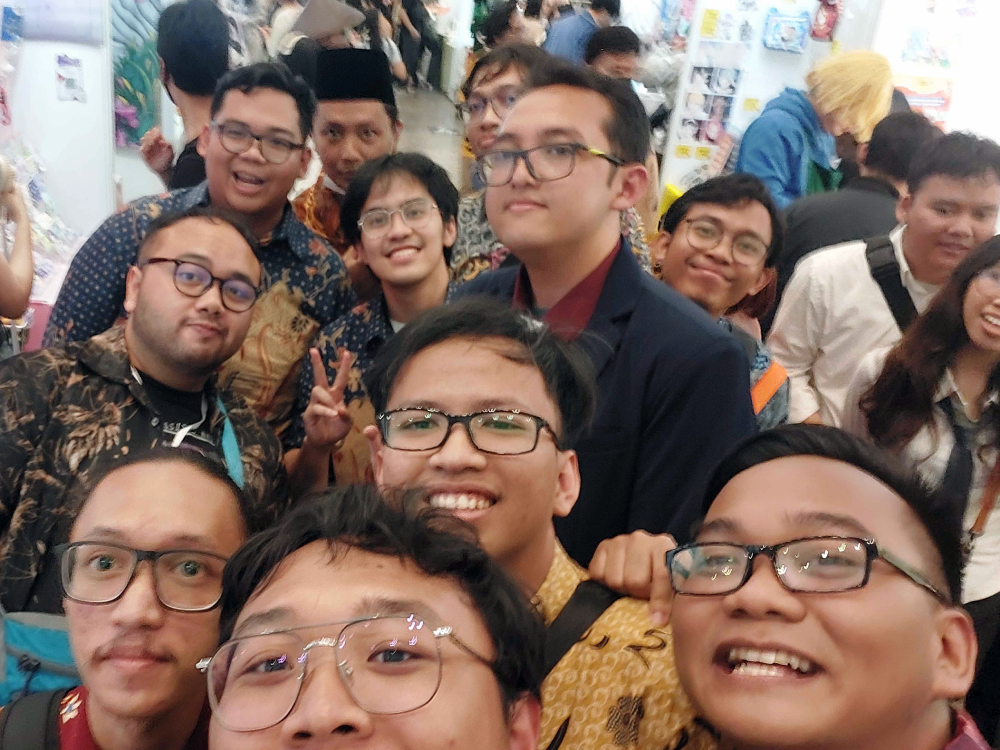
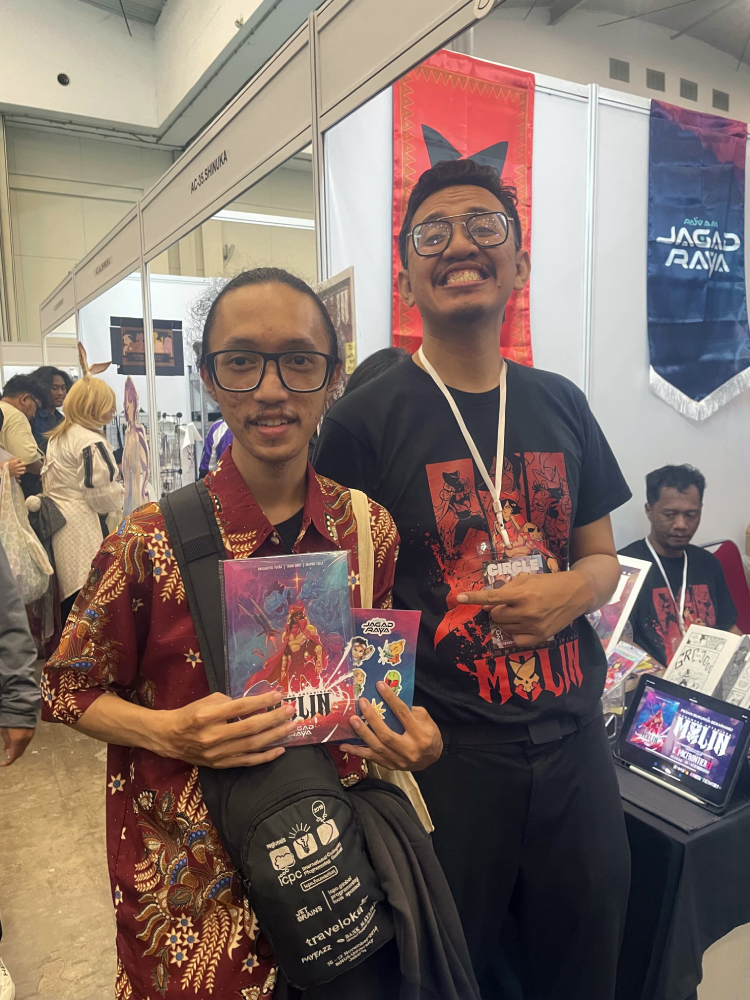

---
# Copyright (c) Gagah Pangeran Rosfatiputra (GPR) <gpr@gagahpangeran.com>.
# Licensed under CC-BY-NC 4.0.
# Read the LICENSE file inside the 'content' directory for full license text.

title: "Karaoke, Nikahan, dan Comifuro"
date: "2025-11-19T22:00:00+07:00"
featuredImage: "./img/comifuro.png"
tags: ["Story", "Karaoke", "Nikahan", "Comifuro"]
lang: "id"
---

Minggu kemaren banyak banget acara yang gue lakukan. Mulai dari karaoke bareng,
datang ke nikahan Irfan, sampe ke Comifuro bareng.

<!-- excerpt -->

Diawali dengan adanya Miku Expo minggu ini di hari Rabu. Sidiq yang udah fans
miku dari lama akhirnya datang jauh-jauh dari [Soppeng][soppeng] ke Jakarta. Gue
sendiri gak ke Miku Expo karena satu dan lain hal. Gue juga gak terlalu suka
datang ke konser yang isinya rame banyak orang gitu. Jadinya cuma Sidiq, Dafa,
sama Satrio yang datang ke Miku Expo 2025.

Karena di akhir pekannya bakal ada nikahan Irfan dan Comifuro, Sidiq akhirnya
lanjut terus di Jakarta sampe hari Sabtu. Maka dari itu, di hari Kamis kami
serombongan pergi ke Lime Light Karaoke. Ada gue, Sidiq, Bimo, Dafa, Kani, Gio,
Ariq, dan Sayid.

Trus sekitar dua jam kemudian, Ervan datang dengan masih pake batik karena dia
kerja jadi PNS di suatu SD di Jakarta.

Berikut adalah beberapa foto-foto yang gue ambil saat kami karaoke.

Akhirnya sebelum pulang kami semua foto bareng.

Karaoke ini sekaligus jadi perayaan sebelum Sidiq nikah di bulan Desember nanti.
Karena tempatnya sangat jauh di Soppeng ditambah tanggalnya dekat banget sama
tahun baru, jadinya sebagian besar pada gak bisa datang ke sana. Kata Sidiq
mungkin abis nikahannya bakal ada perayaan sendiri buat kami yang di Jakarta.

Kemudian hari Sabtunya kami ke nikahan Irfan, salah satu teman kuliah kami juga
dulu. Hari nikahannya bareng sama hari [Comifuro][comifuro], jadi niatannya kami
semua abis kondangan bakal langsung pergi ke CF. Acara nikahannya di gedung IPB
Convention Hotel Botani Square di Bogor. Harusnya Irfan nikahannya di ICE BSD
aja biar sebelahan sama Comifuro.

Gue, Dafa, sama Sidiq naik KRL. Pas lewat stasiun Tanah Abang, kami ngelihat ada
orang yang _cosplay_ dan kayaknya lagi transit buat ke arah stasiun Cisauk. Kami
turun di stasiun Sudirman buat lanjut nyambung naik LRT stasiun Dukuh Atas. Kami
juga ngelihat ada orang-orang yang _cosplay_ pas lagi jalan di jembatan yang
nyambungin ke stasiun LRT.

Ini pertama kali gue naik LRT, jadi berikut adalah foto-foto stasiun LRT Dukuh
Atas.

Kami naik LRT ke arah Harjamukti dan kami bakal dijemput sama Satrio di sana
buat langsung naik mobil ke arah Bogor.

Sampe di sana, kami ketemu Ariq, Bayu, sama Sayid yang udah datang duluan. Kami
juga ketemu teman-teman alumni Fasilkom lain di nikahannya Irfan. Karena
kayaknya banyak pejabat yang diundang, pas mau masuk gedungnya ada _metal
detector_ sama _X-ray machine_.

Abis kami salaman dan makan-makan, sekitar jam 12 siang tiba-tiba orang-orang
pada rame. Ternyata ada Gibran datang ke nikahannya Irfan.

Iya benar, Gibran sang Wakil Presiden Indonesia. Beliau kemudian langsung naik
ke panggung buat foto sama mempelai. Abis itu Gibran langsung pulang dikawal
sama paspampres.

Abis Gibran datang, kami lanjut makan-makan dan kemudian foto sama mempelai.
Abis itu kami langsung pulang buat lanjut pergi ke Comifuro.

Sampe di ICE BSD, penukaran tiketnya udah lancar dan gak antre. Sebelum masuk
kami foto-foto dulu di depan.

Kami kemudian langsung ke _booth_-nya Kani buat ketemu sama dia. Kani juga
kebetulan lagi pake batik. Jadilah kami semua foto bareng pake batik semua.

Abis itu kami bubar buat beli keperluan masing-masing.

Gue kemudian ke _booth_ Jagad Raya buat ketemu Mas Shani Budi dan beli komik
Jagad Raya volume 3.

Karena udah gak ada yang gue mau beli, akhirnya gue muter-muter aja Comifuro
ngalor-ngidul gak jelas. Siapa tau nemu sesuatu yang bagus.

Sekitar jam empat sore, gue ketemu sama Sidiq di depan Hall 8 ICE BSD. Kami
sambil nungguin Dafa sama Ervan. Setelah ngumpul, kami memutuskan untuk pulang.
Tapi hujan deras tiba-tiba datang dengan angin yang kencang banget. Jadinya kami
nunggu sampe hujan sedikit reda.

Sekitar jam 5 sore, hujan udah mulai reda. Kami kemudian pesan taksi online buat
pulang bareng. Pertama kami ke kosan Sidiq yang dulu buat ngambil barangnya yang
masih ada di sana. Kemudian kami lanjut pulang bareng ke rumahnya Dafa dulu.

Sampe di Rumah Dafa, kami istirahat sebentar sambil ngobrolin tentang kerjaan
Ervan sebagai PNS di suatu SD di Jakarta. Kemudian gue sama Ervan pamit pulang.
Gue naik ojek online ke rumah gue karena jaraknya lumayan dekat, sedangkan Ervan
pulang naik KRL karena stasiunnya dekat dari rumah Dafa.

Sekalian kami juga pamit sama Sidiq yang nanti malamnya bakal terbang balik ke
Makassar dan lanjut ke Soppeng. Mungkin gue masih akan lama lagi ketemu Sidiq,
apalagi sebentar lagi dia bakal nikah dan gue gak bisa datang ke nikahannya.

Setelah sampai rumah, gue langsung tidur karena badan gue capek banget.

Mungkin itu aja buat cerita kali ini. Semoga bakal ada acara lain selanjutnya
buat kami semua ngumpul bareng lagi.

[soppeng]: https://id.wikipedia.org/wiki/Kabupaten_Soppeng
[comifuro]: https://comifuro.net
