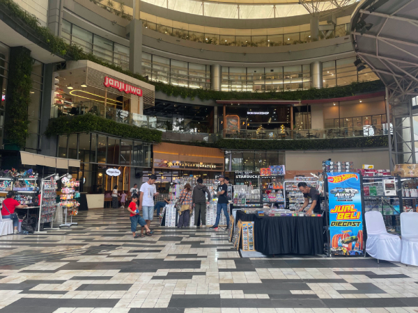
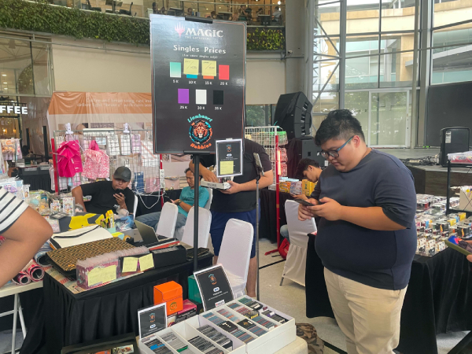
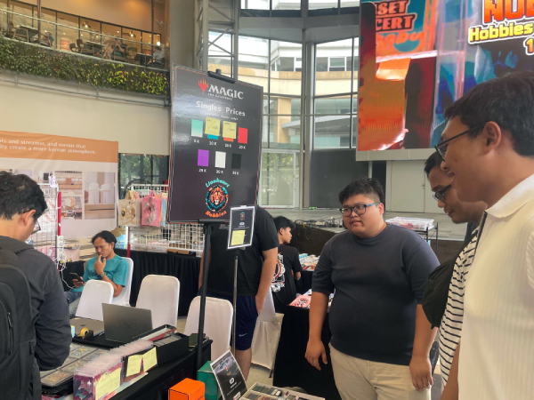
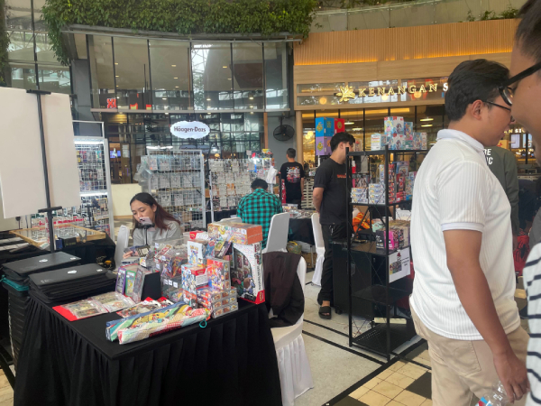
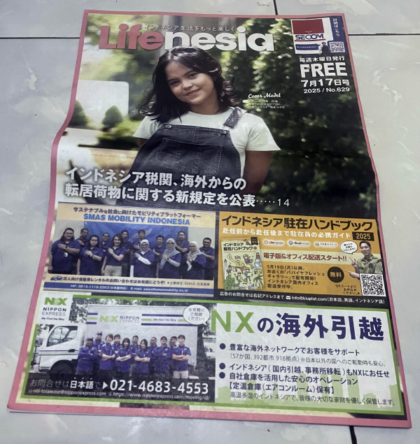
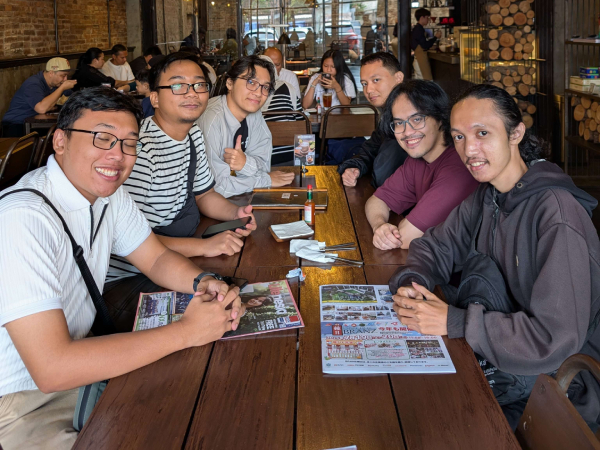
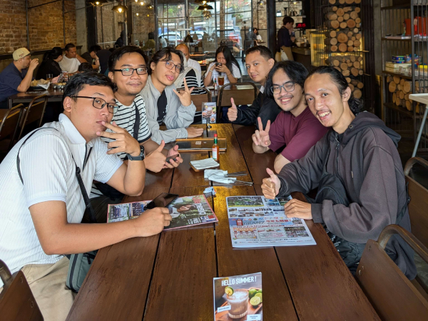

---
# Copyright (c) Gagah Pangeran Rosfatiputra (GPR) <gpr@gagahpangeran.com>.
# Licensed under CC-BY-NC 4.0.
# Read the LICENSE file inside the 'content' directory for full license text.

title: "Mencari Parkir di Gandaria City"
date: "2025-07-27T20:00:00+07:00"
featuredImage: "./img/gancit1.jpg"
tags: ["Story", "Gandaria City", "Brisket"]
lang: "id"
---

Minggu lalu gue ke Gandaria City dengan niatan ketemu sama Dean dan teman-teman
yang lain. Seperti yang pernah gue tulis di post [bukber 2025][bukber2025], Dean
akan pergi ke amerika buat kuliah S2 di sana. Acara ketemuan ini adalah salah
satu kesempatan kami untuk bertemu Dean sebelum dia berangkat bulan depan.

<!-- excerpt -->

Gue ke gancit naik motor dan nyampe sekitar jam 11.40. Kemudian gue masuk ke
tempat parkir resmi yang ada di dalam. Ketika nyampe di depan _parking
gate_-nya, ternyata masuknya harus pake kartu _e-money_. Karena gue gak punya,
terpaksa gue keluar dan parkir di tempat parkir tidak resmi yang letaknya di
samping gancit.

Karena ini pertama kalinya gue ke gancit, gue cuma pake _feeling_ untuk
menavigasikan diri di _mall_ tersebut. Tujuan gue adalah ke tempat pameran atau
bazar mainan, di mana Dean buka _booth_ dan jualan di situ. Masuk ke dalam
langsung ada eskaltor naik, _feeling_ gue mengatakan buat naik aja.

Setelah beberapa menit muter-muter lantai tersebut, gue masih belum nemu juga
tempatnya. Ini kalo gue muterin lantai ini tujuh kali, udah jadi haji gancit nih
gue. Kemudian gue memutuskan untuk nanya di grup chat, karena ada teman-teman
lain yang udah sampe.

Gue dapat patokannya, dekat starbucks katanya. Gue nanya ke satpam dan dikasih
tau kalo starbucks itu adalah di lantai bawah. Gue turun dan menyadari ternyata
dari pintu masuk tadi harusnya gue tinggal belok kiri dan gak usah naik
eskalator.

Gue nyampe di tempatnya dan ketemu sama Ariq, Dafa, dan Ervan yang udah nyampe
duluan. Kemudian gue ketemu sama Dean yang lagi jaga _booth_. Ternyata di
_booth_-nya juga ada Rafif sama Uci, mereka juga teman kuliah gue dulu.

Setelah itu kami duduk dan ngobrolin tentang Ervan yang sekarang udah jadi PNS.
Dia jadi staf IT buat TU di salah satu SD di daerah taman sari. Setelah di cek,
ternyata posisi SD-nya tepat berseberangan sama SMA gue dulu, SMAN 2 Jakarta.
Salah satu hal yang dia ceritain adalah bahwa dia pernah diundang ke ulang tahun
salah satu murid SD tersebut.

Setelah beberapa menit ngobrol, Gio pun datang. Kami masih nunggu Sayid yang
katanya bakal telat karena dia baru bangun jam 12 siang. Kemudian kami
memutuskan untuk pergi makan siang duluan sambil nungguin Sayid. Dean kami
tinggal dan katanya bakal nyusul nanti.

Kami turun ke lantai bawah dan memutuskan untuk makan di KFC. Gue cuma inget
kalo Ariq dan gue pesan menu yang sama yaitu _Winger BBQ_. Sisanya yang lain
beda-beda semua. Kami pesan pake _self servive touch screen_ yang ada di bagian
depan KFC. Di sini pul aGio menawarkan untuk bayarin dulu pake gopay, soalnya
dia mau pamer fitur _split bill_ terbaru dari aplikasi gopay. Sungguh karyawan
yang sangat teladan.

Setelah kami semua duduk, Gio langsung ngasih tau cara pake fitur _split bill_.
Dia foto struknya trus sama aplikasi gopay-nya langsung di-_list_ semua menu dan
harganya. Harga yang tertera pun udah dihitung dan ditambah pajaknya juga. Jadi
kami gak harus manual ngitung semuanya pake kalkulator.

Masalah timbul karena pesanan gue dan Ariq sama dan sama aplikasinya gak bisa
dibagi langsung. Ternyata fitur untuk membagi menu yang sama ke orang yang
berbeda secara otomatis gak ada. Akhirnya Gio harus masukin manual dan ngitung
harganya dibagi dua secara manual juga. Jadinya fitur _split bill_ yang dia
banggakan tersebut malah jadinya lebih lama. Gue akhirnya pake kalkulator HP dan
hasilnya lebih cepat daripada hal yang Gio lakukan.

Setelah beres pembagian harganya, Gio terus ngasih tau kalo ini bisa langsung
ditagih ke akun gopay masing-masing. Abis dikirim, gue dapet notifikasi di HP
gue dan ada _inbox_ masuk di aplikasi gojek gue. Gue kira abis gue buka trus
bisa tinggal langsung bayar. Ternyata gue harus _download_ aplikasi berbeda.
Ternyata fitur _split bill_ ini eksklusif buat aplikasi gopay doang dan gak bisa
pake aplikasi gojeknya langsung.

Kami semua pun langsung "menghina" fitur _split bill_ ini sebagai fitur yang
gagal ke Gio. Udah lama, susah dipakainya, harus pake aplikasi berbeda pula.
Akhirnya kami semua bayar manual ke Gio pake aplikasi gojek secara manual.
Tujuan Gio untuk pamer kecanggihan aplikasi perusahaannya pun gagal total.

Setelah selesai masalah _split bill_ ini, kami semua baru sadar kalo abis pesan
gak ada yang nungguin pesanannya di _counter_. Jangan-jangan karena ini pesannya
_self service_, kami harus nunjukkin struknya baru abis itu pesanannya dibuat.
Akhirnya Gio sama Ariq menuju ke _counter_ buat nanya soal pesanan kami.

Ariq dan Gio kembali dengan membawa pesanan kami. Semuanya ada kecual pesanan
gue sama Ariq, yaitu _WInger BBQ_.

"Mungkin ayamnya masih ditangkap riq", canda gue.

Gak berapa lama Sayid datang dan emang kelihatan kayak orang baru bangun. Dia
kemudian langsung pesan makanan yang sama kayak Dafa. Beberapa lama kemudian dia
balik dan pesanannya udah dibawa. Gue sama Ariq bingung, kok pesanan kami belum
datang juga.

Kami berdua kemudian balik lagi ke _counter_ buat nanya tentang pesanan kami.
Kasirnya bilang kalo bumbu BBQ-nya habis, jadinya kami dikasih _Winger_ biasa.
Mereka juga balikin duit selisih antara _Winger_ biasa dengan _Winger BBQ_,
yaitu empat ribu.

Pas gue sama Ariq balik ke meja dengan membawa pesanan kami yang ada duit empat
ribunya. Sayid kemudian nanya "Kok lu dikasih duit?"

"Ini duit konpensasi", Ariq jawab tapi gak ngasih tau konpensasi buat apa.

"Iya soalnya pesanannya lama, jadi kami dapat duit konpensasi", gue lanjutin.

"Tau begitu gue pesan ini aja biar dapat konpensasi juga". Sayid terlihat
seperti percaya dengan kebohongan gue.

Saat kami sedang makan, Dean tiba-tiba ngasih tau di grup kalo dia ada urusan
dan harus balik duluan. Akhirnya kami lanjut makan dan ngobrol tanpa Dean. Sayid
pun baru gue kasih tau kalo gue bohong soal duit konpensasinya.

Pas lagi ngobrol, ternyata Dafa dan Sayid punya rencana buat makan brisket abis
ini. Jadinya kami memutuskan untuk ikut mereka ke restoran brisket buat makan
lagi. Sayid ditanya di mana restoran brisketnya dan dengan pedenya dia jawab
kalo restorannya ada di Gandaria City. Dafa yang skeptis dengan Sayid trus
ngecek dan ternyata gak ada restoran brisket di gancit. Ternyata restoran yang
dimaksud Sayid letaknya 900 meter dari gancit.

"Loh gue cari di google restoran brisket di Gandaria ada kok. Mana gue tau kalo
ada Gandaria selain Gandaria City."

Begitu pembelaan Sayid.

Rasanya pengen gue gebuk kepalanya Sayid.

Untungnya Ariq bawa mobil. Jadinya kami semua bisa pergi ke restorannya tanpa
harus jalan kaki 900 meter.

Kami nyampe di restorannya dan dikasih menu. Gue sama Ariq memutuskan buat beli
Pizza brisket aja karena kami berdua lagi gak punya banyak duit, sementara ang
lain pesan steak. Abis itu kami semua baru sadar satu hal, minumannya
mahal-mahal semua. Jus jeruk aja harganya 45 ribu. Ini jeruknya dipelihara sejak
kecil atau gimana bisa semahal ini. Akhirnya kami memutuskan buat beli minumnya
nanti aja di alfamart samping restoran.

Kami makan dan ngobrol-ngobrol lagi. Pas lagi ngobrol, kami sadar kalo ada
rombongan mas-mas berbaju gamis di beberapa meja sebelah kami. Mereka semua
berdiri melingkari mejanya. Ternyata mereka lagi ngerayain ulang tahun. Seru
juga ternyata ngelihatin mas-mas bergamis ini nyanyi lagu _Happy Birthday_.

Gue dan Ariq ngambil koran gratis berbahasa jepang yang ada di restoran
tersebut. Meskipun gue gak bisa baca, gue rasa isinya tentang bisnis dan
pekerjaan untuk orang jepang yang tinggal di Indonesia.

Pas mau bayar, kami memutuskan untuk gak pake fitur _split bill_-nya gopay lagi.
Dafa bayarin semuanya dan kami manual ngitung buat bayar ke Dafa. Terakhir kami
foto-foto buat kenang-kenangan.

Abis itu kami keluar ke alfamart buat beli minum. Kemudian Dafa langsung naik
gojek ke stasiun terdekat. Sisanya naik mobil Ariq lagi buat balik ke gancit.
Gue, Gio, dan Ervan balik ke Gancit karena kami bawa motor dan parkir di sana.
Sementara Sayid balik ke gancit karena belum ketemuan sama Dean.

Kami balik lagi ke tempat _booth_ tadi pas nyampe lagi di gancit dan ketemu lagi
sama Rafif dan Uci. Ervan kemudian cabut duluan karena mau belanja dulu.
Kemudian setelahnya gue juga cabut. Gio dan Sayid kayaknya di gancit sampe malam
nungguin Dean balik lagi.

Gue keluar dan ke tempat parkir tadi di samping gancit. Trus abis itu pulang
deh. Nyampe rumah sekitar jam 5 sore, abis itu langsung tidur sampe maghrib.

Udah kayaknya itu aja cerita kali ini.

Bye!

[bukber2025]: /blog/bukber-2025/
