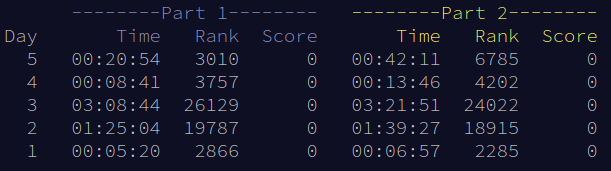

---
# Copyright (c) Gagah Pangeran Rosfatiputra (GPR) <gpr@gagahpangeran.com>.
# Licensed under CC-BY-NC 4.0.
# Read the LICENSE file inside the 'content' directory for full license text.

title: "Parsing Input is Hard (AoC 2022 Day 1-5)"
date: "2022-12-08T17:00:00+07:00"
featuredImage: "./img/jankenpon-stack.png"
tags: ["Advent of Code", "Tech"]
lang: "en"
---

For the past few days, I'm doing some puzzle challenge in [Advent of Code][aoc].
Basically you are given a puzzle and you can solve it with some kind of
programming. There will be one puzzle for each day from 1 until 25 December. You
can check about it on their website for more info.

<!-- excerpt -->

Last year I also solved some AoC problem but couldn't finished all of it. I only
got 31 out of 50 stars. This year I hope that I can solve all of the puzzles.

Each puzzle usually has problem statement and input. The problem statement
itself usually a long story with some explanation about what should we do with
the input. We have to solve it and get the correct answer to submit.

There are two parts for one problem but only one input for these two parts. Each
part usually will have different instruction. After you successfully submit the
correct answer for part one, then you can submit the answer for part two. You
will get one star for each part you successfully submit. So there will be 50
stars total for all parts.

I use C++ and Python to solve the problems. I choose those two programming
languages for no particular reason other than I usually use C++ in many online
judges like [Codeforce][cf] and Python for some problem with very hard input to
parse.

AoC input is not structured to be easy to parse. I think the input parsing
itself is also part of the problem. Because I'm not too familiar with string
parsing in C++, so I use Python because it's easier to use for parsing.

I also don't have to worry about complexity of my solution or some tricky corner
case because there is only one exact input for each problem. I can just
implement solution and some hack from the input given.

I will summarize my attempt to solve each problem from day 1 to day 5. A little
bit too late to post today for first 5 days, but maybe I will post on time for
the next 5 days.

If all my explanation above is confusing, you can go ahead and try it yourself.
You should read the problem statement first (and maybe solve it), so you
understand what I'm talking about bellow.

## Day 1: Calorie Counting

> [Full problem statement][day1problem]

Most of the beginning of the statement is just explanation about how to get
stars in AoC.

The problem is pretty straightforward, given list of numbers and that numbers
are grouped into several groups.

For part one, get the sum for each group and find the largest value of that sum
to get the answer.

I just create array of the sum and the find the maximum element of that array.

For part two, find the top three largest value of that sum then add those three
value to get the answer.

Fortunately the part two is not too different, so I just change it to sort the
array by descending order then sum the first three of its elements.

> [Solution Code][day1solution]

## Day 2: Rock Paper Scissors

> [Full problem statement][day2problem]

After reading the problem, this is basically this is just some kind of 'Rock
Paper Scissor' game.

The input is list of symbol `{A,B,C} {X,Y,Z}`.

- `A` and `X` : **Rock**.
- `B` and `Y` : **Paper**.
- `C` and `Z` : **Scissors**.

For part one, the symbol on the left (`A,B,C`) is the opponent moves and symbol
on the right (`X,Y,Z`) is our move. We get score for each result.

- **Lose** : `0`.
- **Draw** : `3`.
- **Win** : `6`.

Also you got extra point for each move you use.

- **Rock** : `1`.
- **Paper** : `2`.
- **Scissors** : `3`.

Get the total score for all the result of all moves in the input.

For this part, I just convert the symbol to number and then compare it to get
the result.

This is some part of the code.

```cpp
  // op is opponent move, and me is my move
  res += me - 'X' + 1; // extra point for each move
  if (op - 'A' == me - 'X') // draw
    res += 3;
  else if (op - 'A' < me - 'X') // win
    res += 6;
```

I run the solution and submit the answer and then... wrong answer.

I think a bit and stare at my code then realize the bug of my solution.
Condition `op - 'A' < me - 'X'` does not always mean a **win** because. When
`op` is `A` (Rock) and `me` is `Z` (Scissors), it means a **lose**.

So because I'm too lazy to find some math formula for it, I just do some manual
comparison to determine a **win**.

```cpp
  // op is opponent move, and me is my move
  res += me - 'X' + 1; // extra point for each move
  if (op - 'A' == me - 'X') // draw
    res += 3;
  else if (me == 'X' && op == 'C' || // win
           me == 'Y' && op == 'A' ||
           me == 'Z' && op == 'B')
    res += 6;
```

Now for part two, a bit different. The second symbol is the result you should
get.

- `X` : **lose**.
- `Y` : **draw**.
- `Z` : **win**.

The goal is the same as before, get the total score based on the win/draw/lose
result + extra score from move you play.

First I think that I should implement solution to manually check all possible
condition just like before. But then I get some nice solution using modulo
operation.

I implement my solution and then submit the answer... then of course wrong
answer for the first attempt.

Then I remember that in C++, modulo operation with negative number can result to
negative number. I search from some of my old code to handle this and found this
function.

```cpp
int mod(int a, int b)
{
  return (a % b + b) % b;
};
```

Just replace the modulo operation using that function and I get correct answer.

> [Solution Code][day2solution]

## Day 3: Rucksack Reorganization

> [Full problem statement][day3problem]

The input is list of strings.

For part one, we divide each string into two and both have the same length. We
have to find the same character from both half and then convert it to priority.

- `a` through `z` have priorities `1` through `26`.
- `A` through `Z` have priorities `27` through `52`.

We have to find the sum of those priorities.

Pretty straightforward, I just implement it and then run with the sample input.
Then I get different answer compare to the answer of sample input.

After some debugging, turns out for each string, we only have to find the same
character exactly once. My code consider duplicate character also part of it.
The easiest solution is just convert the string to set of char, so there will be
no duplicate character.

Okay, this solution is correct.

For part two it's different problem. For every 3 strings, find the same
character from those strings then do the same as part one.

Because I'm too lazy to find the 'clever' solution. I just make three loops to
find the character.

First loop, compare set of char (from string 1) and string 2 then insert the
same character from those two into new set.

Second loop, compare the result of set before to string 3 then insert the same
character from those two into new set (basically the same).

Finally third loop, the result of set before contains the same character from
those three strings, so I just need to convert it to priority.

So many code duplication but whatever, I can't think any more good solution for
this part.

If you confuse about my solution for this problem, just read the code from the
link bellow.

> [Solution Code][day3solution]

## Day 4: Camp Cleanup

> [Full problem statement][day4problem]

The input is list of pair of ranges.

For part one, count how many pair that one of its range is inside another range.
Here is the sample input.

```
2-4,6-8
2-3,4-5
5-7,7-9
2-8,3-7
6-6,4-6
2-6,4-8
```

This is straightforward, but for me the hard part is parsing the input with C++.
So I just go straight to implement the solution with Python.

I can just split the string using built in method in Python and easily get the
range of both value.

```python
from sys import stdin

for s in stdin:
    a, b = s.strip().split(',')
    la, ra = map(int, a.split('-')) # range a
    lb, rb = map(int, b.split('-')) # range b

```

Then I just check if `la <= lb <= rb <= ra` or `lb <= la <= ra <= rb`. The first
condition means range `b` is inside the range `a` and the second one is vise
versa. I submit the answer and correct.

For part two, count how many pair that overlap each other range.

First solution that I implement is just to check if `ra <= lb` or `rb <= la` and
think it's enought to assume both condition is to check overlap.

I run the solution and submit the answer then... wrong answer.

I try to think for a while and then realize I also have to check the other end
of the range has to be outside another range.

Because I don't want to type too many condition, I just count how many pair that
does not overlap with condition `ra < lb` or `rb < la`. Then I just subtract the
total of pair to it to get the answer.

> [Solution Code][day4solution]

## Day 5: Supply Stacks

> [Full problem statement][day5problem]

The input has two parts. The first part is the stacks of character and next part
is the query. The query has structure "move `n` from `a` to `b`".

For part one, each query we have to move `n` character from stack `a` to stack
`b`. Because this is a stack, the operation LIFO (Last In First Out). So we have
to move `n` character from top of stack `a` one by one to top of stack `b`.

Simple enough.

But the challenge itself for me is to parse the stack. Here is the sample input
of the stack.

```
    [D]
[N] [C]
[Z] [M] [P]
 1   2   3
```

The input looks hard to parse. I immediately use Python to try to implement the
input parser first.

After about several minutes trial and error to create the input parser, I give
up. I just modify the input to something that easier to parse.

I check the actual input for the problem and the number of stacks is only 9. So
it's doable to manually change it.

I manually modify the input of the stack to something like this.

```
3
Z N
M C D
P
```

The number at the top indicate how many stack for the input bellow it. Now it's
easier to parse.

For the second part, instead of move `n` character from top of the stack one by
one, you have to move the top `n` character from stack `a` to `b` without
changing its position.

I spent most of the time debugging my code because I forget that list in Python
is mutable and I got wrong answer for several submission.

> [Solution Code][day5solution]

## Closing

I'm sorry if my explanation above is bad. At least I try to tell what I'm doing
and every struggle for each problem.

The problem for this first 5 days is still pretty straightforward. My biggest
struggle is of course the day 5 because of the unortodox input formatting.

Usually the difficulty spike (for me) starts from day 10. Then I can't solve any
problem on the last few days. But I hope for this year, at least I can solve all
of the problem even though I can't solve the problem at the same day.

This is my stats for day 1 to 5.



Only top 100 that get score, other than that will get zero score. You can take a
look at [AoC leaderboard][leaderboard].

I start late in day 2 because it's Friday and I have Jumu'ah Prayer at noon.
Also start very late in day 3 because I forget about AoC that day. That makes me
to set reminder everyday to do AoC everyday.

You can check my solution for this AoC on [this github repo][repo].

Maybe I should start to write the post for day 6 to 10, so I can finish and post
it on time. Let's see...

[aoc]: https://adventofcode.com
[cf]: https://codeforces.com
[day1problem]: https://adventofcode.com/2022/day/1
[day1solution]:
  https://github.com/gagahpangeran/advent-of-code/blob/master/2022/01/sol.cpp
[day2problem]: https://adventofcode.com/2022/day/2
[day2solution]:
  https://github.com/gagahpangeran/advent-of-code/blob/master/2022/02/sol.cpp
[day3problem]: https://adventofcode.com/2022/day/3
[day3solution]:
  https://github.com/gagahpangeran/advent-of-code/blob/master/2022/03/sol.cpp
[day4problem]: https://adventofcode.com/2022/day/4
[day4solution]:
  https://github.com/gagahpangeran/advent-of-code/blob/master/2022/04/sol.py
[day5problem]: https://adventofcode.com/2022/day/5
[day5solution]:
  https://github.com/gagahpangeran/advent-of-code/blob/master/2022/05/sol.py
[leaderboard]: https://adventofcode.com/2022/leaderboard
[repo]: https://github.com/gagahpangeran/advent-of-code
