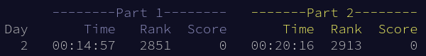

---
# Copyright (c) Gagah Pangeran Rosfatiputra (GPR) <gpr@gagahpangeran.com>.
# Licensed under CC-BY-NC 4.0.
# Read the LICENSE file inside the 'content' directory for full license text.

title: "Parsing is Hard, Naming Variable is Harder (AoC 2023 Day 2)"
date: "2023-12-02T22:00:00+07:00"
featuredImage: "./img/rgb.png"
tags: ["Advent of Code", "Tech"]
lang: "en"
---

It's day 2 and I'm already feeling tired to write AoC post. I'm writing this
post while half asleep and slowly typing with a lots of typo every three words.

<!-- excerpt -->

Somehow today I feel like I'm doing the puzzle very slow for an easy problem.

First, I need to read the problem statement at least three times to understand
the problem. Maybe because I'm feeling tired today and just want to lazying
around on the weekend.

Second, the input of today's problem is not trivial to parse. One of my weakness
when doing AoC is parsing the input. I usually use Python when the input format
is not easy to parse for me to implement. But then I spent most of the time to
code the input parser of my program for at least 10 minutes.

Third, I also spent so much time to naming my variable. When I'm coding the
solution, I need to read again the problem statement to naming my variable. Then
I become confused what to name my variable and decided just to naming it
anything that come up in the problem statement.

## Day 2: Cube Conundrum

> [Full problem statement][problem]

For each line of input is a game. For each game, there are list of each colors
(red, green, blue) and their count. Basically input below can be transform into
table.

```
Game 1: 3 blue, 4 red; 1 red, 2 green, 6 blue; 2 green
```

**Game 1**

```
| red | green | blue |
| --- | ----- | ---- |
| 0   | 3     | 4    |
| 1   | 2     | 6    |
| 0   | 2     | 0    |
```

For the first part, I need to check for each row, the count of each colors does
not exceed certain given number. If all row is pass then that game is
_possible_. Then I need to get the sum of IDs of the game that are _possible_.

Just like I said before, this problem is easy but I need to read the problem
statement multiple times to understand it and then parse the input into data
structure that I want to solve the problem.

For the second part, I need to get the maximum count of each color for all row.
Then to get the _power_ of that game, I need to multiply all of that maximum
count together. Then I need to get the sum of all _power_ of the game.

For this part, it's a bit easier because I already parse the input and only need
to add a little bit of code.

> [Solution Code][solution]

## Closing

Finally the post is almost over. I'm successfully write the second post of AoC
this year. I hope this is not the last post of this year's AoC that I wrote.

And here is some day 2 stats.



Oh yeah, today I did not start late. As you can see I spent almost 15 minutes
for part one. Then part two is easy breezy. 20 minutes is not bad for me.

Okay that's it. Now I want to sleep after posting this.

[problem]: https://adventofcode.com/2023/day/2
[solution]:
  https://github.com/gagahpangeran/advent-of-code/blob/master/2023/02/sol.py
