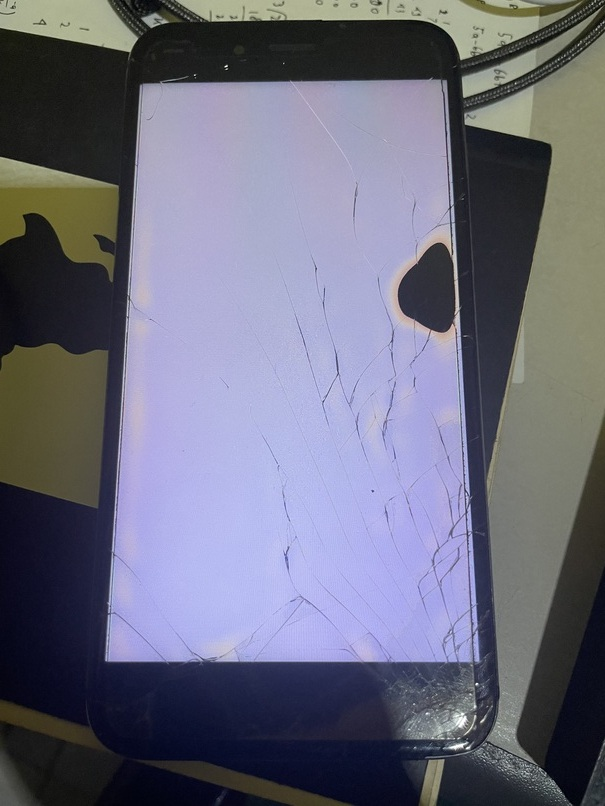
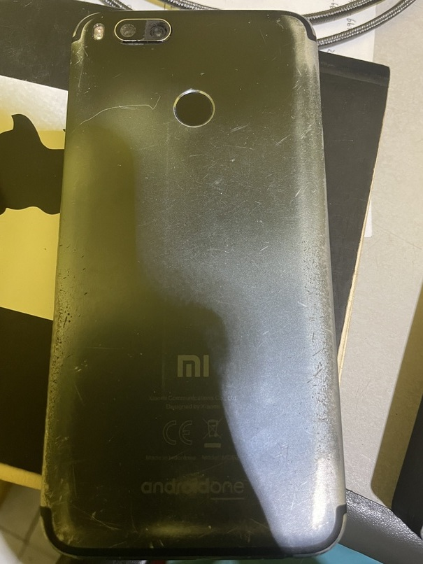
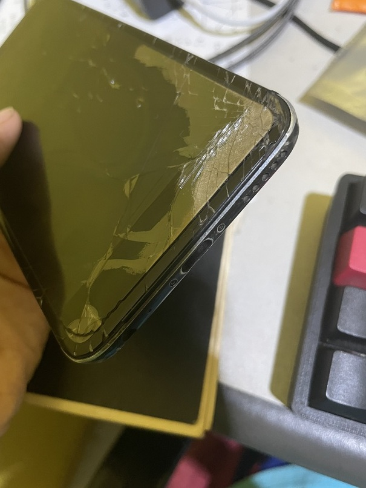
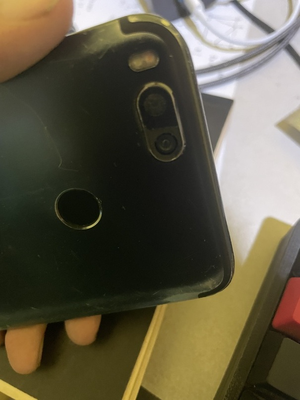
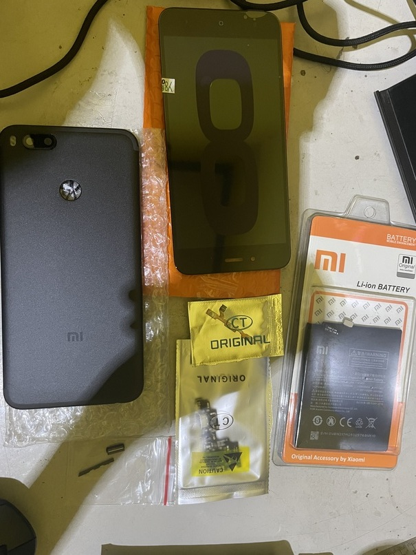
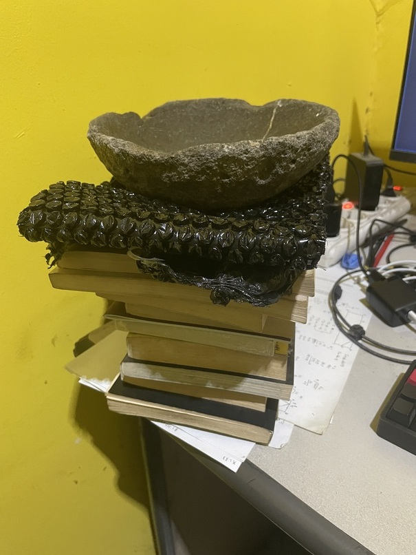
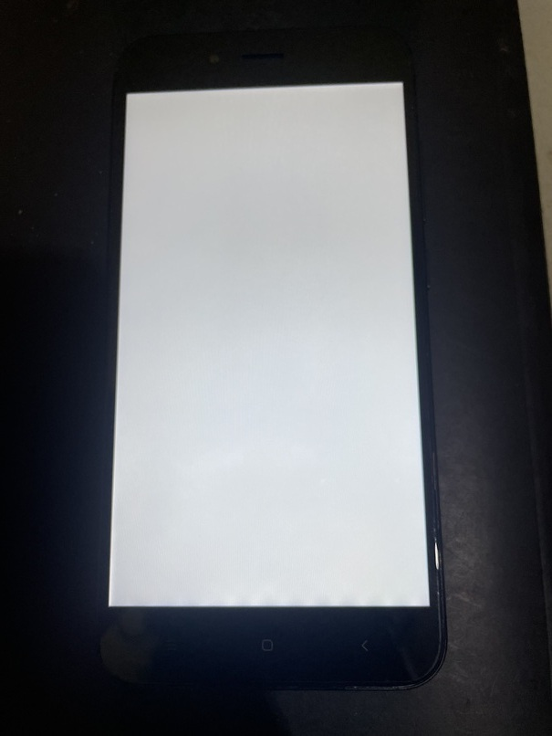
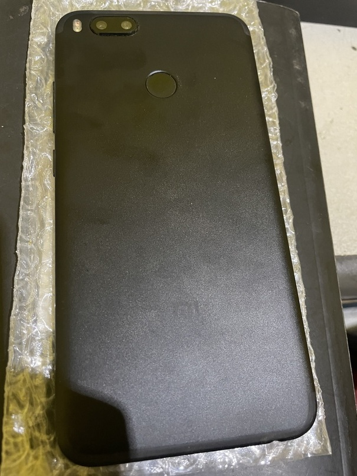
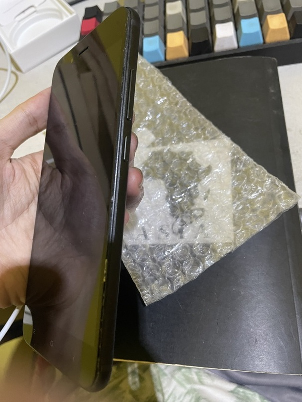
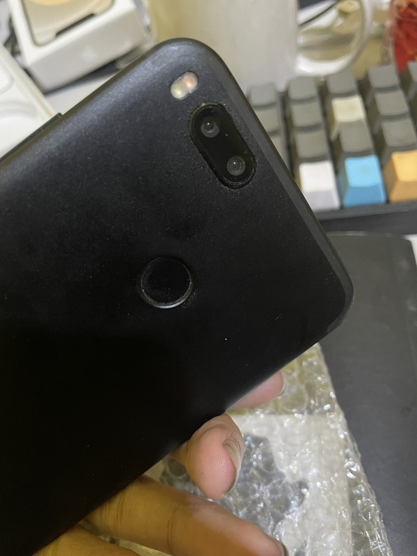

---
# Copyright (c) Gagah Pangeran Rosfatiputra (GPR) <gpr@gagahpangeran.com>.
# Licensed under CC-BY-NC 4.0.
# Read the LICENSE file inside the 'content' directory for full license text.

title: "Repairing My 7 Years Old Phone"
date: "2024-11-08T23:50:00+07:00"
featuredImage: "./img/result-before-after.png"
tags: ["Self Repair", "Xiaomi", "Android"]
lang: "en"
---

I have this phone for 7 years. It has felt a lot of pain and suffering from me.
So about three months ago, I decided to repair it and give it a new life.

<!-- excerpt -->

This phone is Xiaomi Mi A1 and I bought it as a promotional Android One Phone
in 2017. The price is very cheap for the spec at that time. It used stock
android from Google (not the Xiaomi os) and got two major android version
upgrade support. After that I change the OS to LineageOS.

## Condition Before Repair

So this is the phone condition after 7 years of use.

The first time the phone fell from my desk and the corner hit the floor. It only
caused minor crack on the corner of the screen.

The second time, it fell again from my jacket pocket when I rode motorcyble and
then it got run over by car. It caused more screen crack, dead pixel, broken
camera lens and slighly broken USB C port.

The phone is still working fine and I'm still using it in this condition. The
annoying part is just there are big black patch on my screen and slightly loose
charger port.

## Repair Process

After about a year using this phone in this condition, I decide to repair it
myself instead of buy a new one. It is cheaper to do this because the phone is
still working file.

I bought these new spare parts:

- Screen
- Back case
- Power and volume button
- Power and volume flex cable
- Port module
- Battery

I also bought the glue for the screen and I'm surprised with the size of the
glue.

")

Maybe I should open my own repair shop because this glue can be used to repair
1000 more screens.

Okay, let's start the repair.

First I open the back case and then I took off the port module.

 and old (below) port module")

The old one is very loose and the cable often came off from the port when
charging. Any USB-C cable can only charge with the old port and can't connect to
computer.

It's very annoying to me because everytime I want to transfer file from my phone
to computer, I can't do it using wired connection.

After that, I remove the battery. It is easy to remove battery because the old
one is not the original battery.

 and new (below) battery")

I have replaced the battery once, so the glue is not too sticky anymore. I was
using some third party brand, but for this new battery I am using the Xiaomi
brand.

After the battery is removed, I took off the screen flex cable and try to remove
the screen. It's a bit hard because the screen is already shattered and the glue
is still very sticky.

, old screen (middle), and new screen (right)")

I managed to took off the screen but also broke the screen even more in the
process. Who cares, I will replace it anyway.

I connect the flex cable of new screen and connect the new battery without
gluing them for testing.

When the phone turned on, I test the touchscreen but no response. I checked
again and realized the touchscreen flex cable was not connected. So I have to
turn off the phone by removing the battery because I couldn't use the touch
screen.

After checking the touchscreen and battery was working, then I glued them.

 and old (right) volume & power flex cable")

 and old (right) back case")

Lastly I replace the flex cable and back case.

Finally, for clamping the new screen after gluing. I place it under the stack of
books (and also [cobek](https://id.wikipedia.org/wiki/Cobek_dan_ulekan)).

## Final Result

Overall I am satisfied with my own work.

Maybe I will be still using this phone for next few years in the future.

Who knows?
