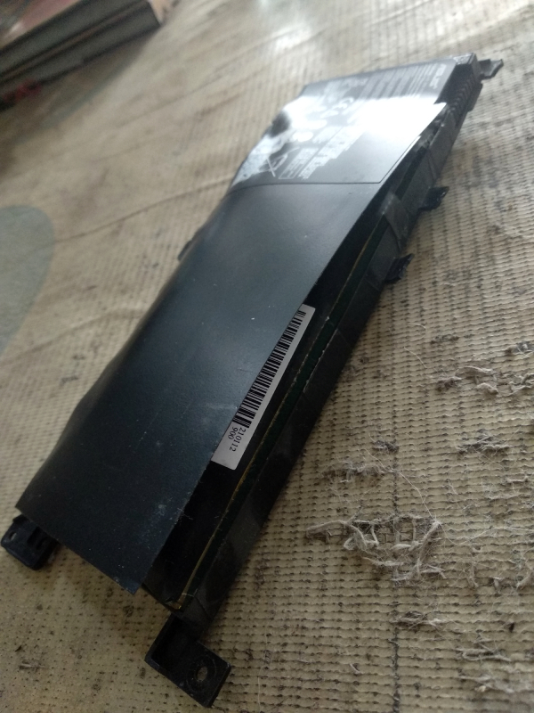
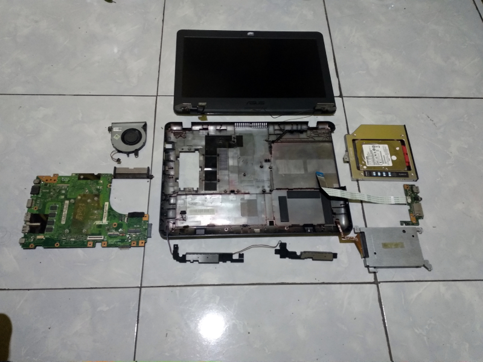
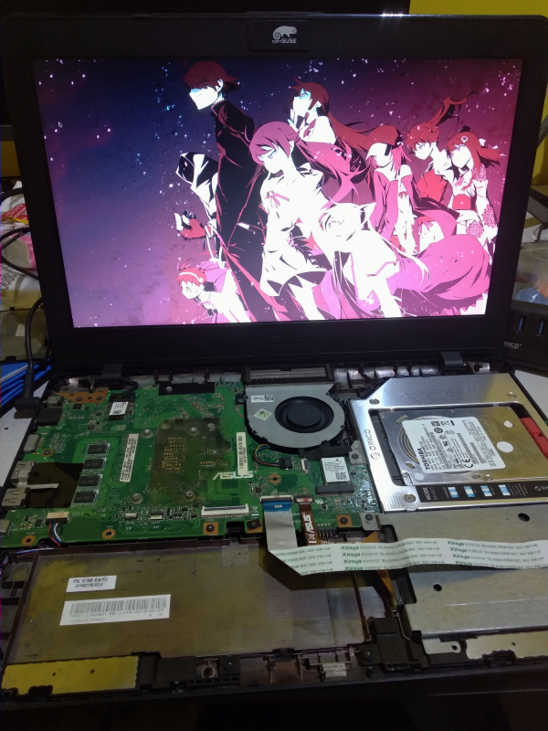
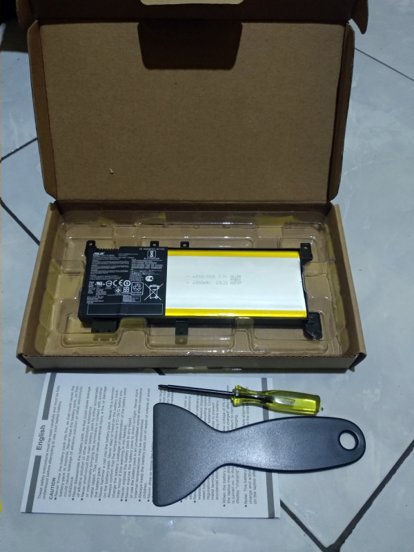

---
# Copyright (c) Gagah Pangeran Rosfatiputra (GPR) <gpr@gagahpangeran.com>.
# Licensed under CC-BY-NC 4.0.
# Read the LICENSE file inside the 'content' directory for full license text.

title: "Spicy Pillow"
date: "2025-05-16T13:00:00+07:00"
featuredImage: "./img/battery-swollen1.jpg"
tags: ["Self Repair", "Battery", "Asus Laptop"]
lang: "en"
---

This pillow is not so comfy.

<!-- excerpt -->

Just like [previous post][lebaran2025], I plan to write this post in early
April. But because I'm lazy, the post is delayed. So here it is.

---

In the morning of 28th March 2025, I saw my laptop is bloated. I saw that the
battery inside is swollen. Because I did not want anything bad to happened, I
quickly open the laptop and remove the battery.

")

My laptop is Asus A442UQ and I use it daily since I bought it in 2018. The
current battery is not the original, I changed it once in 2021.

For the past three months, the battery is not charge properly. It can only hold
for about 30 minutes before suddenly the laptop turned off itself. So I always
plug in the charger when I'm using the laptop since then. Maybe this causing the
battery to swollen.

I like to repair my own things, you can read about [my phone repair
post][phonerepair]. So, I can just order a new battery and install it by myself.

The problem is... this happened just a few days before Eid al-Fitr in Indonesia.
So all of the electronic shop was closed for holiday until 7th April 2025. I
couldn't buy new battery until then.

Meanwhile, because I already opened the laptop. I decided to disassembly all the
parts and clean the inside of my laptop.

So for temporary solution, I just plugged in the charger directly without any
battery. It works well and I hope my laptop is not exploded until I received the
new battery.

Fast forward to 7th April 2025, I ordered the new battery. Two days later the
battery arrived.

I unboxed the package and there are other things other than battery in it. I
also got bonus screwdriver, safety instructions, and plastic spatula. I didn't
know what the plastic spatula for, but I took the free screwdriver.

In the end the battery works well and there is no problem for one month I'm
using it until now. Let's see when will the next time I change this battery
again in the future.

Cheers!

[lebaran2025]: /blog/lebaran-2025/
[phonerepair]: /blog/repairing-my-7-years-old-phone/
