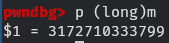
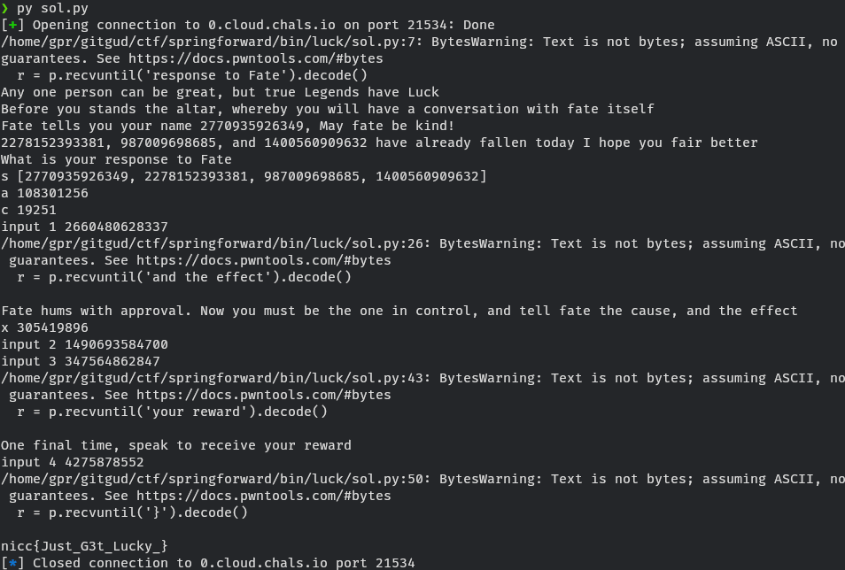

---
# Copyright (c) Gagah Pangeran Rosfatiputra (GPR) <gpr@gagahpangeran.com>.
# Licensed under CC-BY-NC 4.0.
# Read the LICENSE file inside the 'content' directory for full license text.

title: "SpringForwardCTF Writeup"
date: "2024-05-01T20:00:00+07:00"
featuredImage: "./img/lcg.png"
tags: ["CTF", "Writeup", "LCG", "Modular Arithmetic", "Reverse Engineer", "Pwn"]
lang: "en"
---

My head hurts when solving this problem.

<!-- excerpt -->

Usually on the weekend, I open [CTFtime][ctftime] and register as solo team to
random CTF events to solve some problem just for fun.

Last weekend I solve two problems from [SpringForwardCTF][sfctf]. But one of
them is very interesting for me. It's not too easy for me to just solve it
trivially and not too hard for me to impossible to solve. So I just want to
write how I solve that problem in this writeup.

You can see the original [problem statement][problem] on their platform, but I
provide it below in case it is down.

## Problem Statement

**TestofLuck**

- Category : **Bin**
- Tags : `medium`, `bin`
- Score : 731 (35 Solves)

Speak with Fate itself to earn your flag

Developed by: [Robert Blacha][author]

`nc 0.cloud.chals.io 21534`

<details>
  <summary>View Hint</summary>
  <blockquote>It might be possible to predict fate itself</blockquote>
</details>

file : [testOfLuck][testofluck]

## Solving the Problem

First, let's open the binary file using Ghidra to reverse engineered it. I get
the following code (with some variable renamed by me for clarity).

```c
undefined8 main(void)
{
  FILE *pFVar1;

  setvbuf(stdin,(char *)0x0,2,0);
  setvbuf(stdout,(char *)0x0,2,0);
  setvbuf(stderr,(char *)0x0,2,0);
  pFVar1 = fopen("settings.txt","rb");
  __isoc99_fscanf(pFVar1,&DAT_00102142,&seed);
  __isoc99_fscanf(pFVar1,&DAT_00102142,&a);
  __isoc99_fscanf(pFVar1,&DAT_00102142,&c);
  vuln();
  return 0;
}
```

We can see in this `main` function there is not something interesting. It just
open the file `settings.txt` to read the value of three lines as variable
`seed`, `a`, and `c`, and then calling the `vuln` function.

For simplicity to following this write up and testing locally, you can create
file `settings.txt` with these value. I will explain about it later.

```txt
911718783502
244906032
4429
```

Next, let's see the `vuln` function.

```c
void vuln(void)
{
  undefined8 rand0;
  long in_FS_OFFSET;
  ulong input_value;
  undefined8 rand1;
  undefined8 rand2;
  undefined8 rand3;
  ulong rand4;
  long local_10;

  local_10 = *(long *)(in_FS_OFFSET + 0x28);
  input_value = 0;
  puts("Any one person can be great, but true Legends have Luck");
  puts("Before you stands the altar, whereby you will have a conversation with fate itself");
  rand0 = LCGrandom(0);
  printf("Fate tells you your name %lu, May fate be kind!\n",rand0);
  rand1 = LCGrandom(0);
  rand2 = LCGrandom(0);
  rand3 = LCGrandom(0);
  printf("%lu, %lu, and %lu have already fallen today I hope you fair better\n",rand1,rand2,rand3);
  puts("What is your response to Fate");
  __isoc99_scanf(&DAT_00102142,&input_value);
  rand4 = LCGrandom(0);
  if (rand4 != input_value) {
    puts("Fate grows silent");
    exit(1);
  }
  puts(
      "Fate hums with approval. Now you must be the one in control, and tell fate the cause, and the  effect"
      );
  __isoc99_scanf(&DAT_00102142,&input_value);
  rand4 = LCGrandom(input_value);
  __isoc99_scanf(&DAT_00102142,&input_value);
  if (rand4 != input_value) {
    puts("Fate grows silent");
    exit(1);
  }
  puts("One final time, speak to receive your reward");
  __isoc99_scanf(&DAT_00102142,&input_value);
  rand4 = LCGrandom(0);
  if (rand4 != (input_value >> 32 ^ 0x12345678) + (input_value << 32 ^ 0xfedcba9800000000)) {
    puts("Fate grows silent");
    exit(1);
  }
  printFlag();
  if (local_10 != *(long *)(in_FS_OFFSET + 0x28)) {
    __stack_chk_fail();
  }
  return;
}
```

You see that at the start of this function, it gives us a long text with four
random values generated by`LCGrandom` function.

Our first input should matches the next random value generated by this function.
How can we guess that? Let's see inside the function `LCGrandom`.

```c
ulong LCGrandom(long param_1)
{
  long lVar1;

  if (param_1 != 0) {
    seed = param_1;
  }
  lVar1 = longMult(seed,a);
  seed = (ulong)(lVar1 + c) % m;
  return seed;
}
```

This function accept a parameter `param_1`. If the value is not `0`, it uses
`param_1` as `seed`. And then it calls `longMult` function with variable `seed`
and `a` as parameter.

The variable `seed`, `a`, and `c` in this function is the global variable with
value that we read from `settings.txt` file in `main` function.

Once again, let's see inside the function `longMult`.

```c
ulong longMult(ulong seed,long a)
{
  ulong sd;
  ulong ii;

  sd = seed;
  for (ii = 0; ii < a - 1U; ii = ii + 1) {
    sd = (sd + seed) % m;
  }
  return sd;
}
```

We can see that this function is basically just doing calculation of
$(seed \cdot a) \bmod m$.

If we go back and see the `LCGrandom` function, the result of `longMult`
function then added with `c` and then modulo `m`.

So basically the whole `LCGrandom` function is just this calculation

$$
(seed \cdot a + c) \bmod m
$$

If you search keyword `lcg random`, you will get result article in wikipedia
about [Linear Congruential Generator][lcgwiki] and indeed this function is using
this algorithm to generate random number.

The generated random number depends on the previous generated random number. So
we can guess the value of the next random number if we have some consecutive
number generated by this function.

Let's run the program to get some example. Wait a bit because this function
doing many multiplication of large number.

Here is the first output.

```txt
Any one person can be great, but true Legends have Luck
Before you stands the altar, whereby you will have a conversation with fate itself
Fate tells you your name 512492391765, May fate be kind!
183481182527, 3022872323066, and 1338496894763 have already fallen today I hope you fair better
What is your response to Fate
```

We get four number $512492391765$, $183481182527$, $3022872323066$,
$1338496894763$ but we dont know the original value of `seed`, `a`, and `c`. (we
know the value from `settings.txt` file locally, but we don't know the value of
it on the remote program)

Notice that from these four values, we have four equations.

$$
\begin{align*}
s_1 &\equiv a s_0 + c \equiv 512492391765 &\pmod m \\
s_2 &\equiv a s_1 + c \equiv 183481182527 &\pmod m \\
s_3 &\equiv a s_2 + c \equiv 3022872323066 &\pmod m \\
s_4 &\equiv a s_3 + c \equiv 1338496894763 &\pmod m \\
\end{align*}
$$

The value of $s_0$ is the `seed`.

If we substract $s_3$ and $s_2$ we can get the value of $a$.

$$
\begin{align*}
s_3 - s_2 &\equiv (a s_2 + c) - (a s_1 + c) &\pmod m \\
s_3 - s_2 &\equiv a s_2 - a s_1 &\pmod m \\
s_3 - s_2 &\equiv a (s_2 - s_1) &\pmod m \\
a &\equiv (s_3 - s_2)(s_2 - s_1)^{-1} &\pmod m
\end{align*}
$$

_Note: $(s_2 - s_1)^{-1}$ above is inverse modulo of $s_2 - s_1$_.

Oh yeah, I almost forget, to get the value of `m` we can just run the program in
gdb and print it because it is a global variable.



The value of `m` is $3172710333799$ and it is a prime number. Perfect!

The code is something like this.

```python
s = [512492391765, 183481182527, 3022872323066, 1338496894763]

m = 3172710333799

a = ((s[1] - s[2]) * pow(s[0] - s[1], -1, m)) % m
print('a', a)
```

Run the program and we get the value of $a$, it is $244906032$. The same value
as we write in `settings.txt`. So far so good.

Next, to get the value of $c$. Because we already know $a$, we can get $c$ like
this.

$$
\begin{align*}
s_2 &\equiv a s_1 + c &\pmod m \\
c &\equiv s_2 - a s_1 &\pmod m
\end{align*}
$$

```python
# continue from before

c = (s[1] - a * s[0]) % m
print('c', c)
```

Run the program and we get $c$ is $4429$, the same value in `settings.txt`.

Now we know the value of $a$ and $c$, we can predict next value of `LCGrandom`
function.

```python
# continue from before

next = (a * s[-1] + c) % m
print('input 1', next)
```

We get number $2406234343727$ for the $s_5$, let's try enter it to the
`testOfLuck` program. Here is the output

```txt
Any one person can be great, but true Legends have Luck
Before you stands the altar, whereby you will have a conversation with fate itself
Fate tells you your name 512492391765, May fate be kind!
183481182527, 3022872323066, and 1338496894763 have already fallen today I hope you fair better
What is your response to Fate
2406234343727
Fate hums with approval. Now you must be the one in control, and tell fate the cause, and the effect
```

We successfully enter the correct value.

Okay for the 2nd input, let's get back to the code.

```c
...

  puts(
      "Fate hums with approval. Now you must be the one in control, and tell fate the cause, and the  effect"
      );
  __isoc99_scanf(&DAT_00102142,&input_value);
  rand4 = LCGrandom(input_value);
  __isoc99_scanf(&DAT_00102142,&input_value);
  if (rand4 != input_value) {
    puts("Fate grows silent");
    exit(1);
  }
  puts("One final time, speak to receive your reward");
  __isoc99_scanf(&DAT_00102142,&input_value);
  rand4 = LCGrandom(0);
  if (rand4 != (input_value >> 32 ^ 0x12345678) + (input_value << 32 ^ 0xfedcba9800000000)) {
    puts("Fate grows silent");
    exit(1);
  }
  printFlag();

...
```

The 2nd input is become the value of `LCGrandom` parameter. Then the 3rd input
should be the same with the result of `LCGrandom` with out 2nd input as
parameter.

If you notice, we can just enter `0` for the 2nd input and then enter the $s_6$
value of the LCG for the 3rd input.

But let's not forget the 4th input. It is used to generate the value for this
calculation.

```c
(input_value >> 32 ^ 0x12345678) + (input_value << 32 ^ 0xfedcba9800000000)
```

And the result should be the same with the $s_7$ value of the LCG.

It's very difficult, we know the value of $s_7$ but we can reverse it to get the
4th input value, because the shift operation is not reversible operation.

But we can think it backward.

We decided what is the 4th input value and then reverse the operation to get 3th
input and 2nd input.

Let's get back to look at this calculation. I use `n` as the variable for the
4th input and `x` as the result variable.

```c
x = (n >> 32 ^ 0x12345678) + (n << 32 ^ 0xfedcba9800000000)
```

Notice that `(n >> 32 ^ 0x12345678)` will produce the low 32 bit of the result
and `(n << 32 ^ 0xfedcba9800000000)` will produce the high 32 bit of the result.
So we will get 64 bit number as the result.

But we know the maximum value of `x` is `m` because it is the result from
`LCGrandom` function. So we have to get this `x` value less than `m`.

We can achieve this by "turning off" the high 32 bit. So we want the result of
`(n << 32 ^ 0xfedcba9800000000)` is `0` by using `n = 0xfedcba9800000000 >> 32`.

```python
# continue from before

n = 0xfedcba9800000000 >> 32
x = (n >> 32 ^ 0x12345678) + (n << 32 ^ 0xfedcba9800000000)
print('x', x)
```

Now we get the `x` value is $305419896$ and it is less than `m`.

We know that for the 2nd input, we can use it as parameter of `LCGrandom`
function and the function will use it as new seed if the value is not `0`. So to
get the 2nd input, we just have to get it backward.

Now we have two equations. I use $t_0$ as variable of the 2nd input (or the new
seed) and $t_1$ as variable of the 3rd input.

$$
\begin{align*}
t_1 &\equiv a t_0 + c &\pmod m \\
x &\equiv a t_1 + c &\pmod m
\end{align*}
$$

Because we know the value of $x$ now, we can get $t_0$.

$$
\begin{align*}
x &\equiv a (a t_0 + c) + c &\pmod m \\
x &\equiv a^2 t_0 + ac + c &\pmod m \\
a^2 t_0 &\equiv x - ac - c &\pmod m \\
t_0 &\equiv (x - ac - c) (a^2)^{-1} &\pmod m
\end{align*}
$$

Then we can get $t_1$ because we already know $t_0$

Here's the code.

```python
# continue from before

t0 = ((x - a*c - c) * pow(a * a, -1, m)) % m
print('input 2', t0)

t1 = (a * t0 + c) % m
print('input 3', t1)

print('input 4', n)
```

And here is the output.

```txt
Any one person can be great, but true Legends have Luck
Before you stands the altar, whereby you will have a conversation with fate itself
Fate tells you your name 512492391765, May fate be kind!
183481182527, 3022872323066, and 1338496894763 have already fallen today I hope you fair better
What is your response to Fate
2406234343727
Fate hums with approval. Now you must be the one in control, and tell fate the cause, and the effect
1165573931088
2427215753957
One final time, speak to receive your reward
4275878552
[1]    25609 segmentation fault (core dumped)  ./testOfLuck
```

Oops, I forget to add file `flag.txt` for local testing. You can create the file
with this content.

```txt
nicc{fake-flag}
```

So here is the complete code with addition of `pwntools` and little bit of
modification.

```python
from pwn import *
import re

# p = process('./testOfLuck')
p = remote("0.cloud.chals.io", 21534)

r = p.recvuntil('response to Fate').decode()
print(r)

s = list(map(int, re.findall(r'\d+', r)))
print('s', s)

m = 3172710333799

a = ((s[1] - s[2]) * pow(s[0] - s[1], -1, m)) % m
print('a', a)

c = (s[1] - a * s[0]) % m
print('c', c)

next = (a * s[-1] + c) % m
print('input 1', next)

p.sendline(str(next).encode())

r = p.recvuntil('and the effect').decode()
print(r)

n = 0xfedcba9800000000 >> 32
x = (n >> 32 ^ 0x12345678) + (n << 32 ^ 0xfedcba9800000000)
print('x', x)

t0 = ((x - a*c - c) * pow(a * a, -1, m)) % m
print('input 2', t0)

p.sendline(str(t0).encode())

t1 = (a * t0 + c) % m
print('input 3', t1)

p.sendline(str(t1).encode())

r = p.recvuntil('your reward').decode()
print(r)

print('input 4', n)

p.sendline(str(n).encode())

r = p.recvuntil('}').decode()
print(r)
```



**Flag**

```txt
nicc{Just_G3t_Lucky_}
```

## Closing

I was solving this problem on the saturday night when I had a bad headache
because of sleep deprivation. I was also joining Discord voice call while one of
my friend streaming some film for watch together.

So basically I can't concentrate fully. I also need to relearn about modular
arithmetic to solve this problem. My head hurts.

And by the time already 2 A.M., the movie is finished and I decided to sleep and
continue in the morning. I already find how to get the 1st input value and have
rough idea how to find the 2nd, 3rd, and 4th input value.

Next morning, I wake up without headache but when I start to think, my head
starts to hurt again. Looks like I shouldn't thinking to not get headache.

I create the program, get the flag, submit, and decided to sleep again.

[ctftime]: https://ctftime.org
[sfctf]: https://ctftime.org/event/2348
[problem]: https://springforward.ctfd.io/challenges#TestofLuck-36
[author]: https://www.github.com/robertblacha
[testofluck]: ./files/testOfLuck
[lcgwiki]: https://en.wikipedia.org/wiki/Linear_congruential_generator
