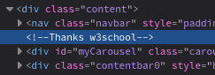
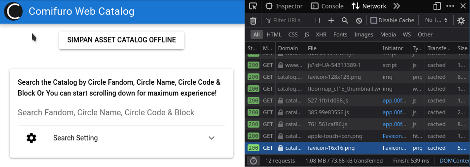

---
# Copyright (c) Gagah Pangeran Rosfatiputra (GPR) <gpr@gagahpangeran.com>.
# Licensed under CC-BY-NC 4.0.
# Read the LICENSE file inside the 'content' directory for full license text.

title: "That Time My Senpai Created A Catalog Page That Took Forever To Load"
date: "2022-09-23T14:00:00+07:00"
featuredImage: "./img/that-time.png"
tags: ["Story", "Comifuro", "Wordpress"]
lang: "en"
---

So basically the title is the summarize of this post. The title is intended to
sounds like many long [light novel][ln] title. The reason I want to write this
post is because there will be [Comifuro][cf] this weekend. Then I remember one
story from my friend about the Comifuro website.

<!-- excerpt -->

_For disclaimer, this story might be not accurate and maybe I forget some detail
about it._

## Flashback Story

I have a friend, we can call him 'VC', and meet him in my first year of my
college. He is a third year student when we met.

At the day when we first met, he told me that he created a new Comifuro website
for that year. At that time, the event was already over and I also attended it
but never checked the Comifuro website itself.

The website itself was just standard wordpress site. He got the job to create
new design and implement it as wordpress theme. He also had to create a new
catalog page with some basic search function.

And here is the interesting things that he told and I still remember about it
until now. He had no database access to the site so he did some workaround to
create the catalog page without database.

He created new wordpress page with custom theme for that page only. Then he
uploaded the CSV data to wordpress theme folder and then fetched and parsed that
CSV data on the front-end using javascript.

He told me, if you open the catalog page, there was no pagination on that page
and all of the images was fetched synchronously. So it would take forever to
wait until the page was fully loaded.

At least he got the job done and that catalog page is functional.

## Hunting The Source Code

Now, because I remember about this story, I decide to hunting the source code of
the website at that time. Fortunately, I can get it from web archive, so let's
get into it.

Start with finding the right snapshot of the comifuro website in the web
archive. Then I choose [this Comifuro website snapshot][snapshot1] right at
second day of the event that time.

I tried to inspect this home page first and hope to get something interesting.
And... I found two things.

The first one is this comment about thanks to w3school.



I assume this is about the carousel code bellow this comment. So I check the
[bootstrap carousel page][carousel] in w3school and compare them. And yes they
are the same code.


The second one is at near the bottom of the source code.


Yep, that's right! It's a reference for [how to center a div in
stackoverflow][stackoverflow]. I know everyone is struggling to do this simple
thing.

Even after discover this two things, still there is no evidence wheter this is
my friend's code or not. So let's get into my main objective, the catalog page.
Just single from main navigation at the top. I get into [this snapshot of web
catalog page][snapshot2].

As expected, the page is loading forever.

And after some digging in dev tools, finally I get this.


So, let's take a look of this code. You can see the full code from [this
gist][gistjs]

The first block of the code is confirmed the story about the data is fetched
from CSV file (and the file itself is part of wordpress theme).

```javascript
$(document).ready(function () {
  $.ajax({
    type: "GET",
    url: "https://web.archive.org/web/20170903130004/http://comifuro.net/wp-content/themes/mesocolumn/assets/images/circle/circle.csv",
    dataType: "text",
    success: function (data) {
      processData(data);
    }
  });
});
```

Here is the [original result][gistcsv] of the csv file. And this is the [table
view][gisttable] after some magic using
`column -s, -t < circle.csv | less -N -S` command.

As you can see this CSV file is the 'database' for this catalog page.

Next block of the code is also interesting.

```javascript
/* Showing all circles = O(n^2+n), kek */
function processData(allText) {
  var allTextLines = allText.split(/\r\n|\n/);
  var headers = allTextLines[0].split(",");
  var lines = [];

  for (var i = 1; i < allTextLines.length; i++) {
    var data = allTextLines[i].split(",");
    if (data.length == headers.length) {
      var tarr = [];
      for (var j = 0; j < headers.length; j++) {
        tarr.push(data[j]);
      }
      lines.push(tarr);
    }
  }
  showAllGrid(lines); // Show in Grid (No Pagination)
}
```

So this is the main bottleneck code of this page. It loads all of the data
without pagination in `O(n^2+n)` complexity (or `O(n^2)` because we can ignore
the second `n` term).

The next bad things about this catalog page without pagination is all of the
image is not compressed and fetched synchronously. So the page will be loading
forever until it loads all of the images.

The visitors of Comifuro at that time is supposed to access this catalog page if
they want to browse and search online. Just imagine they open this page via
mobile browser inside the building with bad internet signal, how long it will
take until the page is usable to browse and search.

## Doing Some Experiments

So I want to measure how long until the page is fully load. I'm using networking
dev tools in firefox to get the exact time.

My home internet connection is about 2 MB/s. Let's see the result!


_Weird_

I try once again to fully reload the page with <kbd>ctrl</kbd> +
<kbd>alt</kbd> + <kbd>R</kbd>. This time it shows the catalog content.


Based on the two tries above. The page and its resource are fully fetched for
about 2 minutes with my connection. It makes about thousand requests and
download about 150 MB resources.

Not too bad.

With raw calculation, `150 MB / 2 MB/s = 75 s`. 75 seconds or 1.25 minutes, a
bit far from 1.89 minutes in real result.

Once again I open the catalog with different browser. I'm using chromium this
time.


I don't know what happened, but chromium loads very slow for about 6 minutes.
The result is very far from firefox. Still the same about thousand requests but
it downloads only about 75 MB resources.

Maybe because I've open the page in firefox before so some of the resouces are
loaded from cache. Or maybe because external factor like the web archive itself
is slow. But another weird thing is chromium only fetchs 75 MB compare to
firefox with 150 MB resources. Honestly I dont know ¯\\\_(ツ)\_/¯

Well I don't want to thing about it now. But the thing that I want to check is
the page is loaded very slow. Maybe it was unusable for use case that I mention
before. Visitors open the catalog page using mobile browser inside the building
with bad internet signal.

At least the search function is implemented in front-end. So after the page is
loaded, you don't have to wait again to see the search result.

## Closing

Now I check [the current catalog][catalog] page, it's far better than this very
bad catalog page. In fact the next iteration of catalog page that I found in
[this snapshot][snapshot3] is already better by load all images asynchronously.

The current catalog page is very fast. It also has button to save the assets
catalog offline. The visitors can just download it on mobile browser it before
the event and then access it later.



I will be attending this event on this weekend to meet with my friends. But I
anticipate there will be so many visitors because this is the first offline
Comifuro event after two years of quarantine and also there's meet and greet
event with vtuber agency in this event. And for makes things worse, there's also
K-Pop concert at the same place with Comifuro. It means there will be sea of
people there.

I hope I can survived.

_Fun fact: the Comifuro 10 is announced and marketed as **CFX**. At the same
year, there's also COMPFEST X event and its branding is also CFX._

[ln]: https://en.wikipedia.org/wiki/Light_novel
[cf]: https://comifuro.net/
[snapshot1]: https://web.archive.org/web/20170903125550/http://comifuro.net/
[carousel]: https://www.w3schools.com/bootstrap/bootstrap_carousel.asp
[stackoverflow]:
  https://stackoverflow.com/questions/20142606/in-a-bootstrap-responsive-page-how-to-center-a-div
[snapshot2]:
  https://web.archive.org/web/20170903130004/http://comifuro.net/webcatalog/comifuro-9
[gistjs]:
  https://gist.github.com/gagahpangeran/bf7e4061d9f27474794a4377ab38a3a6#file-a-js
[gistcsv]:
  https://gist.github.com/gagahpangeran/bf7e4061d9f27474794a4377ab38a3a6#file-circle-csv
[gisttable]:
  https://gist.github.com/gagahpangeran/bf7e4061d9f27474794a4377ab38a3a6#file-table-txt
[snapshot3]:
  https://web.archive.org/web/20181124141616/https://catalog.comifuro.net/
[catalog]: https://catalog.comifuro.net/
