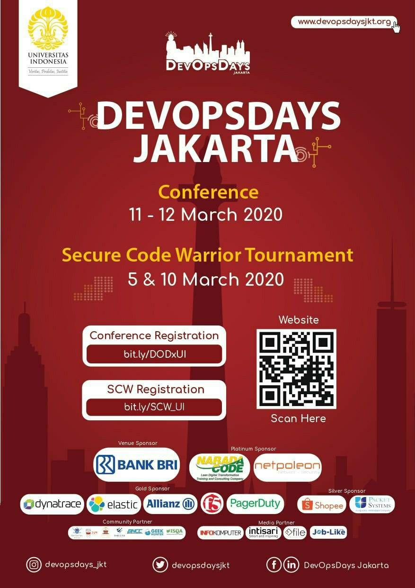
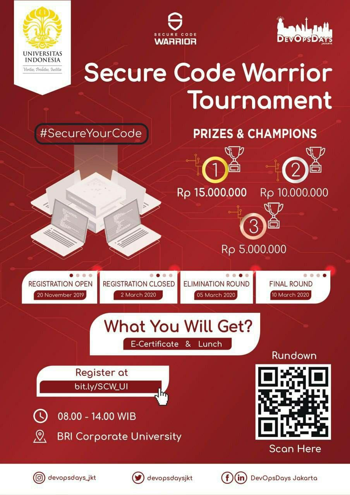
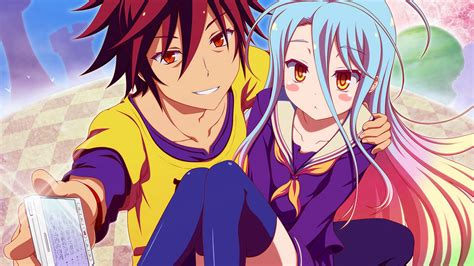
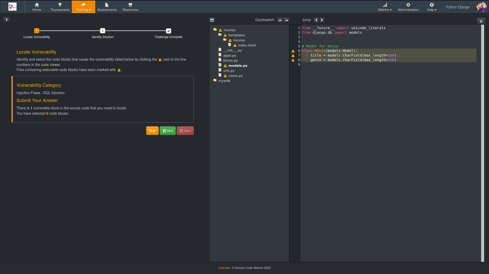
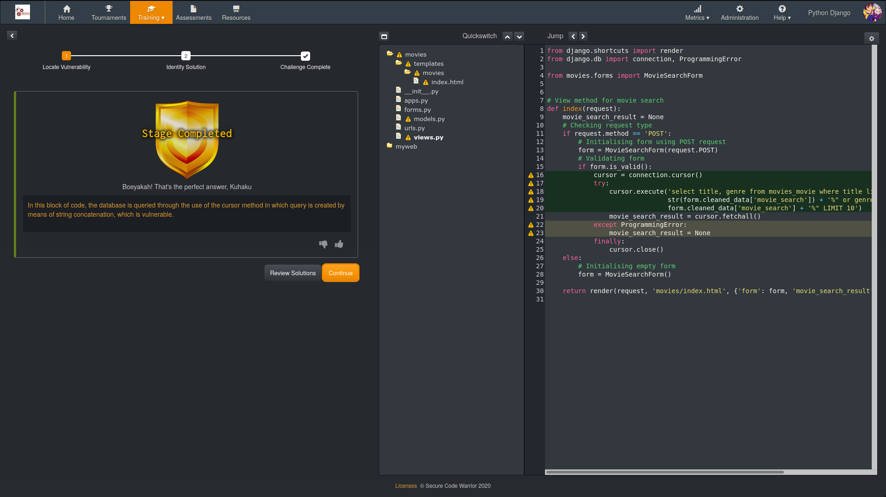
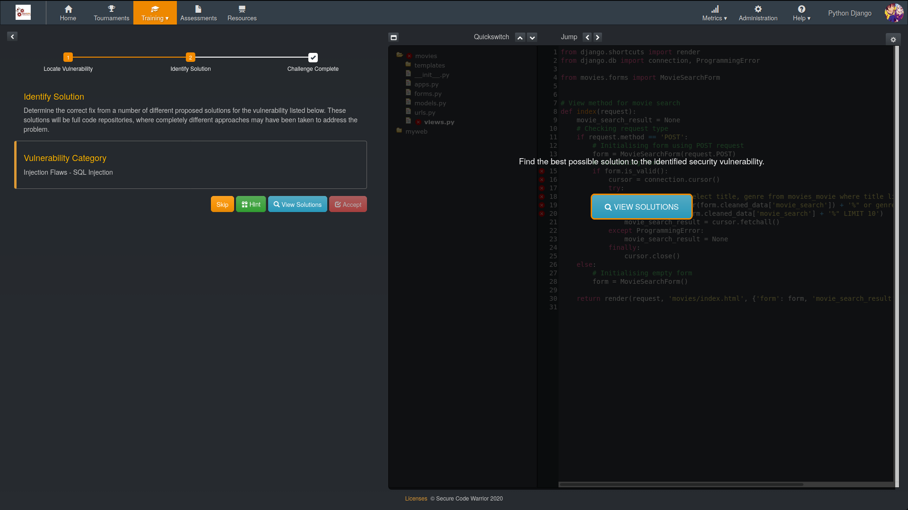
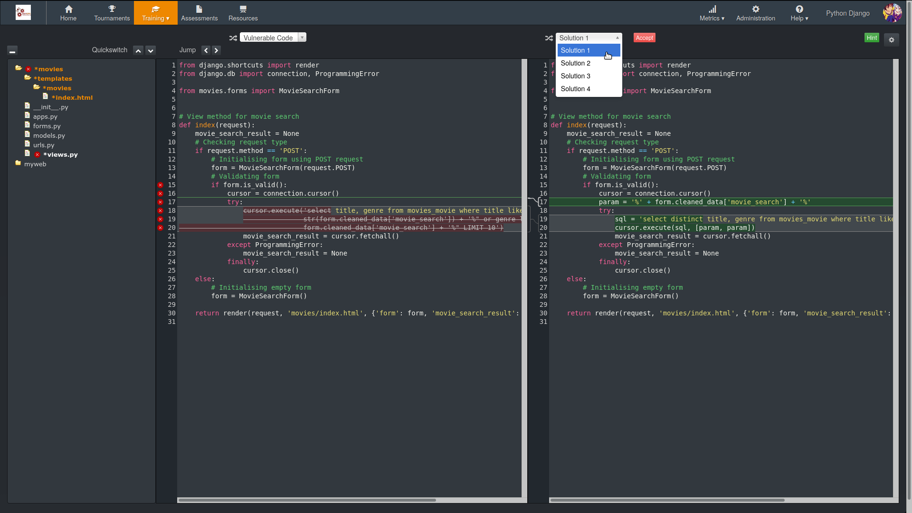
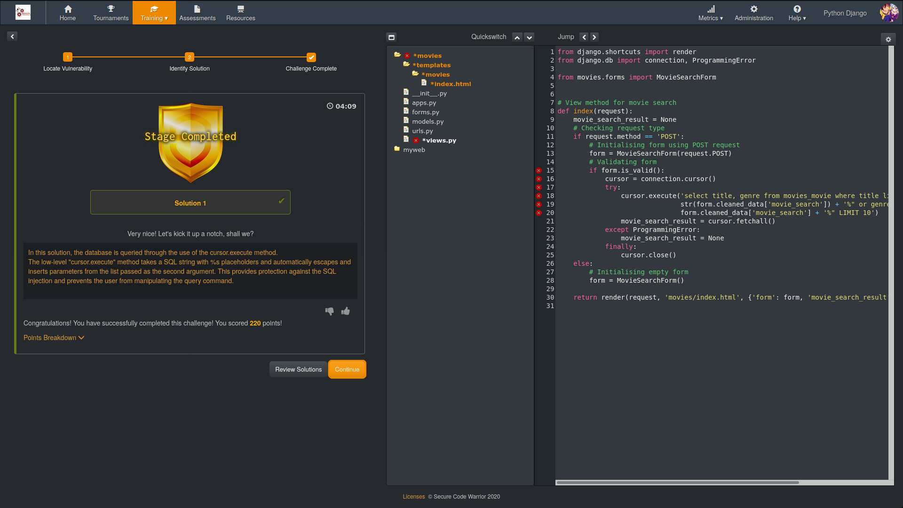
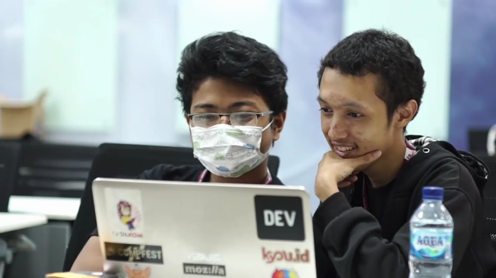

---
# Copyright (c) GPR <gpr@gagahpangeran.com>. Licensed under CC-BY-NC 4.0.
# Read the LICENSE file inside the 'content' directory for full license text.

title: Klik-klik Berhadiah di Secure Code Warrior
date: "2020-03-20T18:35:00+07:00"
description:
  "Jadi ceritanya minggu lalu gue dan Distra dapat juara 3 di lomba Secure Code
  Warrior atau disingkat SCW. Jadi apa sih itu SCW? Apakah ada hubungannya
  dengan SJW? Gimana caranya gue bisa menang padahal dikejar-kejar deadline PPL?
  Nah gini ceritanya."
featuredImage: ./img/scw.png
categories: ["Story", "Competition"]
tags: ["DevOpsDay Jakarta", "Secure Code Warrior"]
lang: id
---

Jadi ceritanya minggu lalu gue dan [Distra](https://twitter.com/ramadistra/)
dapat juara 3 di lomba Secure Code Warrior atau disingkat SCW. Jadi apa sih itu
SCW? Apakah ada hubungannya dengan SJW? Gimana caranya gue bisa menang padahal
dikejar-kejar deadline PPL? Nah gini ceritanya.

## Pendaftaran

Jadi gue baru tahu lomba SCW dari grup Lomba Hunter Fasilkom, di hari minggu 2
hari sebelum pendaftaran di tutup. Ternyata SCW ini adalah bagian dari acara
Devops Days Jakarta. Gue langsung nanya ke
[Gio](https://twitter.com/giovanismid) karena biasanya dia tahu soal ginian.
Ternyata Gio udah daftar sama [Nuga](https://twitter.com/nux_99).

Gue cukup tertarik untuk ikut setelah melihat video tentang apa itu SCW. Hal
yang gue dapet abis nonton videonya adalah kayaknya format lombanya mirip CTF
yang disuruh nyari bug suatu program, kemudian disuruh ngebenerin bug tersebut.
Videonya sendiri bisa dilihat
[di sini](https://www.youtube.com/watch?v=G4eNo9ZJ8oQ) dan
[di sini](https://www.youtube.com/watch?v=0bPFS1tyNbM).

Gue lihat tanggal penyisihannya, 5 Maret, hari kamis pas sprint review PPL.
Finalnya tanggal 10 Maret, hari selasa pas individual review PPL, tapi bukan
jadwalnya kelompok gue. Gue bisa aja skip kelas DSA sama ML pas paginya. Tapi
gue mulai ragu karena gak mau skip sprint review PPL hari kamis siangnya.

Trus gue lihat lagi rundown-nya dan ternyata penyisihannya cuma sampe jam 12,
sisanya cuma talk sama pengumuman sampe jam 2 siang. Trus gue cek tempatnya
ternyata di BRI Corporate University di daerah Ragunan. Kayaknya bakal keburu
kalo gue balik dari sana jam 12 dan ngejar sprint review PPL di Pacil sekitar
jam 2.

Masalah selanjutnya adalah mencari teman untuk bikin tim. Sebenarnya bisa aja
sih satu tim isinya cuma gue doang, tapi kayaknya gue belom cukup jago untuk
melakukan itu. Satu tim isinya maksimal dua orang, gue masih belom tahu
kira-kira yang bisa diajak siapa.

Esoknya pas hari Senin gue ada kelas keamanan informasi yang isinya belajar sama
ngerjain soal CTF (Capture The Flag). Gue coba ngajak Distra buat ikut SCW dan
dia mau ikut setelah gue ngasih tahu lombanya kayak gimana. Lalu selanjutnya gue
memutuskan nama tim Kuhaku yang juga dipakai sebagai nama kelompok kita di kelas
CTF ini.

Kenapa Kuhaku?

Ya kalo kalian pernah nonton anime No Game No Life pasti tahu kalo Kuhaku itu
adalah nama lain dari duo Sora dan Shiro.

## Sebelum Penyisihan

Jadi karena hari pas penyisihan itu ada sprint review PPL dan ada beberapa task
di proyek PPL kelompok gue yang belom selesai, gue dan dua anggota kelompok PPL
gue yang lain, [Sage](https://twitter.com/sagehs) dan
[Achir](https://twitter.com/ardan___), memutuskan untuk ngerjain PPL di Pacil
pada Rabu malam.

Ngerjain PPL selesai sekitar jam 2 pagi hari Kamis, kita bertiga pun balik. Pas
nyampe kontrakan gue masih harus menyelesaikan “suatu masalah besar” yang ada di
proyek PPL gue. Akhirnya gue selesai ngoding sekitar abis subuh jam 5 Pagi.

Janjian ngumpul buat berangkat bareng ke tempat lombanya sekitar jam setengah
tujuh di Pacil. Gue memutuskan untuk tidur bentar dan berharap semoga bangun
(famous last word).

Gue terbangun jam setengah 7 pas dengan kepala agak pusing akibat cuma tidur
bentar. Gue lihat cuaca agak mendung. Trus
[Greg](https://twitter.com/Greg_Aprisunnea) udah nge-chat nanyain lagi di mana,
gue jawab aja ‘OTW’ (heh?).

Gue masuk kamar mandi dan cuma cuci muka doang gak mandi, abis itu ganti baju.
Pas udah mau siap berangkat, tiba-tiba hujan deras. Osyiet. Apa yang harus gue
lakukan sekarang.

Gue memutuskan untuk nerobos hujan naik motor ke Pacil gedung lama, tentunya
dengan memakai jas hujan. Selama di perjalanan gue agak ngebut naik motornya dan
jalanan lumayan sepi karena hujan. Kayaknya saat itu gue udah gak mikir ada
kemungkinan terjadi kecelakaan karena jalanan licin.

Gue berhasil nyampe dengan selamat di Pacil sekitar jam 7 kurang. Dan… baru ada
Greg. Harusnya kita janjian bertiga, gue, Greg, dan
[Kusuman](https://twitter.com/ipmankus), jam setengah 7 di Pacil lama. Tapi
Kusuman belom nyampe.

Kusuman dateng sekitar jam 7 lewat 12 menit. Kita langsung pesan grebkar ke
tempat lombanya di daerah Ragunan. Eh, ternyata kita beneran lewat depan pintu
masuk Ragunan. Tadinya gue mau minta stop biar gue bisa main bentar ke Ragunan
mau ngelihat jerapah (kenapa harus jerapah? gue juga gatau), tapi niat tersebut
gue urungkan.

Nyampe depan lobi ada pemeriksaan suhu tubuh. Gue panik. Takut aja kalo suhu
tubuh gue lagi tinggi karena kurang tidur. Bisa-bisa gue disangka kena Covid
terus diisolasi di Ragunan bareng jerapah (Kenapa jerapah lagi? Gue juga masih
gatau).

Pas registrasi di lobi, kami disuruh ngasih KTP trus dikasih stiker yang
bertuliskan nama kami dan dikasih masker. Jadi sekarang untuk dapat masker aja
kami harus tukar dengan kartu identitas kami ya. Selangka itukah masker saat
ini?

Hal yang pertama kali kita bertiga lakukan saat masuk ke dalam adalah pergi ke
WC. Abis keluar dari WC kemudian belok ke kantin. Kalo dilihat kantinnya cukup
sepi dan cuma ada satu tempat jualan.

Kami memutuskan beli nasi goreng buat sarapan. Pas dibayar ternyata harga nasi
gorengnya 20 ribu padahal di tulisannya 15 ribu. Alasan yang jual katanya
harganya belum update. Yaudah lah ya kita terima aja.

Pas lagi sarapan, kita bertiga ngelihat Gio sama Nuga udah nyampe. Abis itu
Distra nyampe tapi kita udah selesai sarapan. Dia udah pake kaos tulisan Secure
Code Warrior. Ternyata di lantai atas ada registrasi lagi buat lombanya. Kita
bertiga langsung ke atas.

## Penjelasan Teknis

Sekitar jam 9 pagi, penjelasan tentang teknis pelaksanaan babak penyisihan
dimulai. Ruangan tempat lombanya ada di lantai 2 dan kayaknya ini ballroom
gedung ini.

Gue dan Distra duduk di barisan paling kanan meja kedua dari belakang. Gio dan
Nuga ada di baris sebelah kiri gue meja paling belakang. Sementara Greg dan
Kusuman ada di tiga baris sebelah kiri gue meja paling belakang. Tim dari UI
(atau lebih tepatnya Fasilkom) yang gue tau cuma kita berenam, jadi ada tiga
tim.

Jadi penjelasan teknis bagaimana lomba SCW ini bekerja adalah sebagai berikut.

- Ada tiga jenis bentuk soal:

  1. Diberikan baris suatu celah keamanan dari sebuah proyek dengan banyak file,
     akan ada beberapa pilihan jenis celah keamanannya, kita disuruh pilih apa
     jenis celah keamanannya tersebut.
  2. Diberikan jenis suatu nama celah keamanan, akan ada beberapa pilihan baris
     kode di dalam suatu proyek, kita disuruh milih baris kode mana yang
     merupakan celah keamanan tersebut.
  3. Diberikan file yang mengandung sebuah celah keamanan, akan ada empat
     pilihan file yang mengandung patch dari celah tersebut, kita disuruh
     memilih satu di antara empat kemungkinan tersebut yang mana merupakan patch
     yang benar.

- Sebelum memulai turnamen, peserta harus memilih jenis framework dan/atau
  bahasa pemrograman yang akan digunakan.
- Ada beberapa level di suatu turnamen.
- Di setiap level akan ada beberapa soal.
- Di setiap soal biasanya merupakan proyek yang berisi banyak file source code
  dan akan ada dua babak.
- Babak pertama biasanya merupakan bentuk soal (1) atau (2).
- Setelah jenis celah keamannya tertebak, selanjutnya dilanjutkan dengan memilih
  patch untuk celah tersebut yaitu bentuk soal (3).
- Setiap babak memiliki nilai poin yang berbeda-beda tergantung level.
- Setiap babak terdapat nyawa.
- Tiap menjawab salah, nyawa akan berkurang dan jumlah nyawa terbatas (biasanya
  tiga).
- Soal pada babak tersebut masih dapat dikerjakan asalkan nyawa belum habis.
- Jika soal berhasil terjawab, maka akan terdapat pengurangan poin pada babak
  tersebut sesuai nyawa yang hilang.
- Jika nyawa sudah habis, maka babak tersebut sudah tidak dapat dikerjakan lagi.
- Setiap babak terdapat hint.
- Jumlah hint biasanya tidak terbatas, tetapi setiap penggunaan hint akan
  mengurangi poin pada babak tersebut.
- Potongan poin saat menggunakan hint biasanya lebih sedikit daripada potongan
  poin apabila nyawa menghilang.
- Jika berhasil menjawab soal pada suatu babak tanpa kehilangan nyawa atau tanpa
  memakai hint, maka akan mendapatkan full point.
- Lakukan terus untuk setiap babak di tiap soal untuk setiap level hingga soal
  habis atau waktu turnamen selesai.

TL;DR : Intinya ini cara ngerjain soalnya klik-klik doang. Kalo kalian penasaran
gimana caranya coba cari videonya di yutup atau cobain langsung di platform-nya
[Secure Code Warrior](https://portal.securecodewarrior.com/).

Kami diberikan kesempatan untuk nyobain platform-nya dan ngerjain soal latihan.
Kami coba pilih bahasa Python dan framework Django. SCW

Ya jadi seperti yang bisa dilihat kalo pada dasarnya lomba ini klik-klik doang.
Tapi gak asal klik karena kami harus tahu vuln-nya gimana dan gimana cara
nge-patch-nya.

Sebelum penyisihan dimulai, gue ngeganti foto tim kami jadi Sora dan Shiro biar
kalo tim lain ngelihat mungkin ada yang tahu arti nama tim kami.

## Penyisihan

Babak penyisihan dimulai sekitar jam 10. Gak banyak yang bisa dikerjain di sini
karena pada dasarnya gue dan Distra ngerjain soal sambil diskusi.

Distra yang kelihatannya lagi sakit kayaknya batuk-batuk terus. Karena tadi pas
mau masuk dikasih masker, dia pake masker sepanjang penyisihan. Kalo dia
batuk-batuk terus tapi gak pake masker kayaknya dia udah gue pukul duluan sampe
pingsan biar gak nyebarin virus. Dia juga sering bolak-balik WC, mungkin karena
ruangan di dalam dingin jadinya dia beser.

Kita ngerjain soal pelan-pelan. Scoreboard ditampilin di depan dan udah banyak
tim yang dapat skor gede banget. Kami berusaha untuk gak salah pas ngerjain soal
dan juga gak pake hint.

Karena mata gue rabun jauh dan belum sempat beli kacamata lagi karena hilang,
tiap beberapa menit sekali gue nyuruh Distra ngelihat scoreboard di depan. Di
scoreboard terlihat ada tim yang namanya R.O.P skornya udah jauh banget di atas.
Timnya Kusuman dan Greg sama timnya Gio dan Nuga juga udah di atas.

Gue dan Distra akhirnya memutuskan untuk langsung ngerjain soal yang levelnya
paling tinggi. Ngerjain soal bisa di-skip dan soal yang di-skip bisa dikerjain
ulang tanpa ngurangin poin, soal yang dikerjain pun gak harus ngurut dari
level 1.

Kami akhirnya ngerjain soal yang ada di level 8. Posisi kami langsung naik
cepat. Tim kami menyalip timnya Gio-Nuga dan timnya Greg-Kusuman. Sekarang tim
kami ada di peringkat 2 di bawah R.O.P. Ternyata soal di babak penyisihan ini
ada batasnya dan kelihatannya tim R.O.P udah selesai ngerjain semua soal. Tim
kami yang masih ada beberapa soal belum dikerjain berusaha ngejar.

Akhirnya tim kami berhasil menyalip R.O.P dan berada di peringkat 1 dengan
perbedaan skor yang lumayan tipis. Kami gak pake hint sama sekali dan kehilangan
5 nyawa sedangkan R.O.P juga gak pake hint sama sekali tapi kehilangan 9 nyawa.

Kayaknya waktu penyisihan masih lama tapi kami udah selesai. Kami memutuskan ke
WC dulu.

Sambil nungguin waktu habis, kami cuma ngelihatin scoreboard. dan berharap gak 5
tim tiba-tiba skornya di atas kami. Finalnya sendiri emang ngambil 5 tim teratas
di penyisihan.

MC-nya dari tadi keliling nanya-nanyain peserta. Dia udah wawancara tim R.O.P
yang sekarang di peringkat 2. Kemudian mereka wawancara tim Greg-Kusuman. Pas
Greg ditanyain namanya siapa dia malah jawab “Raihan Ramadistra”. Gue sama
Distra langsung teriak-teriak pemalsuan identitas. Trus pas ditanya asalnya
darimana, Greg jawab “dari sini”. Trus MC-nya kayak percaya aja kalo mereka dari
BRI Corporate University.

Kemudian MC-nya tiba-tiba nyariin tim Kuhaku. Gue sama Distra langsung diam.
Biar gak kelihatan mencolok, gue langsung pake masker.

Entah gimana caranya, kedua MC tersebut berhasil menemukan kami. Salah satu dari
mereka wawancara gue, kira-kira begini isinya.

- MC : “Mas dari tim Kuhaku ya”
- Gue : “Bisa dibilang begitu”
- MC : “Arti nama Kuhaku itu sendiri apa mas?”
- Gue : “Ya itu adalah artinya, mungkin sebagian orang di sini juga tahu
  artinya”
- MC : “Ini kalian berdua asalnya dari mana ya”
- Gue : “Dari kampus di Depok”
- MC : “Oh Depok, dari UI?”
- Gue : “Ya anggap aja begitu”
- MC : “Benar nih mas dari UI? Apa dari Gundar? Atau dari PNJ?”
- Trus Distra nunjuk ke tulisan Fasilkom UI di japan (jaket panda) yang gue
  pake. Yah ketahuan deh.
- MC : “Oh dari UI beneran ya mas. Udah semester berapa?”
- Gue nanya ke Distra : “Udah semester berapa kita?”
- Distra : “Semester 6”
- Gue ke MC : “Udah semester 6”
- MC : “Oh begitu”

Sisa dari wawancaranya kayaknya gak penting karena gue gak ingat.

Abis itu gue ngelihat scoreboard dan timnya Gio-Nuga disalip sama tim lain dan
tidak masuk 5 besar.

Hasil akhir scoreboard penyisihan seperti ini.

## Setelah Penyisihan

Abis penyisihan selesai ternyata gak langsung pengumuman yang lolos final. Gue
nanya ke panitia apakah bisa langsung pulang dan mereka jawab harus ada minimal
satu anggota sampe akhir kalo enggak nanti hangus kesempatan masuk finalnya.

Gue dan Kusuman harus segera ke Pacil karena ada Sprint Review PPL. Sementara
Distra dan Greg sprint review-nya udah hari Selasa kemarin. Mereka pun kami
tinggalkan.

Gue an Kusuman akhirnya ambil makan siang yang dikasih trus langsung balik.
Kusuman pesan gokar dan entah nge-bug atau kenapa, tarifnya cuma 10 ribu. Dari
Ragunan ke UI cuma 10 Ribu! Wow!

Sesampainya di Pacil, ternyata sprint review-nya molor dari yang di jadwal
(sudah kuduga). Gue langsung ketemu kelompok PPL gue dan ternyata ada masalah
dengan deployment-nya. Gue coba solve dan berhasil. Yak, gue bisa menghadapi
sprint review dengan tenang.

Sorenya abis sprint review gue nanya ke Distra apakah kita lolos ke final apa
enggak. Mungkin aja kan tiba-tiba ada 5 tim yang tiba-tiba naik di atas tim
kita. Ternyata tim Kuhaku lolos ke final.

## Sebelum Final

Singkat cerita setelah penyisihan, tim Gue-Distra dan Greg-Kusuman lolos ke
final. Ternyata pas hari final tersebut ada kuis DSA. Gue harus izin ke Pak Ari,
dosen kelas DSA gue, buat gak ikut kuis.

Ketika teman-teman yang lain pada sibuk belajar dan bikin citsit buat kuis DSA,
gue malah santai-santai aja. Muehehehe. Harusnya gue latihan SCW tapi karena
terlalu malas akhirnya gue cuma rebahan di kamar.

Pas hari final paginya, gue, Greg, dan Kusuman ngumpul di pacil lagi. Untungnya
hari ini paginya gak hujan. Pas sebelum naik grebkar gue ketemu Pak Ari dan
bilang tentang gue yang gak bisa ikut kuis DSA. Pak Ari bilang bakal ngasih kuis
susulan ke gue. Oke aman berarti.

Ternyata malam sebelum final, Greg udah latihan ngerjain soal di platform SCW.
Trus selama di perjalanan, Kusuman baca-baca dokumen hasil Greg latihan semalam.
Gue jadi khawatir dengan nasib tim gue yang gak ada persiapan sama sekali buat
final.

Pas nyampe seperti biasa dicek suhu, dikasih masker, kami ke WC dulu, dan ke
kantin untuk sarapan.

Pas mau pesan nasi goreng lagi yang jaga orangnya beda. Harga nasi gorengnya pun
15 ribu sesuai dengan harga yang ditulis. Hmmm, ada yang aneh.

Nasi gorengnya pas dibikin pun cukup lama, lebih lama dari terakhir kita pesan,
ada mungkin sekitar 20 menit kami nunggu. Pas nasi gorengnya nyampe ternyata
rasanya lebih enak daripada yang kemarin, satu lagi keanehan muncul. Apakah
karena yang bikin beda?

Jadi kalo harganya 20 ribu, jadinya cepat, tapi rasanya gak begitu enak. Kalo
harganya 15 ribu, jadinya lama, tapi rasanya lebih enak.

Gue selesai duluan dan naik ke atas. Kali ini ruangannya di lantai 3 dan
tempatnya lebih kecil. Udah ada 3 tim lain yang udah duduk. Distra udah duduk
duluan juga. Beberapa menit kemudian Kusuman dan Greg juga udah masuk.

Kemudian penjelasan tentang teknis dimulai. Kali ini sistem scoring-nya agak
beda dan kayaknya soalnya juga lebih susah. Berbeda dari penyisihan, kemungkinan
semua soal gak akan bisa di-solve dalam waktu 2 jam.

Abis selesai penjelasan teknis ada waktu buat latihan sebentar di platform SCW
lagi. Trus tiba-tiba ada mas-mas cameraman nyamerin gue dan Distra, katanya
minta tolong mau shooting bentar buat video dokumentasi.

Video lengkap dokumentasinya ada di
[IGTV DevOpsDays Jakarta](https://www.instagram.com/tv/B9q9mFyAmhZ).

## Final

Jadi seperti biasa tim kami mulai dengan slow start. Sementara tim R.O.P dan
Devoops udah cepet banget naik skornya. Ternyata benar soalnya lebih susah
daripada penyisihan. Ternyata lomba ini gak cuma sekedar klik-klik doang.

Lagi di ngerjain soal tiba-tiba Distra bersin di samping gue. Gue kaget. Takut
aja tiba-tiba ada virus menular masuk ke badan gue.

“Lu gak pake masker?”, gue nanya.

“Gak dikasih”, Distra jawab.

Gue langsung aja ngasih masker yang tadi pagi dikasih pas registrasi, karena
emang gue gak terlalu butuh.

Gak banyak yang bisa diceritain pas ngerjain soal final. Paling cuma Distra yang
lagi-lagi bolak balik ke WC karena beser.

15 menit sebelum waktu habis, scoreboard di freeze. Posisi tim Kuhaku saat di
scoreboard di freeze ada di peringkat 3. Belum ada satu tim pun yang berhasil
solve semua soal. Ternyata tingkat kesulitan soal di final ini benar-benar naik.

Pas waktunya habis dan yak tiba-tiba scoreboard finalnya langsung keluar.
Langsung ketahuan deh pemenangnya.

R.O.P peringkat 1, Devoops peringkat 2, dan Kuhaku peringkat 3. Selisih skor
antara peringkat 1 dan 2 cukup tipis. Kalo kata salah satu anggota tim R.O.P,
sebelum waktu habis mereka jawab soal ngasal dan ternyata benar.

## Setelah Final

Setelah final berakhir ada kuis sebentar, pertanyaannya adalah “Di negara mana
sajakah kantor Secure Code Warrior berada?”.

Gue yang emang gak tahu memutuskan diam. Eh, Distra tiba-tiba ngangkat tangan
gue. Woy, gue gak tahu jawabannya.

Trus Distra ngasih tahu kalo di footer website Secure Code Warrior ada alamat
kantornya.

Ya udah langsung aja gue jawab, “Australia, Inggris, Amerika…”.

Terus sambil pura-pura gatau, gue nanya Distra, “Satu lagi di mana?”

Distra sambil lihat layar laptop ngasih tahu gue, “Belgia”

“Belgia!”, gue menjawab negara terakhir.

Yak, dan memang benar itu jawabannya. Gue pun mendapatkan flashdisk berukuran 64
GB.

Abis itu ada penyerahan bingkisan tas berisi kaos dan stiker, foto-foto finalis,
dan pengumuman pemenang. Tentu saja pemenangnya sesuai scoreboard yang sudah
dilihat.

Tapi ternyata penyerahan hadiahnya besok pas acara utama DevOpsDays-nya dan kalo
gak datang hadiahnya hangus. Ya udah lah ya, berarti terpaksa besok kita harus
datang lagi. Tapi katanya gapapa datangnya sore pas mau penyerahan hadiah.
Berarti paginya gue masih bisa buat ikut kelas MPPI dan siangnya cuma skip kelas
CTF.

Abis ambil makan siang, kami berempat langsung pulang ke Pacil karena Greg sama
Distra ada individual review PPL. Pas Kusuman pesan gokar lagi, ternyata hari
ini gak nge-bug tarifnya. Yah kecewa… Padahal kemarin bisa naik gokar cuma 10
ribu dari Ragunan ke UI.

## Pengambilan Hadiah

Besoknya pada hari Rabu, paginya gue skip kelas MPPI buat ngerjain tugas DSA
yang deadline malam itu juga (Hehe, maafkan saya Pak Harry). Gue ngerjain di
Plaza gedung baru bareng [Cahya](https://twitter.com/cahyanugraha12n/).

Sekitar jam 2 siang, kita berempat (gue, Distra, Greg, dan Kusuman) berangkat.
Tentu saja kami berempat skip kelas CTF yang seharusnya berlangsung pada saat
jam 2 tersebut.

Di perjalanan, kami berempat tentunya sambil ngerjain tugas DSA yang
deadline-nya malam itu. Dataset yang diberikan adalah dataset fake jobposting
dan dataset corona yang ternyata update tiap beberapa jam sekali.

Nyampe lagi di sana sekitar jam 3 sore. Kali ini kami disuruh langsung masuk aja
dan gak dikasih masker. Di lantai bawah banyak booth entah dari perusahaan apa.
Kami langsung naik ke lantai 2 dan di dalam ballroom-nya ada banyak orang. Kami
langsung nyari tempat duduk kosong dan kembali melanjutkan ngerjain tugas DSA.

Kemudian tiba-tiba ada mbak-mbak nyamperin dan nawarin ngasih makan siang. Wah
si mbak tahu aja nih kalo gue belom makan. Kemudian kita ambil makan siang dan
langsung makan. Di depan lagi ada pembicara entah darimana. Pokoknya kita makan
di tempat duduk padahal yang lain pada merhatiin pembicara di depan.

Gue cuma ingat kalo ada satu pembicara dari salah satu bank di Indonesia, sebut
saja bank ABC. Si pembicara bilang kalo bank tersebut udah menggunakan CI/CD
dalam pengembangan software di bank tersebut. Katanya mereka masih pake legacy
code yang pake COBOL. Wow, gue mikirin COBOL mungkin mirip kayak hieroglyphics
di dunia ngoding.

Abis sesi tersebut selesai, lalu dilanjut penyerahan hadiah buat pemenang Secure
Code Warrior. Kita dipanggil satu-satu ke depan buat penyerahan hadiah.

Di IG DevOpsDays yang dipake malah foto gue lagi ngelihat entah kemana.

[ sedang melihat masa depan")](https://www.instagram.com/p/B9nW-V3AGhG)

Abis foto-foto, kita memutuskan untuk langsung balik karena hadiahnya nanti akan
ditransfer.

Pas nyampe pacil gue langsung menyelesaikan tugas DSA dan juga bikin tulisan
buat individual review PPL besoknya. Gue berada di plaza gedung baru pacil sampe
malam dan melihat pemandangan biasa mahasiswa fasilkom kalo ada deadline.

## Afterword

Udah kayak light novel aja ada afterword segala.

Gue cukup senang karena berhasil dapat juara 3 di lomba SCW ini. Format lombanya
juga baru buat gue. Meskipun ngerjain soalnya cuma klik-klik doang, tapi butuh
pengetahuan khusus tentang bahasa pemrograman dan framework yang kita pilih.
Pengetahuan tersebut berguna buat nyari celah keamanan apa di soal tersebut dan
bagaimana cara ngebenerinnya.

Pas hari kamisnya abis pengambilan hadiah, gue masuk kelas DSA lagi belajar SVM
dan gue gak ngerti. Masuk kelas ML juga lagi belajar SVM dan gue juga gak
ngerti. Karena udah dua pertemuan terakhir gak masuk. Trus karena sekarang UI
juga lagi darurat Covid-19, kuliah jadinya pake sistem PJJ (Pembelajaran Jarak
Jauh). Gue gak tahu nasib kuis DSA gue gimana.

Gue udah lama gak nulis cerita sepanjang ini dan akhir-akhir ini blog gue juga
lumayan update dengan tulisan tentang PPL. Jadi sekali-kali bolehlah bikin
cerita yang panjang kayak ini.

Mungkin terakhir dari gue ini aja.

Stay inside and stay healthy!
