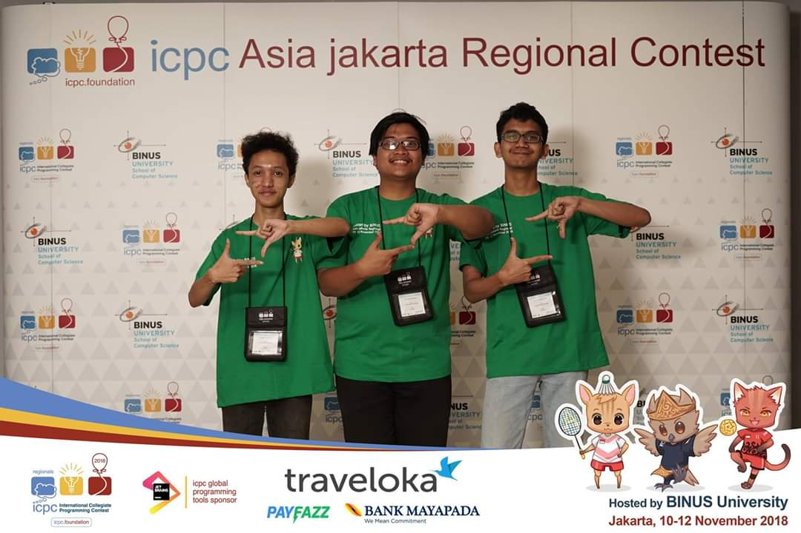

Recap kehidupan gue selama 2018 kemarin akhirnya ditulis juga. Jadi kali ini gue
akan menulis tentang apa saja yang gue lakukan di 2018 kemarin.

## Ikutan 30 Hari bercerita

Jadi di Instagram ada event yang namanya 30 hari bercerita. Untuk mengembalikan
niatan gue untuk menulis di 2018, gue coba deh ikutan tapi di akhir-akhir
jadinya malah gak konsisten deh. Tahun ini ikut lagi kok. Semoga konsisten ke
depannya.

## Misan Evergarden

Rencana untuk ngontrak bareng teman-teman di pacil akhirnya terwujud. Gue dan 7
orang teman yg lain yaitu Aab, Abd, Gio, Cloud, Ariq, Sidiq, dan Kani di akhir
tahun 2017 memutuskan untuk mencari kontrakan. Akhirnya di awal tahun 2018 kami
sudah menempati kontrakan baru tersebut.

Jadi apa itu Misan Evergarden?

Secara singkat sih Misan itu nama jalan di mana kontrakan kami berada. Lalu
kebetulan sama pemiliknya, kontrakan tersebut dinamakan Misan Garden. Kebetulan
lagi, pada saat itu lagi tayang anime Violet Evergarden. Akhirnya kami
memutuskan untuk menamai kontrakan kami Misan Evergarden.

Banyak hal seru yang terjadi saat tinggal bersama tentunya, misalnya nonton
anime bareng, belajar bareng (bahkan sampai stress karena ujian DDP2 dan Alin
barengan), sampe pernah hampir keracunan bareng karena kue jamuran yang dikasih
sama Aziz. Ya pokoknya seru deh.

## Ikut kepanitiaan

Di 2018 gue cukup banyak ikut kepanitiaan. Dari mulai Betis, Compfest, Siwak,
dan PMB. Mungkin mulai bahas satu-satu kali ya.

Untuk yang pertama yaitu Betis. Apa itu Betis? Apakah itu bagian tubuh yang
merupakan sebagian dari kaki? Jadi Betis itu bimbingan belajar gratis yang
diselenggarakan sama Fasilkom UI. Lumayan seru sih ini kepanitiaan, karena gue
bisa ketemu sama peserta Betis yang emang mau belajar untuk masuk PTN meskipun
punya keterbatasan biaya. Trus gue kan di Betis itu divisi akademis ya, karena
gue juga sebelumnya jadi admin grup Line kaskus SBMPTN 2017, gue mencoba ingin
berbagi ilmu lewat materi yang gue beri. Dan juga gue membuat soal Matematika
Dasar yang lumayan susah (kata orang-orang susah sih), tapi gapapa lah buat
mereka belajar, hehe.

Selanjutnya adalah COMPFEST. Nah di sini gue ikut bagian IT Dev dan kerjaannya
adalah… ngoding. Ya benar, kuliah sehari-hari udah ngoding lalu ditambah di
Compfest ngoding lagi. Tapi gue belajar banyak hal saat di Compfest, dari mulai
cara ngoding yang baik, mulai menggunakan (dan menjadi budak) VS Code, dan
tentunya karena Front-End [website COMPFEST](https://compfest.id/) menggunakan
React.js, gue juga harus berurusan dengan javascript. Mungkin kalau ada yg
bertanya apa yg salah dengan javascript, jawabannya adalah 'banyak'. Silakan
cari di google satu-satu atau bisa langsung
[klik ini](https://lmgtfy.app/?t=i&q=javascript+meme). Salah satu hal yang
paling gak terlupakan di IT Dev Compfest adalah rasa senang saat nge-Bully Fata,
Manager IT Dev. Berikut adalah gambar yang bagus dan siapa tau ke-index google
buat keyword 'Fata Nugraha'.

Kepanitiaan selanjutnya adalah Siwak. Jadi Siwak itu kepanjangannya adalah… (oke
gue lupa), intinya Siwak itu acara yang mirip tafakur alam (kalo kalian tau). Di
siwak gue ikut divisi danus dan sudah pasti nge-danus. Selain itu juga disini
ada bikin website sebagai salah satu sumber pendapatannya. Kalo Siwak sih
sebenernya yang seru pas acaranya berlangsung. Karena divisi danus udah gabut
pas acara berlangsung, gue disuruh jadi penanggung jawab sebuah kelompok. Hal
buruk yang terjadi pertama adalah kelompok yang gue urusin trontonnya berangkat
duluan dan gue gak naik di tronton tersebut. Ternyata gak ada panitia yang naik
tronton itu juga, jadilah mereka nyasar entah kemana sementara gue yang naik
tronton lain udah nyampe duluan. Trus apa lagi ya(?) yang gue ingat sih Radit
kehujanan pas naik ke curug. Udah mungkin itu doang.

Yang terakhir adalah PMB. PMB adalah singkatan dari Pembinaan Mahasiswa Baru.
Gue gabung di divisi mentor dan jadi mentor untuk maba Fasilkom angkatan 2018.
Jadi mentor ini seru banget karena bisa ketemu banyak mahasiswa baru tentunya.
Selain itu juga gue sebagai mentor mengajarkan berbagai macam hal ke mentee gue,
gue juga belajar banyak hal dari mereka.

Akhirnya mungkin kepanitiaan yang gue akan ikuti lagi mungkin cuma Betis sama
COMPFEST. Tapi ikut berbagai macam kepanitiaan tersebut membuat gue memiliki
berbagai pengalaman menarik.

## Mulai mencari uang sendiri

Di 2018 gue mulai mencari uang sendiri. Di awal tahun, yaitu di semester 2 gue
kuliah, gue daftar jadi asdos DDP1 (Dasar-dasar Pemrograman 1) dan keterima jadi
asdos kelas ekstensi. Di liburan semester 2 ke semester 3, gue jadi freelance
buat ngembangin website [Kyou](https://kyou.id/). Abis itu di semester 3, gue
menjadi asdos DDP1 lagi dan menjadi asdos nya para maba.

Dengan mencari uang sendiri gue jadi lebih menghargai uang. Karena ternyata
nyari uang itu capek, hehe. Tapi sisi positif yang lain adalah gue bisa membeli
beberapa kebutuhan sekunder dan tersier gue dengan uang sendiri. Contohnya
adalah gue beli laptop baru pake uang sendiri.

## Banyak ikut event jejepangan

Bisa dibilang tahun 2018 gue cukup banyak ikut event yang berbau jejepangan. Gue
datang ke Comifuro 10 dan 11, Ennichisai, Comicfest, GJUI, dan yang terakhir
AFA. Semoga di tahun 2019 ini disela-sela kesibukan gue masih bisa datang ke
berbagai event tersebut. Kalo dilihat yang paling terdekat sih Comifuro 12 bulan
Februari nanti.

## Main gitar, menulis, dan nonton anime berkurang, serta ngoding dan membaca manga yang meningkat

Mungkin kalo dilihat dari judulnya kepanjangan ya, wkwk. Jadi di 2018 ini gue
udah mulai jarang main gitar karena banyaknya tugas kuliah. Menulis di blog ini
aja bahkan gak ada sama sekali di 2018. Selain itu nonton anime yang rutin gue
lakukan selama SMA juga udah jarang, bahkan anime Fall 2018 aja gak ada yang gue
tonton selama ongoing. Mungkin di liburan ini mau puas-puasin nonton Anime.

Semakin jarangnya aktivitas yang gue lakukan sebelumnya mungkin juga disebabkan
oleh aktivitas gue yang lain. Kalo pas SMP gue lagi parah-parahnya baca Light
Novel (Hampir semua light novel yang ada di Baka Tsuki gue baca), nah kalo
sekarang gue malah seringnya baca manga. Didukung dengan adanya aplikasi
Mangarock, jadilah gue kalo lagi gabut atau malas-malasan di kasur akhirnya baca
manga. Selain itu juga di semester 2 dan semester3 banyak banget matkul yang
ngoding. Jadilah gue sepanjang tahun 2018 banyak ngoding.

Sebenarnya tahun 2018 juga gue mulai banyak nonton film anime di bioskop. Kalo
di 2017 gue nonton film No Game No Life Zero sama Uchiage Hanabi. Di 2018 gue
nonton film Chuunibyou, Let me eat your pancreas live action, sama movie anime I
want to eat your pancreas.

Oh ya, di 2018 juga gue mulai banyak beli novel jepang yang diterjemahin dan
diterbitin sama penerbit haru. Lumayan banyak yang gue beli, yaitu Hyouka,
Credit Roll of the Fool (Hyouka 2), Another I dan II, serta I Want to Eat Your
Pancreas. Di akhir tahun kemarin juga gue beli box set Monogatari series 1st
season di Amazon. Jadilah gue banyak utang baca novel yang harus gue lunasi.

Harapan gue sih bisa lebih sering main gitar, baca novel, dan nulis lagi. Kalo
nonton anime bisa lah pas liburan.

## Ikutan lomba

Di 2018 sebenarnya gue cuma ikut 2 lomba, ICPC Jakarta sama CTF Ristek Festival.
Tapi kedua lomba tersebut membuat gue jadi bersemangat untuk ikut lomba lagi
setelah lama hiatus gak ikut lomba apa-apa.

Pertama, ikut ICPC regional Jakarta. Buat yang belum tau, ICPC itu lomba
competitive programming yang skala nya internasional. Dimulai dari penyisihan
untuk seluruh tim di Indonesia, abis itu final regional di Jakarta, kemudian
Word Final. Tim gue, yang terdiri dari gue, Dipsi, dan Ferro, berhasil sampe
final regional Jakarta di Binus. Target kita sebenarnya cuma sampe final
regional aja, karena katanya regional Jakarta itu terkenal enak-enak makanannya.
Ternyata benar, makanannya memang enak-enak. Jadi karena target kami sudah
tercapai, kami gak menyesal meskipun gak juara di regional ini.

Lomba yang selanjutnya gue ikuti adalah Capture The Flag yang diselenggarakan
oleh Ristek Fasilkom UI dalam rangkaian acara Ristek Festival. Tim gue terdiri
dari gue, Reynaldo, dan Cahya, di antara kami belum ada yang pernah ikut lomba
CTF ataupun belajar CTF secara serius. Jadilah kita YOLO aja langsung ikut
lombanya dan gak latihan sama sekali. Banyak insiden sebelum lomba, seperti Rey
lupa bawa charger laptop dan Cahya maag nya kambuh, dan juga pas lomba ternyata
Rey belum tau apa itu nc (netcat). Tapi takdir berkata lain, tim kami juara 1
meskipun persiapannya retard.

<!-- TODO: insert CTF image -->

Tahun kemaren di Pekan Ristek gue udah juara 3 di lomba Code in the Dark sama
IPSC. Jadi mungkin di 2019 ini udah gabisa ikut lomba apapun karena regulasinya
kalo udah pernah juara gak boleh ikut lomba selanjutnya.

## Masih jomblo

Oke section ini langsung lewatin aja wkwkwk. Sama seperti sebelumnya (dan bahkan
dari lahir), di 2018 gue masih jomblo. Mungkin juga kedepannya dalam jangka
waktu yang belum bisa ditentukan masih jomblo juga. Jadi skip aja ya untuk
bagian ini, sedih kalo diceritain soalnya.

## Dompet yang hilang

Jadi ceritanya dompet gue hilang pas abis nonton film I wan to eat your pancreas
di CGV Central Park. Entah hilang atau jatuh, mungkin juga diambil orang pas gue
balik naik Transjakarta. Kalo kehilangan uangnya gak terlalu sedih, hilang
surat-surat penting seperti KTP dan lainnya masih bisa dibuat lagi. Yang sedih
itu adalah kenangan bersama dompet tersebut dari SMP. Gue gak akan pernah ketemu
dompet yang seperti itu lagi seumur hidup gue :(

Ada korek kuping besi sama besi pembuka simcard di dalam dompet itu, kalo beli
lagi lumayan ribet karena harus adaptasi lagi. Selain itu ada juga foto kelompok
kecil PMB pas gue maba di dalam situ. Kan sedih kalo ilang

Untung KTM gue dikantongin jadinya gak ikut ilang. Masih bisa dapet diskon
mahasiswa deh.

## Belajar banyak hal baru

Tentu saja di 2018 gue banyak belajar hal baru khususnya di bidang pemrograman.
Mulai dari belajar Java, React.js, Django, bahkan sampe belajar ngoding
assembly. Selain itu juga banyak materi dan pengalaman yang gue dapatkan baik di
kuliah maupun di luar kuliah. Jadi menurut gue tahun 2018 merupakan tahun
terbaik sekaligus terburuk bagi hidup gue sampai saat ini. Gatau kedepannya
bakal ganti apa enggak.

Jadi ada beberapa harapan di 2019 yang ingin gue sampaikan.

Aktivitas yang sudah jarang dilakukan di 2018 dan berharap akan sering dilakukan
di 2019: main gitar dan menulis.

Aktivitas yang sering dilakukan di 2018 dan berharap dikurangi di 2018: ngoding.

Akhir kata gue ingin menulis prinsip hidup baru gue di 2019, yaitu: Part Time
Student, Full Time Learner.
