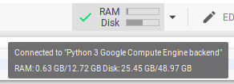

---
# Copyright (c) GPR <gpr@gagahpangeran.com>. Licensed under CC-BY-NC 4.0.
# Read the LICENSE file inside the 'content' directory for full license text.

title: Torrent to Google Drive Using Google Colab
date: "2019-07-29T20:59:00+07:00"
description:
  "Have you ever thought of downloading a Torrent and saving it directly to
  Google Drive? I found one of the tricks, using Google Colab."
featuredImage: ./img/torrent-to-gdrive.png
categories: ["Tech"]
tags: ["Google Colab", "Google Drive", "Torrent"]
lang: en
---

Have you ever thought of downloading a Torrent and saving it directly to Google
Drive? I found one of the tricks, using Google Colab.

First, this is my new blog and all my old posts have been archived. Now I use
Gatsby js + WordPress to build this blog. You can find many tutorials on the
internet. This blog is still in developing and there are still many features
that have not been implemented. You can see the progress in
[my github](https://github.com/gagahpangeran/blog.gagahpangeran.com).

So this is my first time write in English, sorry if there are a lot of mistakes
because my first language is Bahasa Indonesia.
[Jump to tutorial](#using-google-colab) if you don't want to read my intro.

## Motivation

For your information, I am being Software Developer Engineer Intern at GDP Labs
Jakarta. I want to download anime from [nyaa.si](https://nyaa.si/) using office
wifi while working. Unfortunately, the wifi blocks torrent. If I use a VPN, it
might be slow. I've done it before because my university wifi also blocks
torrents.

One day I heard my intern friends was chatting about Google Colab. One of them
had a task to training data with machine learning using Google Colab. He said
that he gets resource of RAM, storage, GPU, and can install anything via bash
like a normal computer. I think that Google Colab might be connected to Google
Drive and I can do something to download torrent to my Google Drive. If it
works, I can download the file while saving it in my drive. I have unlimited
storage on Google Drive using my university student account.

## Using Google Colab

Open [Google Colab](https://colab.research.google.com/) and click 'New Python 3
Notebook'. If you have ever used Jupyter Notebook, you might be familiar. Google
Colab notebook can add code and text block. You can execute any python script in
block code by click run or ctrl+enter. You also can execute any bash command in
block code by using exclamation mark at the beginning of the command.

Make sure your Notebook is connected by looking at the green check mark in the
top right corner. Just click on 'connecting' next to the editing button if it's
not connected. If you hover on the green check mark, you can see your resource.



I get 12 GB RAM and 49 GB Disk, that's pretty good for a cloud computer. You can
do anything in google colab for 12 hours, after that the session is over and
restart (maybe to prevent crypto mining). Your Notebook will be automatically
saved.

## Install transmission-cli

You can download torrent with command line using transmission-cli. If you often
use Linux and prefer to use other programs besides transmission-cli, go for it.
Install transmission-cli by executing this command in block code.

```bash
!apt-get install transmission-cli
```

Wait until the installation is complete.

## Mount Your Google Drive Folder

Expand left sidebar and then click 'Files' tab. You will see button 'Mount
Drive', click it to connect your Gdrive folder and then a new block code will
appear and contain this script.

```python
# Run this cell to mount your Google Drive.
from google.colab import drive
drive.mount('/content/drive')
```

Execute that script and you will get the link to auth your account. Click the
link, select your account that you want to use as a google drive storage. Allow
the permission and you will get the code to auth your Gdrive. Copy the code,
back to your Notebook, paste the code in the box under the sentence 'Enter your
authorization code:', then click enter.

If you succeed, you will see your drive in the sidebar by expand 'drive' folder.


## Download Your File

Okay, This is the step you are waiting for, hehe. For example, I want to
download newest episode of JoJo's Bizarre Adventure – Golden Wind from
[here](https://nyaa.si/view/1154760). Copy the torrent file link and then
execute this command in code block.

```bash
!transmission-cli -w '/content/drive/My Drive' https://nyaa.si/download/1154760.torrent
```

Let's see, `'/content/drive/My Drive'` is your root Gdrive folder. If you want
to download the file to subfolder, just add the name of the subfolder at the
end. Example: `'/content/drive/My Drive/Jojo Anime'`. Replace
`https://nyaa.si/download/1154760.torrent` with your torrent file link, you can
use magnet link too.

## Finish

Wait until your file is downloaded and you will see the file in your drive. If
you want to download new file, just change the file link and execute the last
command. Maybe you want to add more block code and download multiple files. I
don't know whether you can download multiple files parallely or not, I never do
that. ¯\\(ツ)/¯

I hope Google doesn't block this trick or maybe suspend my account because I
share this trick.
